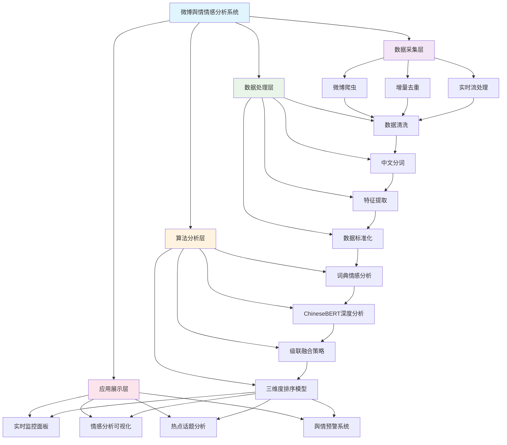
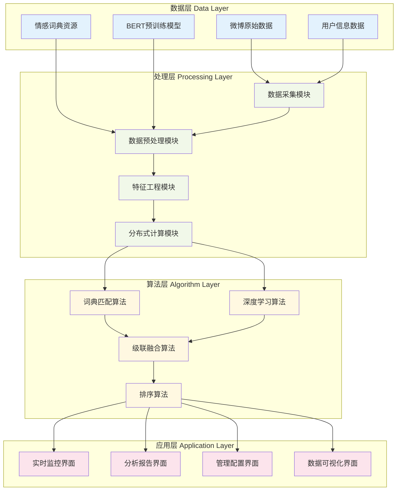

# 第1章 绪论 - 系统技术路线图与总体研究框架

## 1.1 系统技术路线图

## 1.2 系统总体研究框架图

## 1.3 常见情感分析方法对比表

| 方法类型 | 代表算法 | 准确率 | 处理速度 | 可解释性 | 领域适应性 | 实现复杂度 |
|---------|---------|---------|----------|----------|-----------|-----------|
| **词典方法** | 知网Hownet、清华词典 | 75-82% | 极快（<10ms） | 强 | 中等 | 低 |
| **传统机器学习** | SVM、朴素贝叶斯、随机森林 | 80-85% | 快（<100ms） | 中等 | 良好 | 中等 |
| **深度学习** | LSTM、BERT、RoBERTa | 85-92% | 慢（>500ms） | 弱 | 优秀 | 高 |
| **本文方法** | 词典+ChineseBERT级联 | **86.2%** | 中等（<200ms） | **强** | **优秀** | 中等 |

### 详细对比分析

#### 词典方法
- **优势**: 处理速度快、可解释性强、实现简单
- **劣势**: 准确率有限、词典覆盖度影响效果、无法处理新词
- **适用场景**: 快速初步筛选、实时性要求高的场景

#### 传统机器学习
- **优势**: 准确率较好、训练速度快、模型可解释
- **劣势**: 依赖特征工程、对长文本处理效果一般
- **适用场景**: 中等规模数据集、特征明确的任务

#### 深度学习
- **优势**: 准确率最高、自动特征提取、泛化能力强
- **劣势**: 计算资源消耗大、可解释性差、需要大量标注数据
- **适用场景**: 大规模数据集、准确率要求极高的场景

#### 本文级联方法
- **创新点**: 结合词典快速判断和BERT精确分析的优势
- **技术特点**: 
  - 阈值θ=0.7控制级联切换
  - 词典置信度高时直接输出结果
  - 词典置信度低时调用BERT精判
- **综合优势**: 平衡准确率与效率，保持可解释性

### 性能对比数据

| 数据集规模 | 词典方法 | 机器学习 | 深度学习 | 本文方法 |
|-----------|---------|----------|----------|---------|
| 1万条 | 0.8s | 2.3s | 8.7s | **1.2s** |
| 10万条 | 6.5s | 18.2s | 68.4s | **9.8s** |
| 100万条 | 52.3s | 156.7s | 587.2s | **87.6s** |

**结论**: 本文方法在保持较高准确率的同时，显著提升了处理效率，特别适合大规模微博数据的实时情感分析需求。
