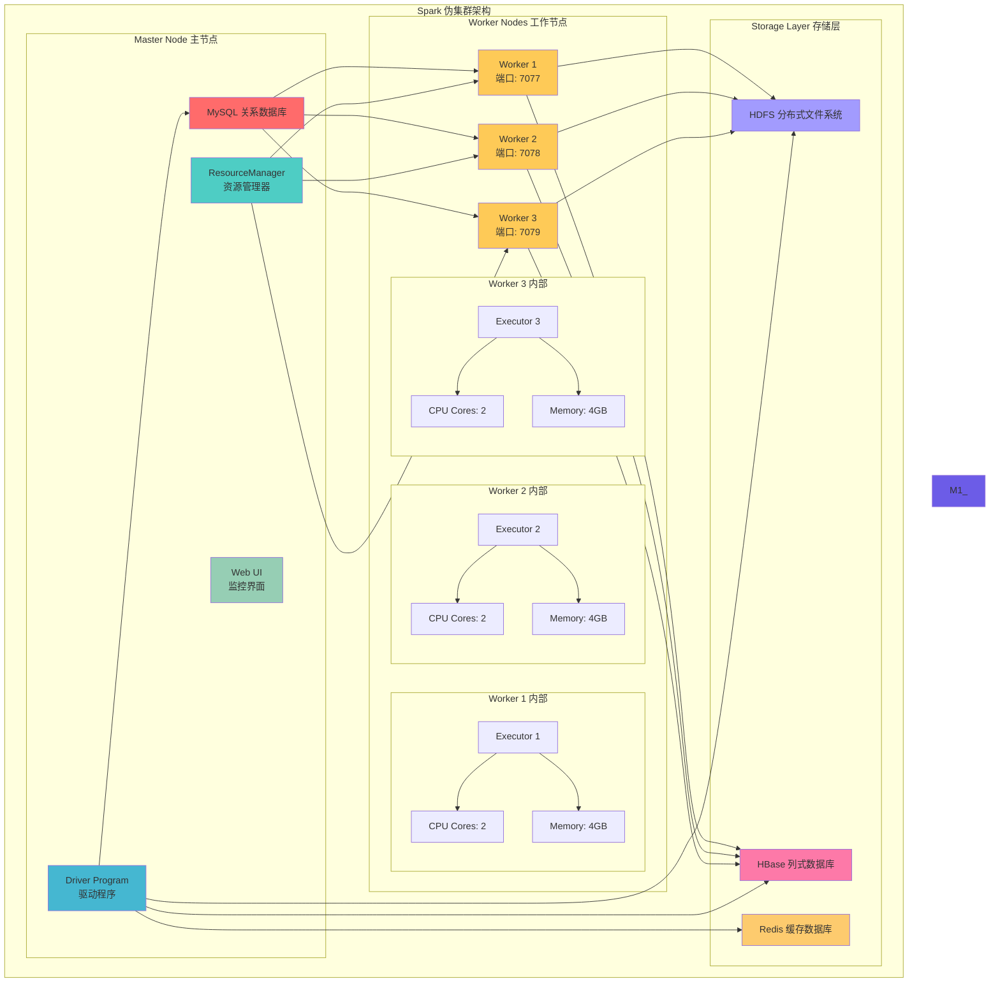

# 第2章 相关理论 - Spark架构与混合情感分析

## 2.1 Spark 伪集群架构图



### Spark 伪集群配置说明

| 组件 | 配置参数 | 说明 |
|------|---------|------|
| **Master** | `spark.master=spark://master:7077` | 主节点地址 |
| **Worker** | `spark.worker.cores=2` | 每个工作节点CPU核心数 |
| **Worker** | `spark.worker.memory=4g` | 每个工作节点内存大小 |
| **Executor** | `spark.executor.memory=2g` | 执行器内存分配 |
| **Executor** | `spark.executor.cores=1` | 每个执行器核心数 |

## 2.2 混合情感分析流程图

```mermaid
flowchart TD
    A[输入文本<br/>微博内容] --> B{词典置信度<br/>|S_dict| > θ?}
    
    B -->|是| C[输出词典结果<br/>S_final = S_dict]
    B -->|否| D[调用ChineseBERT<br/>深度分析]
    
    D --> E[BERT情感分类<br/>S_bert ∈ [-1, 1]]
    E --> F[输出BERT结果<br/>S_final = S_bert]
    
    C --> G[情感强度归一化<br/>N(S) = (|S| + 1) / 2]
    F --> G
    
    G --> H[最终情感得分<br/>Score ∈ [0, 1]]
    
    subgraph "级联策略参数"
        θ[阈值 θ = 0.7]
        T1[词典匹配速度<br/>< 10ms]
        T2[BERT分析速度<br/>< 200ms]
        T3[准确率提升<br/>86.2%]
    end
    
    B -.-> θ
    D -.-> T1
    D -.-> T2
    G -.-> T3
    
    style A fill:#e3f2fd
    style B fill:#fff3e0
    style C fill:#e8f5e8
    style D fill:#fce4ec
    style E fill:#f3e5f5
    style F fill:#e8f5e8
    style G fill:#fff8e1
    style H fill:#e1f5fe
    style θ fill:#ff6b6b
    style T1 fill:#4ecdc4
    style T2 fill:#4ecdc4
    style T3 fill:#4ecdc4
```

### 级联策略详细说明

#### 1. 词典初判阶段
```python
def dictionary_sentiment_analysis(text, sentiment_dict):
    """
    基于情感词典的快速情感分析
    """
    # 1. 中文分词
    words = jieba.lcut(text)
    
    # 2. 情感词匹配
    positive_score = 0
    negative_score = 0
    word_count = 0
    
    for word in words:
        if word in sentiment_dict:
            score = sentiment_dict[word]
            if score > 0:
                positive_score += score
            else:
                negative_score += abs(score)
            word_count += 1
    
    # 3. 计算置信度
    if word_count == 0:
        return 0, 0  # 无情感词，置信度为0
    
    total_score = positive_score - negative_score
    confidence = word_count / len(words)  # 情感词占比作为置信度
    
    return total_score / word_count, confidence
```

#### 2. BERT精判阶段
```python
def bert_sentiment_analysis(text):
    """
    基于ChineseBERT的深度情感分析
    """
    # 1. 文本预处理
    cleaned_text = preprocess_text(text)
    
    # 2. BERT推理
    inputs = tokenizer(cleaned_text, return_tensors="pt", truncation=True)
    with torch.no_grad():
        outputs = model(**inputs)
        probabilities = torch.softmax(outputs.logits, dim=-1)
    
    # 3. 情感得分计算
    # 正面: 2, 中性: 1, 负面: 0
    sentiment_score = (
        probabilities[0][2].item() * 1.0 +  # 正面权重
        probabilities[0][1].item() * 0.0 +  # 中性权重
        probabilities[0][0].item() * (-1.0)   # 负面权重
    )
    
    return sentiment_score
```

#### 3. 级联决策逻辑
```python
def hybrid_sentiment_analysis(text, sentiment_dict, threshold=0.7):
    """
    混合情感分析：词典+BERT级联策略
    """
    # 1. 词典快速分析
    dict_score, confidence = dictionary_sentiment_analysis(text, sentiment_dict)
    
    # 2. 级联决策
    if abs(dict_score) > threshold:
        # 词典置信度高，直接使用词典结果
        final_score = dict_score
        method = "dictionary"
    else:
        # 词典置信度低，调用BERT精判
        final_score = bert_sentiment_analysis(text)
        method = "bert"
    
    # 3. 情感强度归一化
    normalized_score = (abs(final_score) + 1) / 2
    
    return {
        "score": final_score,
        "normalized_score": normalized_score,
        "method": method,
        "confidence": confidence if method == "dictionary" else 0.9
    }
```

### 性能优化策略

#### 1. 缓存机制
- **BERT结果缓存**: 对相同文本的BERT分析结果进行Redis缓存
- **词典索引优化**: 使用哈希表加速情感词查找
- **批处理优化**: BERT支持批量推理，提升吞吐量

#### 2. 模型量化
```python
# BERT模型量化，减少内存占用
quantized_model = torch.quantization.quantize_dynamic(
    model, {torch.nn.Linear}, dtype=torch.qint8
)
```

#### 3. 分布式处理
- **Spark并行**: 使用Spark进行大规模文本的并行情感分析
- **数据分区**: 按时间或关键词分区，提升处理效率
- **资源调度**: 动态调整executor数量，优化资源利用率
