# 第3章 需求分析 - 系统功能用例图与需求清单

## 3.1 系统功能用例图

```mermaid
graph TD
    subgraph "系统用户"
        U1[系统管理员]
        U2[数据分析师]
        U3[舆情监控员]
        U4[普通用户]
    end
    
    subgraph "微博舆情情感分析系统"
        subgraph "数据采集模块"
            UC1[配置爬虫参数]
            UC2[启动数据采集]
            UC3[监控采集进度]
            UC4[查看采集日志]
        end
        
        subgraph "数据预处理模块"
            UC5[设置清洗规则]
            UC6[执行数据清洗]
            UC7[中文分词处理]
            UC8[质量评估检查]
        end
        
        subgraph "情感分析模块"
            UC9[选择分析方法]
            UC10[批量情感分析]
            UC11[查看分析结果]
            UC12[导出分析报告]
        end
        
        subgraph "三维度排序模块"
            UC13[设置权重参数]
            UC14[计算热度得分]
            UC15[生成排序结果]
            UC16[可视化展示]
        end
        
        subgraph "实时监控模块"
            UC17[配置监控关键词]
            UC18[设置预警规则]
            UC19[查看实时数据]
            UC20[接收预警通知]
        end
        
        subgraph "流水线管理模块"
            UC21[创建处理流水线]
            UC22[配置任务依赖]
            UC23[监控执行状态]
            UC24[管理任务调度]
        end
        
        subgraph "可视化展示模块"
            UC25[查看仪表盘]
            UC26[生成图表报告]
            UC27[导出可视化]
            UC28[自定义视图]
        end
        
        subgraph "系统管理模块"
            UC29[用户权限管理]
            UC30[系统配置管理]
            UC31[日志审计查看]
            UC32[性能监控分析]
        end
    end
    
    %% 管理员用例
    U1 --> UC1
    U1 --> UC2
    U1 --> UC5
    U1 --> UC6
    U1 --> UC13
    U1 --> UC14
    U1 --> UC17
    U1 --> UC18
    U1 --> UC21
    U1 --> UC22
    U1 --> UC29
    U1 --> UC30
    U1 --> UC31
    U1 --> UC32
    
    %% 数据分析师用例
    U2 --> UC3
    U2 --> UC4
    U2 --> UC7
    U2 --> UC8
    U2 --> UC9
    U2 --> UC10
    U2 --> UC11
    U2 --> UC12
    U2 --> UC15
    U2 --> UC16
    U2 --> UC23
    U2 --> UC24
    U2 --> UC25
    U2 --> UC26
    U2 --> UC27
    U2 --> UC28
    
    %% 舆情监控员用例
    U3 --> UC19
    U3 --> UC20
    U3 --> UC25
    U3 --> UC26
    U3 --> UC27
    
    %% 普通用户用例
    U4 --> UC25
    U4 --> UC26
    U4 --> UC27
    
    style U1 fill:#ff6b6b
    style U2 fill:#4ecdc4
    style U3 fill:#45b7d1
    style U4 fill:#96ceb4
```

## 3.2 系统功能需求清单表

| 模块编号 | 功能模块 | 子功能 | 需求描述 | 优先级 | 用户类型 |
|---------|---------|---------|----------|--------|----------|
| **M1** | 数据采集 | 爬虫参数配置 | 支持关键词、时间范围、采集频率设置 | 高 | 管理员 |
| **M1** | 数据采集 | 增量数据采集 | 避免重复采集，支持断点续传 | 高 | 管理员 |
| **M1** | 数据采集 | 实时流采集 | 支持微博API实时数据流接入 | 中 | 管理员 |
| **M1** | 数据采集 | 采集进度监控 | 实时显示采集进度和状态 | 高 | 管理员、分析师 |
| **M1** | 数据采集 | 异常处理机制 | 网络异常自动重试，失败日志记录 | 高 | 管理员 |
| **M2** | 数据预处理 | 数据清洗规则 | 支持自定义清洗规则（去重、去噪、格式化） | 高 | 管理员、分析师 |
| **M2** | 数据预处理 | 中文分词处理 | 基于jieba分词，支持自定义词典 | 高 | 分析师 |
| **M2** | 数据预处理 | 繁简转换 | 支持繁体字到简体字的批量转换 | 中 | 分析师 |
| **M2** | 数据预处理 | 数据质量评估 | 提供数据完整性、准确性评估指标 | 中 | 分析师 |
| **M3** | 情感分析 | 词典情感分析 | 基于情感词典的快速情感判断 | 高 | 分析师 |
| **M3** | 情感分析 | BERT深度分析 | 基于ChineseBERT的精确情感分析 | 高 | 分析师 |
| **M3** | 情感分析 | 级联融合策略 | 词典+BERT的智能级联决策 | 高 | 分析师 |
| **M3** | 情感分析 | 批量处理能力 | 支持大规模数据批量情感分析 | 高 | 分析师 |
| **M4** | 三维度排序 | 情感强度计算 | 情感得分归一化处理 | 高 | 分析师 |
| **M4** | 三维度排序 | 热度指标计算 | 转发、评论、点赞数量综合计算 | 高 | 分析师 |
| **M4** | 三维度排序 | 时间衰减模型 | 基于时间的热度衰减算法 | 中 | 分析师 |
| **M4** | 三维度排序 | 权重参数配置 | 支持情感、热度、时效权重调整 | 中 | 分析师 |
| **M5** | 实时监控 | 关键词订阅 | 支持多个关键词同时监控 | 高 | 监控员 |
| **M5** | 实时监控 | 舆情预警设置 | 支持阈值、频率、趋势预警规则 | 高 | 监控员 |
| **M5** | 实时监控 | 实时数据展示 | 实时流数据可视化展示 | 高 | 监控员 |
| **M5** | 实时监控 | 预警通知推送 | 支持邮件、短信、系统内通知 | 中 | 监控员 |
| **M6** | 流水线管理 | 任务编排 | 支持拖拽式任务流程编排 | 高 | 管理员 |
| **M6** | 流水线管理 | 依赖关系配置 | 支持任务间依赖条件设置 | 中 | 管理员 |
| **M6** | 流水线管理 | 执行状态监控 | 实时监控流水线执行状态 | 高 | 管理员 |
| **M6** | 流水线管理 | 定时任务调度 | 支持Cron表达式的定时调度 | 中 | 管理员 |
| **M7** | 可视化展示 | 综合仪表盘 | 6大主题仪表盘展示 | 高 | 所有用户 |
| **M7** | 可视化展示 | 交互式图表 | 支持缩放、筛选、钻取操作 | 高 | 所有用户 |
| **M7** | 可视化展示 | 多格式导出 | 支持PNG、PDF、Excel格式导出 | 中 | 所有用户 |
| **M7** | 可视化展示 | 自定义视图 | 用户可自定义关注的指标和布局 | 低 | 所有用户 |
| **M8** | 系统管理 | 用户权限管理 | 基于角色的访问控制（RBAC） | 高 | 管理员 |
| **M8** | 系统管理 | 系统配置管理 | 数据库、缓存、Spark参数配置 | 高 | 管理员 |
| **M8** | 系统管理 | 日志审计功能 | 完整的操作日志记录和审计 | 中 | 管理员 |
| **M8** | 系统管理 | 性能监控 | 系统资源使用情况实时监控 | 中 | 管理员 |

### 非功能性需求

| 需求类型 | 具体要求 | 衡量指标 |
|---------|---------|----------|
| **性能需求** | 大规模数据处理能力 | 支持100万条微博/小时处理速度 |
| **性能需求** | 实时性要求 | 情感分析响应时间<200ms |
| **性能需求** | 并发用户支持 | 支持100个并发用户同时使用 |
| **可用性需求** | 系统可用性 | 99.5%以上系统可用时间 |
| **可用性需求** | 界面友好性 | 符合Web无障碍标准 |
| **可扩展性需求** | 水平扩展能力 | 支持Spark集群动态扩容 |
| **可扩展性需求** | 存储扩展能力 | 支持PB级数据存储 |
| **安全性需求** | 数据安全 | 用户数据加密存储 |
| **安全性需求** | 访问控制 | 基于JWT的身份认证 |
| **安全性需求** | 操作审计 | 完整的用户操作日志记录 |
| **兼容性需求** | 浏览器兼容 | 支持Chrome、Firefox、Safari、Edge |
| **兼容性需求** | 移动端适配 | 响应式设计，支持移动设备访问 |

### 系统约束条件

| 约束类型 | 具体约束 | 影响范围 |
|---------|---------|----------|
| **技术约束** | 开发语言 | 后端使用Python/Java，前端使用Vue.js |
| **技术约束** | 数据库 | MySQL + HBase + Redis混合存储 |
| **技术约束** | 大数据框架 | 基于Apache Spark进行分布式计算 |
| **业务约束** | 数据来源 | 仅支持微博平台数据采集 |
| **业务约束** | 合规要求 | 遵守微博robots.txt协议 |
| **资源约束** | 硬件要求 | 最低4GB RAM，推荐16GB+ |
| **资源约束** | 网络要求 | 需要稳定的互联网连接 |
| **时间约束** | 项目周期 | 毕业设计项目，4个月内完成 |
