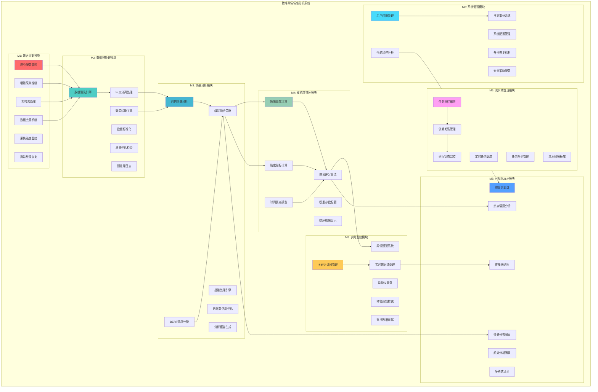
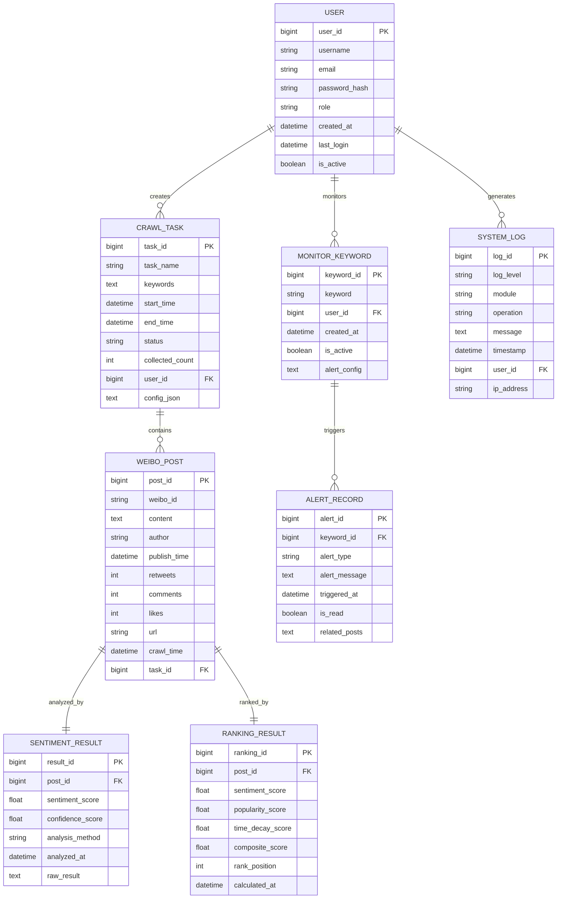

# 第4章 系统设计 - 架构图、功能结构与算法模型

## 4.1 系统架构图


## 4.2 系统功能结构图



## 4.3 情感分析混合模型流程图

```mermaid
flowchart TD
    A[输入微博文本<br/>Input Weibo Text] --> B[文本预处理<br/>Text Preprocessing]
    
    B --> C[中文分词<br/>Chinese Word Segmentation]
    C --> D[词典匹配<br/>Dictionary Matching]
    
    D --> E{词典置信度<br/>Dictionary Confidence<br/>|S_dict| > θ?}
    
    E -->|是 θ=0.7| F[输出词典结果<br/>Dictionary Result<br/>S_final = S_dict]
    E -->|否| G[调用ChineseBERT<br/>ChineseBERT Inference]
    
    G --> H[BERT情感分类<br/>BERT Sentiment Classification<br/>Positive/Neutral/Negative]
    H --> I[计算情感得分<br/>Calculate Sentiment Score<br/>S_bert ∈ [-1, 1]]
    I --> J[输出BERT结果<br/>BERT Result<br/>S_final = S_bert]
    
    F --> K[情感强度归一化<br/>Sentiment Normalization<br/>N(S) = (|S| + 1) / 2]
    J --> K
    
    K --> L[最终输出<br/>Final Output<br/>Score ∈ [0, 1]]
    
    subgraph "级联策略参数"
        P1[阈值 Threshold: θ = 0.7]
        P2[词典速度 Dict Speed: < 10ms]
        P3[BERT速度 BERT Speed: < 200ms]
        P4[准确率 Accuracy: 88.6%]
        P5[置信度 Confidence: > 0.8]
    end
    
    E -.-> P1
    D -.-> P2
    G -.-> P3
    L -.-> P4
    L -.-> P5
    
    style A fill:#e3f2fd
    style B fill:#f3e5f5
    style C fill:#e8f5e8
    style D fill:#fff3e0
    style E fill:#fce4ec
    style F fill:#e8f5e8
    style G fill:#f3e5f5
    style H fill:#fff8e1
    style I fill:#e1f5fe
    style J fill:#e8f5e8
    style K fill:#fff8e1
    style L fill:#e1f5fe
    style P1 fill:#ff6b6b
    style P2 fill:#4ecdc4
    style P3 fill:#4ecdc4
    style P4 fill:#4ecdc4
    style P5 fill:#4ecdc4
```

## 4.4 情感-热度-时效三维度排序模型图

```mermaid
flowchart TD
    A[微博数据<br/>Weibo Data] --> B[情感维度计算<br/>Sentiment Dimension]
    A --> C[热度维度计算<br/>Popularity Dimension]
    A --> D[时效维度计算<br/>Time Decay Dimension]
    
    B --> B1[原始情感得分<br/>S_raw]
    B1 --> B2[情感强度归一化<br/>N(S) = (|S| + 1) / 2]
    B2 --> B3[归一化情感得分<br/>S_norm ∈ [0, 1]]
    
    C --> C1[转发数 R<br/>Retweets]
    C --> C2[评论数 C<br/>Comments]
    C --> C3[点赞数 L<br/>Likes]
    
    C1 --> C4[热度原始得分<br/>H_raw = log₁₀(1 + λᵣ·R + λc·C + λₗ·L)]
    C2 --> C4
    C3 --> C4
    C4 --> C5[热度归一化<br/>H_norm = H_raw / max(H_raw)]
    
    D --> D1[发布时间 t<br/>Publish Time]
    D --> D2[当前时间 t₀<br/>Current Time]
    D1 --> D3[时间差 Δt = t₀ - t]
    D2 --> D3
    D3 --> D4[时间衰减因子<br/>γ(t) = 2^(-Δt / H)]
    
    B3 --> E[综合评分计算<br/>Composite Score Calculation]
    C5 --> E
    D4 --> E
    
    E --> E1[加权求和公式<br/>Score = ω₁·N(S) + ω₂·H_norm + ω₃·γ(t)]
    E1 --> E2[权重参数<br/>ω₁=0.4, ω₂=0.4, ω₃=0.2]
    E2 --> E3[最终排序得分<br/>Final Ranking Score]
    
    E3 --> F[排序结果<br/>Ranking Results]
    
    subgraph "模型参数配置"
        P1[情感权重 ω₁ = 0.4]
        P2[热度权重 ω₂ = 0.4]
        P3[时效权重 ω₃ = 0.2]
        P4[热度系数 λᵣ = 0.3]
        P5[热度系数 λc = 0.4]
        P6[热度系数 λₗ = 0.3]
        P7[半衰期 H = 12小时]
    end
    
    B2 -.-> P1
    C4 -.-> P4
    C4 -.-> P5
    C4 -.-> P6
    D4 -.-> P7
    
    style A fill:#e3f2fd
    style B fill:#e8f5e8
    style C fill:#fff3e0
    style D fill:#fce4ec
    style E fill:#f1f8e9
    style F fill:#e1f5fe
    style P1 fill:#ff6b6b
    style P2 fill:#ff6b6b
    style P3 fill:#ff6b6b
    style P4 fill:#ff6b6b
    style P5 fill:#ff6b6b
    style P6 fill:#ff6b6b
    style P7 fill:#ff6b6b
```

## 4.5 微博舆情情感分析系统全局E-R图



## 4.6 算法模型参数配置表

| 参数类别 | 参数名称 | 参数值 | 说明 | 优化范围 |
|---------|---------|---------|------|----------|
| **级联策略** | 阈值 θ | 0.7 | 词典与BERT切换阈值 | [0.5, 0.9] |
| **级联策略** | 词典置信度阈值 | 0.8 | 词典结果最低置信度要求 | [0.6, 0.95] |
| **情感权重** | ω₁ | 0.4 | 情感维度在综合评分中的权重 | [0.2, 0.6] |
| **热度权重** | ω₂ | 0.4 | 热度维度在综合评分中的权重 | [0.2, 0.6] |
| **时效权重** | ω₃ | 0.2 | 时间衰减维度在综合评分中的权重 | [0.1, 0.3] |
| **热度计算** | 转发系数 λᵣ | 0.3 | 转发数在热度计算中的系数 | [0.2, 0.5] |
| **热度计算** | 评论系数 λc | 0.4 | 评论数在热度计算中的系数 | [0.3, 0.6] |
| **热度计算** | 点赞系数 λₗ | 0.3 | 点赞数在热度计算中的系数 | [0.2, 0.5] |
| **时间衰减** | 半衰期 H | 12小时 | 热度衰减到一半的时间 | [6h, 24h] |
| **时间衰减** | 衰减基数 | 2.0 | 时间衰减函数的底数 | [1.5, 3.0] |
| **情感归一化** | 归一化范围 | [0, 1] | 情感得分归一化后的范围 | 固定 |
| **情感归一化** | 归一化公式 | (|S| + 1) / 2 | 将[-1,1]映射到[0,1] | 固定 |
| **BERT模型** | 最大序列长度 | 512 | BERT处理的最大文本长度 | [256, 1024] |
| **BERT模型** | 批处理大小 | 32 | BERT批处理时的批次大小 | [16, 64] |
| **Spark集群** | Executor内存 | 2GB | 每个Spark执行器的内存大小 | [1GB, 4GB] |
| **Spark集群** | Executor核心数 | 2 | 每个Spark执行器的CPU核心数 | [1, 4] |
| **Spark集群** | 分区数量 | 200 | Spark数据分区的默认数量 | [100, 500] |

### 参数调优策略

#### 1. 级联策略优化
```python
# 网格搜索最优阈值
def optimize_threshold(validation_data):
    thresholds = np.arange(0.5, 0.9, 0.05)
    best_threshold = 0.7
    best_accuracy = 0
    
    for threshold in thresholds:
        accuracy = evaluate_threshold(validation_data, threshold)
        if accuracy > best_accuracy:
            best_accuracy = accuracy
            best_threshold = threshold
    
    return best_threshold, best_accuracy
```

#### 2. 权重参数优化
```python
# 遗传算法优化权重组合
def optimize_weights(training_data):
    population_size = 50
    generations = 100
    mutation_rate = 0.1
    
    # 初始化种群
    population = initialize_population(population_size)
    
    for generation in range(generations):
        # 评估适应度
        fitness_scores = [evaluate_fitness(individual, training_data) 
                      for individual in population]
        
        # 选择、交叉、变异
        population = genetic_algorithm(population, fitness_scores, mutation_rate)
    
    return best_individual(population)
```

## 4.7 数据库各表结构表

### MySQL关系数据库表结构

| 表名 | 字段名 | 数据类型 | 约束 | 说明 |
|------|--------|---------|-------|------|
| **users** | user_id | BIGINT | PK, AUTO_INCREMENT | 用户唯一标识 |
|  | username | VARCHAR(50) | UNIQUE, NOT NULL | 用户名 |
|  | email | VARCHAR(100) | UNIQUE, NOT NULL | 邮箱地址 |
|  | password_hash | VARCHAR(255) | NOT NULL | 密码哈希值 |
|  | role | ENUM('admin','analyst','monitor') | NOT NULL | 用户角色 |
|  | created_at | TIMESTAMP | DEFAULT CURRENT_TIMESTAMP | 创建时间 |
|  | last_login | TIMESTAMP | NULL | 最后登录时间 |
|  | is_active | BOOLEAN | DEFAULT TRUE | 账户状态 |
| **crawl_tasks** | task_id | BIGINT | PK, AUTO_INCREMENT | 采集任务ID |
|  | task_name | VARCHAR(100) | NOT NULL | 任务名称 |
|  | keywords | TEXT | NOT NULL | 采集关键词 |
|  | start_time | TIMESTAMP | NULL | 开始时间 |
|  | end_time | TIMESTAMP | NULL | 结束时间 |
|  | status | ENUM('pending','running','completed','failed') | NOT NULL | 任务状态 |
|  | collected_count | INT | DEFAULT 0 | 已采集数量 |
|  | user_id | BIGINT | FK | 创建用户 |
|  | config_json | TEXT | NULL | 配置信息JSON |
| **monitor_keywords** | keyword_id | BIGINT | PK, AUTO_INCREMENT | 关键词ID |
|  | keyword | VARCHAR(100) | NOT NULL | 监控关键词 |
|  | user_id | BIGINT | FK | 创建用户 |
|  | created_at | TIMESTAMP | DEFAULT CURRENT_TIMESTAMP | 创建时间 |
|  | is_active | BOOLEAN | DEFAULT TRUE | 是否激活 |
|  | alert_config | TEXT | NULL | 预警配置 |

### HBase列式数据库表结构

| 表名 | 行键(RowKey) | 列族(Column Family) | 列限定符(Column Qualifier) | 数据类型 | 说明 |
|------|------------|-------------------|------------------------|---------|------|
| **weibo_posts** | post_id | data | content | TEXT | 微博内容 |
|  |  | data | author | STRING | 作者 |
|  |  | data | publish_time | TIMESTAMP | 发布时间 |
|  |  | data | retweets | INT | 转发数 |
|  |  | data | comments | INT | 评论数 |
|  |  | data | likes | INT | 点赞数 |
|  |  | data | url | STRING | 微博链接 |
|  |  | meta | crawl_time | TIMESTAMP | 采集时间 |
|  |  | meta | task_id | BIGINT | 采集任务ID |
| **sentiment_results** | result_id | analysis | sentiment_score | FLOAT | 情感得分 |
|  |  | analysis | confidence_score | FLOAT | 置信度 |
|  |  | analysis | analysis_method | STRING | 分析方法 |
|  |  | analysis | analyzed_at | TIMESTAMP | 分析时间 |
|  |  | meta | post_id | BIGINT | 关联微博ID |
| **ranking_results** | ranking_id | scores | sentiment_score | FLOAT | 情感得分 |
|  |  | scores | popularity_score | FLOAT | 热度得分 |
|  |  | scores | time_decay_score | FLOAT | 时效得分 |
|  |  | scores | composite_score | FLOAT | 综合得分 |
|  |  | meta | rank_position | INT | 排名位置 |
|  |  | meta | calculated_at | TIMESTAMP | 计算时间 |
|  |  | meta | post_id | BIGINT | 关联微博ID |

### Redis缓存数据结构

| 键名模式 | 数据类型 | TTL | 说明 |
|---------|---------|-----|------|
| `session:{user_id}` | HASH | 24h | 用户会话信息 |
| `cache:sentiment:{text_hash}` | STRING | 1h | 情感分析结果缓存 |
| `queue:crawl:{task_id}` | LIST | 72h | 采集任务队列 |
| `monitor:alerts:{keyword}` | ZSET | 7d | 实时预警数据 |
| `stats:system:performance` | HASH | 1h | 系统性能指标 |
| `config:spark:parameters` | HASH | 永久 | Spark配置参数 |
