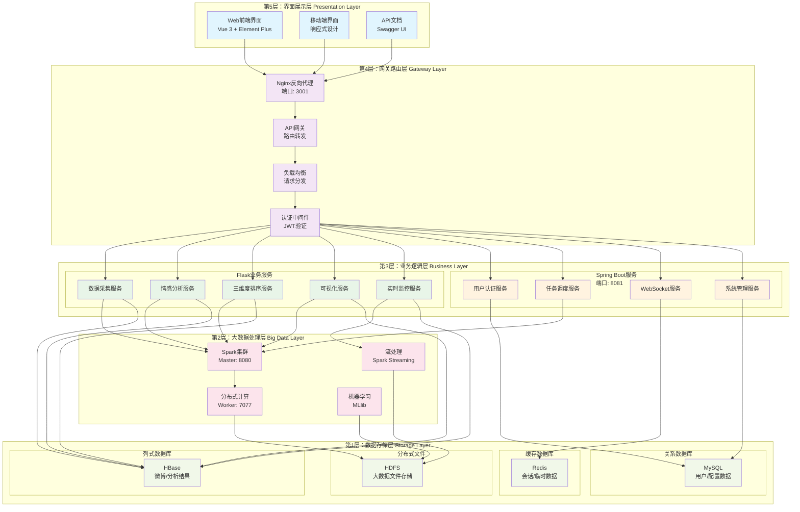
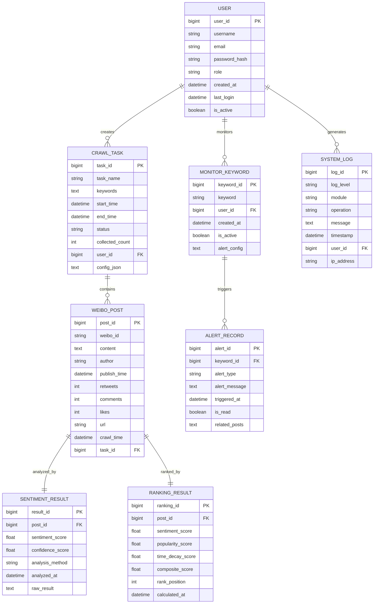
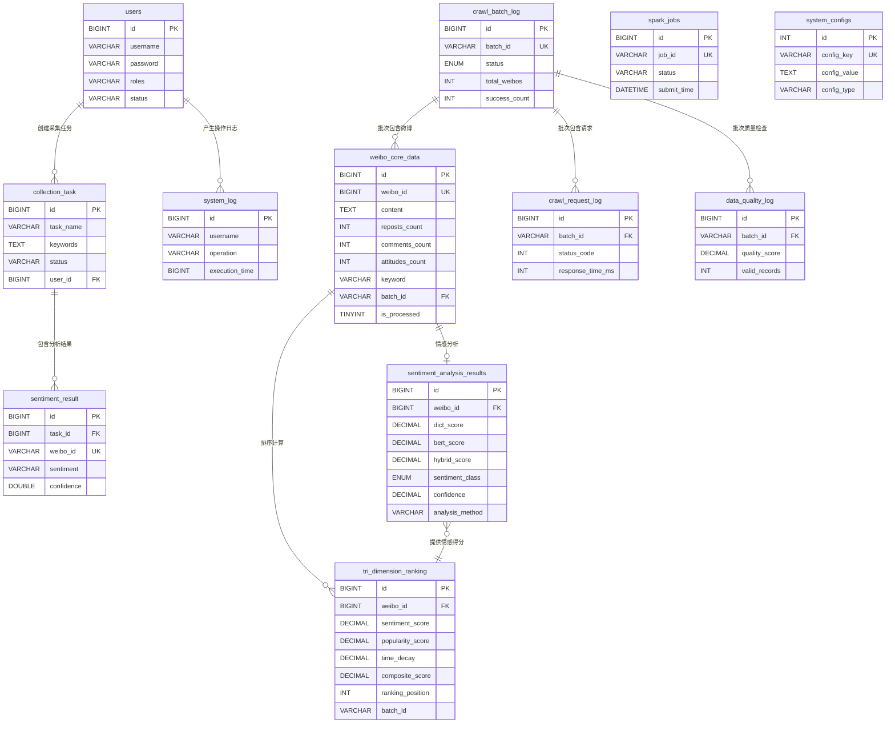

# 第4章 系统设计 - 架构图、功能结构与算法模型

## 4.1 系统架构图



## 4.2 系统功能结构图


## 4.3 情感分析混合模型流程图

```mermaid
flowchart TD
    %% ==================== 输入与预处理阶段 ====================
    INPUT["📥 输入微博文本<br/>待分析微博原始文本"]

    subgraph PREPROCESS ["阶段一：文本预处理"]
        direction TB
        PP1["去除HTML标签与特殊字符"]
        PP2["繁体→简体转换"]
        PP3["表情符号语义映射<br/>[开心]→积极 [怒]→消极"]
        PP4["停用词过滤与文本归一化"]
        PP1 --> PP2 --> PP3 --> PP4
    end

    INPUT --> PREPROCESS

    %% ==================== 词典快速分析路径 ====================
    subgraph LEXICON ["阶段二：词典快速分析（轻量级路径）"]
        direction TB
        L1["jieba中文分词"]
        L2["情感词典匹配<br/>BosonNLP + 知网HowNet + 大连理工"]
        L3["程度副词加权<br/>非常×2.0 / 比较×1.5 / 略微×0.5"]
        L4["否定词翻转处理<br/>不/没/无 → 极性取反"]
        L5["计算词典情感得分<br/>S_dict = Σ(w_i × p_i × d_i × n_i) / N"]
        L6["计算词典置信度<br/>C_dict = min(匹配词数/总词数, 1.0)"]
        L1 --> L2 --> L3 --> L4 --> L5 --> L6
    end

    PREPROCESS --> LEXICON

    %% ==================== 级联决策节点 ====================
    DECISION{"级联决策<br/>C_dict ≥ θ ?<br/>θ = 0.7"}

    LEXICON --> DECISION

    %% ==================== 高置信度 → 直接输出 ====================
    DECISION -->|"✅ 是：高置信度<br/>约70%样本<br/>延迟 < 10ms"| DICT_OUT["词典分析结果<br/>S_final = S_dict<br/>label = sign(S_dict)"]

    %% ==================== 低置信度 → BERT深度分析 ====================
    DECISION -->|"❌ 否：低置信度/高歧义<br/>约30%样本"| BERT_PATH

    subgraph BERT_PATH ["阶段三：ChineseBERT深度分析（重量级路径）"]
        direction TB
        B1["字符级Tokenize<br/>拼音嵌入 + 字形嵌入"]
        B2["ChineseBERT编码器<br/>12层Transformer<br/>Hidden Size = 768"]
        B3["[CLS] 向量提取<br/>句子级语义表示"]
        B4["Softmax三分类<br/>P(正面), P(中性), P(负面)"]
        B5["计算BERT情感得分<br/>S_bert = P(正) - P(负)<br/>S_bert ∈ [-1, 1]"]
        B1 --> B2 --> B3 --> B4 --> B5
    end

    BERT_OUT["BERT分析结果<br/>S_final = S_bert<br/>label = argmax(P)"]
    BERT_PATH --> BERT_OUT

    %% ==================== 汇聚 → 归一化输出 ====================
    subgraph NORMALIZE ["阶段四：结果归一化与输出"]
        direction TB
        N1["情感强度归一化<br/>N(S) = (|S_final| + 1) / 2<br/>N(S) ∈ [0, 1]"]
        N2["情感标签映射<br/>正面: S > 0.1<br/>中性: -0.1 ≤ S ≤ 0.1<br/>负面: S < -0.1"]
        N3["生成分析结果<br/>{label, score, confidence, method}"]
        N1 --> N2 --> N3
    end

    DICT_OUT --> NORMALIZE
    BERT_OUT --> NORMALIZE

    OUTPUT["📤 输出情感分析结果<br/>供三维度排序模型使用"]
    NORMALIZE --> OUTPUT

    %% ==================== 性能参数标注 ====================
    subgraph PARAMS ["级联策略关键参数"]
        direction LR
        PA["置信度阈值<br/>θ = 0.7"]
        PB["词典路径延迟<br/>< 10ms/条"]
        PC["BERT路径延迟<br/>~150ms/条"]
        PD["加权平均延迟<br/>~52ms/条"]
        PE["整体准确率<br/>86.2%"]
    end

    %% ==================== 虚线标注关系 ====================
    DECISION -..-> PA
    DICT_OUT -..-> PB
    BERT_OUT -..-> PC
    OUTPUT -..-> PD
    OUTPUT -..-> PE

    %% ==================== 样式定义 ====================
    style INPUT fill:#e3f2fd,stroke:#1565c0,stroke-width:2px,color:#0d47a1
    style OUTPUT fill:#e3f2fd,stroke:#1565c0,stroke-width:2px,color:#0d47a1

    style PREPROCESS fill:#f3e5f5,stroke:#7b1fa2
    style PP1 fill:#f8f0fb
    style PP2 fill:#f8f0fb
    style PP3 fill:#f8f0fb
    style PP4 fill:#f8f0fb

    style LEXICON fill:#e8f5e9,stroke:#2e7d32
    style L1 fill:#f1f8f2
    style L2 fill:#f1f8f2
    style L3 fill:#f1f8f2
    style L4 fill:#f1f8f2
    style L5 fill:#f1f8f2
    style L6 fill:#f1f8f2

    style DECISION fill:#fff9c4,stroke:#f9a825,stroke-width:3px,color:#e65100
    style DICT_OUT fill:#c8e6c9,stroke:#2e7d32,stroke-width:2px
    style BERT_OUT fill:#bbdefb,stroke:#1565c0,stroke-width:2px

    style BERT_PATH fill:#e3f2fd,stroke:#1565c0
    style B1 fill:#e8f0fe
    style B2 fill:#e8f0fe
    style B3 fill:#e8f0fe
    style B4 fill:#e8f0fe
    style B5 fill:#e8f0fe

    style NORMALIZE fill:#fff3e0,stroke:#e65100
    style N1 fill:#fff8ec
    style N2 fill:#fff8ec
    style N3 fill:#fff8ec

    style PARAMS fill:#fafafa,stroke:#9e9e9e,stroke-dasharray: 5 5
    style PA fill:#ffcdd2
    style PB fill:#c8e6c9
    style PC fill:#bbdefb
    style PD fill:#fff9c4
    style PE fill:#fff9c4
```



## 4.4 情感-热度-时效三维度排序模型图

```mermaid
flowchart TD
    A[微博数据<br/>Weibo Data] --> B[情感维度计算<br/>Sentiment Dimension]
    A --> C[热度维度计算<br/>Popularity Dimension]
    A --> D[时效维度计算<br/>Time Decay Dimension]
    
    B --> B1[原始情感得分<br/>S_raw]
    B1 --> B2[情感强度归一化<br/>N(S) = (|S| + 1) / 2]
    B2 --> B3[归一化情感得分<br/>S_norm ∈ [0, 1]]
    
    C --> C1[转发数 R<br/>Retweets]
    C --> C2[评论数 C<br/>Comments]
    C --> C3[点赞数 L<br/>Likes]
    
    C1 --> C4[热度原始得分<br/>H_raw = log₁₀(1 + λᵣ·R + λc·C + λₗ·L)]
    C2 --> C4
    C3 --> C4
    C4 --> C5[热度归一化<br/>H_norm = H_raw / max(H_raw)]
    
    D --> D1[发布时间 t<br/>Publish Time]
    D --> D2[当前时间 t₀<br/>Current Time]
    D1 --> D3[时间差 Δt = t₀ - t]
    D2 --> D3
    D3 --> D4[时间衰减因子<br/>γ(t) = 2^(-Δt / H)]
    
    B3 --> E[综合评分计算<br/>Composite Score Calculation]
    C5 --> E
    D4 --> E
    
    E --> E1[加权求和公式<br/>Score = ω₁·N(S) + ω₂·H_norm + ω₃·γ(t)]
    E1 --> E2[权重参数<br/>ω₁=0.4, ω₂=0.4, ω₃=0.2]
    E2 --> E3[最终排序得分<br/>Final Ranking Score]
    
    E3 --> F[排序结果<br/>Ranking Results]
    
    subgraph "模型参数配置"
        P1[情感权重 ω₁ = 0.4]
        P2[热度权重 ω₂ = 0.4]
        P3[时效权重 ω₃ = 0.2]
        P4[热度系数 λᵣ = 0.3]
        P5[热度系数 λc = 0.4]
        P6[热度系数 λₗ = 0.3]
        P7[半衰期 H = 12小时]
    end
    
    B2 -.-> P1
    C4 -.-> P4
    C4 -.-> P5
    C4 -.-> P6
    D4 -.-> P7
    
    style A fill:#e3f2fd
    style B fill:#e8f5e8
    style C fill:#fff3e0
    style D fill:#fce4ec
    style E fill:#f1f8e9
    style F fill:#e1f5fe
    style P1 fill:#ff6b6b
    style P2 fill:#ff6b6b
    style P3 fill:#ff6b6b
    style P4 fill:#ff6b6b
    style P5 fill:#ff6b6b
    style P6 fill:#ff6b6b
    style P7 fill:#ff6b6b
```

## 4.5 微博舆情情感分析系统全局E-R图



## 4.6 数据库逻辑结构设计

### 4.6.1 逻辑设计原则

在概念结构设计（E-R模型）的基础上，本系统遵循以下原则将实体及联系转换为关系模式：

1. **满足第三范式（3NF）**：各表消除传递依赖，保证数据冗余最小化，同时在查询热点字段上适度保留冗余以减少联表开销。
2. **双后端分库管理**：Spring Boot后端（Java）管理用户认证、任务调度等结构化运维数据；Python后端管理微博采集、情感分析、三维度排序等核心业务数据。两组表通过 `weibo_id`、`task_id` 等逻辑外键关联。
3. **主键统一采用自增BIGINT**：所有表均以 `id BIGINT AUTO_INCREMENT` 作为物理主键，业务唯一标识（如 `weibo_id`、`batch_id`）通过 UNIQUE KEY 约束保证唯一性。
4. **索引策略**：对高频查询字段（时间、状态、外键、排序得分）建立索引，对复合查询建立联合索引。

### 4.6.2 关系模式定义

根据E-R模型，将各实体及联系转换为以下关系模式。其中<u>下划线</u>表示主键，*斜体*表示外键。

#### 一、用户与权限管理

**users**（<u>id</u>, username, password, email, roles, status, created_at, updated_at）

#### 二、数据采集管理

**collection_task**（<u>id</u>, task_name, keywords, status, start_time, end_time, *user_id*, created_at, updated_at）

**weibo_core_data**（<u>id</u>, weibo_id, content, created_at, crawled_at, user_id, user_name, verified, followers_count, reposts_count, comments_count, attitudes_count, has_image, has_video, image_urls, location, topics, source, keyword, *batch_id*, is_processed, is_ranked, last_updated）

**crawl_batch_log**（<u>id</u>, batch_id, task_name, task_type, keywords, status, total_weibos, success_count, failure_count, start_time, end_time, error_message, created_at）

**crawl_request_log**（<u>id</u>, *batch_id*, request_url, request_type, status_code, response_time_ms, success, error_message, request_time）

#### 三、情感分析

**sentiment_result**（<u>id</u>, *task_id*, weibo_id, content, sentiment, confidence, publish_time, created_at）

**sentiment_analysis_results**（<u>id</u>, *weibo_id*, dict_score, bert_score, hybrid_score, sentiment_class, intensity, confidence, dict_positive_count, dict_negative_count, bert_positive_prob, bert_neutral_prob, bert_negative_prob, analysis_method, model_version, analysis_time, processing_time_ms）

#### 四、三维度排序

**tri_dimension_ranking**（<u>id</u>, *weibo_id*, sentiment_score, sentiment_category, reposts_count, comments_count, attitudes_count, raw_popularity, popularity_score, popularity_class, time_decay, alpha_weight, beta_weight, composite_score, ranking_position, *batch_id*, calculation_time, algorithm_version）

#### 五、系统运维管理

**spark_jobs**（<u>id</u>, job_id, job_name, status, submit_time, finish_time, arguments）

**system_log**（<u>id</u>, username, operation, method, params, execution_time, ip_address, created_at）

**data_quality_log**（<u>id</u>, *batch_id*, check_type, total_records, valid_records, invalid_records, quality_score, issues, check_time）

**system_configs**（<u>id</u>, config_key, config_value, config_type, description, created_at, updated_at）

### 4.6.3 数据库表总览

| 序号 | 表名 | 中文名称 | 所属模块 | 管理后端 | 记录量级 |
|:---:|------|---------|---------|---------|---------|
| 1 | users | 用户表 | 用户权限 | Spring Boot | 百级 |
| 2 | collection_task | 采集任务表 | 数据采集 | Spring Boot | 百级 |
| 3 | weibo_core_data | 微博核心数据表 | 数据采集 | Python | 万~十万级 |
| 4 | crawl_batch_log | 爬虫批次日志表 | 数据采集 | Python | 百级 |
| 5 | crawl_request_log | 爬虫请求日志表 | 数据采集 | Python | 千~万级 |
| 6 | sentiment_result | 情感结果表（简化） | 情感分析 | Spring Boot | 万级 |
| 7 | sentiment_analysis_results | 情感分析结果表（详细） | 情感分析 | Python | 万~十万级 |
| 8 | tri_dimension_ranking | 三维度排序结果表 | 排序模型 | Python | 万~十万级 |
| 9 | spark_jobs | Spark作业表 | 系统运维 | Spring Boot | 百级 |
| 10 | system_log | 系统操作日志表 | 系统运维 | Spring Boot | 千级 |
| 11 | data_quality_log | 数据质量日志表 | 系统运维 | Python | 百级 |
| 12 | system_configs | 系统配置表 | 系统运维 | Python | 十级 |

### 4.6.4 核心表逻辑结构

#### 表1 用户表（users）

| 字段名 | 数据类型 | 约束 | 说明 |
|--------|---------|------|------|
| id | BIGINT | PK, AUTO_INCREMENT | 用户唯一标识 |
| username | VARCHAR(50) | UNIQUE, NOT NULL | 用户名 |
| password | VARCHAR(255) | NOT NULL | BCrypt加密密码 |
| email | VARCHAR(100) | UNIQUE | 邮箱地址 |
| roles | VARCHAR(255) | NOT NULL | 角色列表（如 ROLE_ADMIN,ROLE_USER） |
| status | VARCHAR(20) | NOT NULL | 账户状态（ACTIVE / INACTIVE） |
| created_at | DATETIME | NOT NULL, DEFAULT NOW | 注册时间 |
| updated_at | DATETIME | NOT NULL, AUTO UPDATE | 最后更新时间 |

#### 表2 采集任务表（collection_task）

| 字段名 | 数据类型 | 约束 | 说明 |
|--------|---------|------|------|
| id | BIGINT | PK, AUTO_INCREMENT | 任务唯一标识 |
| task_name | VARCHAR(255) | NOT NULL | 任务名称 |
| keywords | TEXT | NOT NULL | 采集关键词（JSON数组） |
| status | VARCHAR(20) | NOT NULL | 状态（pending/running/completed/failed） |
| start_time | DATETIME | NULL | 实际开始时间 |
| end_time | DATETIME | NULL | 实际结束时间 |
| user_id | BIGINT | FK → users.id | 创建者 |
| created_at | DATETIME | NOT NULL, DEFAULT NOW | 创建时间 |
| updated_at | DATETIME | NOT NULL, AUTO UPDATE | 更新时间 |

#### 表3 微博核心数据表（weibo_core_data）

| 字段名 | 数据类型 | 约束 | 说明 |
|--------|---------|------|------|
| id | BIGINT | PK, AUTO_INCREMENT | 自增主键 |
| weibo_id | BIGINT | UNIQUE, NOT NULL | 微博业务ID |
| content | TEXT | NOT NULL | 微博正文内容 |
| created_at | DATETIME | INDEX | 微博发布时间 |
| crawled_at | DATETIME | DEFAULT NOW | 采集时间 |
| user_id | BIGINT | INDEX, DEFAULT 0 | 微博作者ID |
| user_name | VARCHAR(128) | DEFAULT '未知用户' | 微博作者昵称 |
| verified | TINYINT | DEFAULT 0 | 是否认证用户 |
| followers_count | INT | DEFAULT 0 | 作者粉丝数 |
| reposts_count | INT | DEFAULT 0 | 转发数 |
| comments_count | INT | DEFAULT 0 | 评论数 |
| attitudes_count | INT | DEFAULT 0 | 点赞数 |
| has_image | TINYINT | DEFAULT 0 | 是否含图片 |
| has_video | TINYINT | DEFAULT 0 | 是否含视频 |
| image_urls | JSON | NULL | 图片URL列表 |
| location | VARCHAR(128) | NULL | 发布位置 |
| topics | JSON | NULL | 话题标签列表 |
| source | VARCHAR(128) | NULL | 发布来源（如iPhone客户端） |
| keyword | VARCHAR(128) | INDEX | 采集时使用的关键词 |
| batch_id | VARCHAR(64) | INDEX | 所属采集批次 |
| is_processed | TINYINT | DEFAULT 0 | 是否已完成情感分析 |
| is_ranked | TINYINT | DEFAULT 0 | 是否已完成排序计算 |
| last_updated | DATETIME | AUTO UPDATE | 最后更新时间 |

#### 表4 情感分析结果表（sentiment_analysis_results）

| 字段名 | 数据类型 | 约束 | 说明 |
|--------|---------|------|------|
| id | BIGINT | PK, AUTO_INCREMENT | 自增主键 |
| weibo_id | BIGINT | UQ(weibo_id, analysis_method) | 关联微博ID |
| dict_score | DECIMAL(5,4) | DEFAULT 0 | 词典分析得分 |
| bert_score | DECIMAL(5,4) | DEFAULT 0 | BERT模型得分 |
| hybrid_score | DECIMAL(5,4) | DEFAULT 0 | 级联策略最终得分 |
| sentiment_class | ENUM | DEFAULT 'neutral' | 情感分类（positive/neutral/negative） |
| intensity | DECIMAL(3,2) | DEFAULT 0 | 情感强度 [0,1] |
| confidence | DECIMAL(3,2) | DEFAULT 0 | 分析置信度 [0,1] |
| dict_positive_count | INT | DEFAULT 0 | 匹配的正面词数 |
| dict_negative_count | INT | DEFAULT 0 | 匹配的负面词数 |
| bert_positive_prob | DECIMAL(5,4) | NULL | BERT正面概率 |
| bert_neutral_prob | DECIMAL(5,4) | NULL | BERT中性概率 |
| bert_negative_prob | DECIMAL(5,4) | NULL | BERT负面概率 |
| analysis_method | VARCHAR(32) | DEFAULT 'cascade' | 最终采用方法（cascade-lexicon/cascade-bert） |
| model_version | VARCHAR(32) | DEFAULT 'v2.0.0' | 模型版本号 |
| analysis_time | DATETIME | DEFAULT NOW, INDEX | 分析完成时间 |
| processing_time_ms | INT | NULL | 处理耗时（毫秒） |

#### 表5 三维度排序结果表（tri_dimension_ranking）

| 字段名 | 数据类型 | 约束 | 说明 |
|--------|---------|------|------|
| id | BIGINT | PK, AUTO_INCREMENT | 自增主键 |
| weibo_id | BIGINT | UQ(weibo_id, batch_id) | 关联微博ID |
| sentiment_score | DECIMAL(5,4) | DEFAULT 0 | 归一化情感得分 N(S) |
| sentiment_category | VARCHAR(32) | DEFAULT 'neutral' | 情感分类标签 |
| reposts_count | INT | DEFAULT 0 | 转发数（快照） |
| comments_count | INT | DEFAULT 0 | 评论数（快照） |
| attitudes_count | INT | DEFAULT 0 | 点赞数（快照） |
| raw_popularity | DECIMAL(10,4) | DEFAULT 0 | 对数平滑后原始热度 |
| popularity_score | DECIMAL(10,4) | DEFAULT 0 | 归一化热度得分 H_norm |
| popularity_class | ENUM | DEFAULT 'low' | 热度等级（high/medium/low） |
| time_decay | DECIMAL(5,4) | DEFAULT 1 | 时间衰减因子 γ(t) |
| alpha_weight | DECIMAL(3,2) | DEFAULT 0.40 | 情感权重 ω₁ |
| beta_weight | DECIMAL(3,2) | DEFAULT 0.40 | 热度权重 ω₂ |
| composite_score | DECIMAL(10,4) | DEFAULT 0, INDEX DESC | 综合排序得分 |
| ranking_position | INT | DEFAULT 0, INDEX | 最终排名位置 |
| batch_id | VARCHAR(64) | UQ(weibo_id, batch_id) | 计算批次ID |
| calculation_time | DATETIME | DEFAULT NOW, INDEX | 计算时间 |
| algorithm_version | VARCHAR(32) | DEFAULT 'v2.0.0' | 排序算法版本 |

#### 表6 爬虫批次日志表（crawl_batch_log）

| 字段名 | 数据类型 | 约束 | 说明 |
|--------|---------|------|------|
| id | BIGINT | PK, AUTO_INCREMENT | 自增主键 |
| batch_id | VARCHAR(64) | UNIQUE, NOT NULL | 批次唯一标识 |
| task_name | VARCHAR(128) | NULL | 任务名称 |
| task_type | VARCHAR(64) | NULL | 任务类型 |
| keywords | JSON | NULL | 采集关键词列表 |
| status | ENUM | DEFAULT 'pending' | 状态（pending/running/completed/failed） |
| total_weibos | INT | DEFAULT 0 | 采集总数 |
| success_count | INT | DEFAULT 0 | 成功数 |
| failure_count | INT | DEFAULT 0 | 失败数 |
| start_time | DATETIME | NULL | 开始时间 |
| end_time | DATETIME | NULL | 结束时间 |
| error_message | TEXT | NULL | 错误信息 |
| created_at | DATETIME | DEFAULT NOW, INDEX | 创建时间 |

#### 表7 系统配置表（system_configs）

| 字段名 | 数据类型 | 约束 | 说明 |
|--------|---------|------|------|
| id | INT | PK, AUTO_INCREMENT | 自增主键 |
| config_key | VARCHAR(64) | UNIQUE, NOT NULL | 配置键名 |
| config_value | TEXT | NULL | 配置值 |
| config_type | VARCHAR(32) | DEFAULT 'string' | 值类型（string/int/json/boolean） |
| description | VARCHAR(256) | NULL | 配置说明 |
| created_at | DATETIME | DEFAULT NOW | 创建时间 |
| updated_at | DATETIME | AUTO UPDATE | 更新时间 |

### 4.6.5 表间关联关系图



### 4.6.6 核心数据流转路径

系统数据在各表间的流转遵循以下逻辑链路，体现了从采集到分析再到排序的完整数据生命周期：

```
用户(users) → 创建任务(collection_task)
                    ↓
            爬虫执行(crawl_batch_log → crawl_request_log)
                    ↓
            原始数据入库(weibo_core_data, is_processed=0)
                    ↓
            质量检查(data_quality_log)
                    ↓
            情感分析(sentiment_analysis_results, 标记 is_processed=1)
                    ↓
            三维度排序(tri_dimension_ranking, 标记 is_ranked=1)
                    ↓
            前端展示(通过 composite_score DESC 排序查询)
```

**关键设计说明**：

- **weibo_core_data** 表通过 `is_processed` 和 `is_ranked` 两个标志位实现流水线状态管理，Spark批处理任务可据此筛选待处理数据，避免重复计算。
- **sentiment_analysis_results** 表以 `(weibo_id, analysis_method)` 为联合唯一键，支持同一微博保存不同分析方法（cascade-lexicon / cascade-bert）的结果，便于方法对比与审计。
- **tri_dimension_ranking** 表以 `(weibo_id, batch_id)` 为联合唯一键，支持同一微博在不同批次下产生不同排序得分（因时间衰减因子随时间变化），同时保留 `alpha_weight`、`beta_weight` 权重参数快照，确保排序结果可复现。

## 4.7 算法模型参数配置表

| 参数类别 | 参数名称 | 参数值 | 说明 | 优化范围 |
|---------|---------|---------|------|----------|
| **级联策略** | 阈值 θ | 0.7 | 词典与BERT切换阈值 | [0.5, 0.9] |
| **级联策略** | 词典置信度阈值 | 0.8 | 词典结果最低置信度要求 | [0.6, 0.95] |
| **情感权重** | ω₁ | 0.4 | 情感维度在综合评分中的权重 | [0.2, 0.6] |
| **热度权重** | ω₂ | 0.4 | 热度维度在综合评分中的权重 | [0.2, 0.6] |
| **时效权重** | ω₃ | 0.2 | 时间衰减维度在综合评分中的权重 | [0.1, 0.3] |
| **热度计算** | 转发系数 λᵣ | 0.3 | 转发数在热度计算中的系数 | [0.2, 0.5] |
| **热度计算** | 评论系数 λc | 0.4 | 评论数在热度计算中的系数 | [0.3, 0.6] |
| **热度计算** | 点赞系数 λₗ | 0.3 | 点赞数在热度计算中的系数 | [0.2, 0.5] |
| **时间衰减** | 半衰期 H | 12小时 | 热度衰减到一半的时间 | [6h, 24h] |
| **时间衰减** | 衰减基数 | 2.0 | 时间衰减函数的底数 | [1.5, 3.0] |
| **情感归一化** | 归一化范围 | [0, 1] | 情感得分归一化后的范围 | 固定 |
| **情感归一化** | 归一化公式 | (|S| + 1) / 2 | 将[-1,1]映射到[0,1] | 固定 |
| **BERT模型** | 最大序列长度 | 512 | BERT处理的最大文本长度 | [256, 1024] |
| **BERT模型** | 批处理大小 | 32 | BERT批处理时的批次大小 | [16, 64] |
| **Spark集群** | Executor内存 | 2GB | 每个Spark执行器的内存大小 | [1GB, 4GB] |
| **Spark集群** | Executor核心数 | 2 | 每个Spark执行器的CPU核心数 | [1, 4] |
| **Spark集群** | 分区数量 | 200 | Spark数据分区的默认数量 | [100, 500] |

### 参数调优策略

#### 1. 级联策略优化
```python
# 网格搜索最优阈值
def optimize_threshold(validation_data):
    thresholds = np.arange(0.5, 0.9, 0.05)
    best_threshold = 0.7
    best_accuracy = 0
    
    for threshold in thresholds:
        accuracy = evaluate_threshold(validation_data, threshold)
        if accuracy > best_accuracy:
            best_accuracy = accuracy
            best_threshold = threshold
    
    return best_threshold, best_accuracy
```

#### 2. 权重参数优化
```python
# 遗传算法优化权重组合
def optimize_weights(training_data):
    population_size = 50
    generations = 100
    mutation_rate = 0.1
    
    # 初始化种群
    population = initialize_population(population_size)
    
    for generation in range(generations):
        # 评估适应度
        fitness_scores = [evaluate_fitness(individual, training_data) 
                      for individual in population]
        
        # 选择、交叉、变异
        population = genetic_algorithm(population, fitness_scores, mutation_rate)
    
    return best_individual(population)
```

## 4.8 数据库各表结构表

### MySQL关系数据库表结构

| 表名 | 字段名 | 数据类型 | 约束 | 说明 |
|------|--------|---------|-------|------|
| **users** | user_id | BIGINT | PK, AUTO_INCREMENT | 用户唯一标识 |
|  | username | VARCHAR(50) | UNIQUE, NOT NULL | 用户名 |
|  | email | VARCHAR(100) | UNIQUE, NOT NULL | 邮箱地址 |
|  | password_hash | VARCHAR(255) | NOT NULL | 密码哈希值 |
|  | role | ENUM('admin','analyst','monitor') | NOT NULL | 用户角色 |
|  | created_at | TIMESTAMP | DEFAULT CURRENT_TIMESTAMP | 创建时间 |
|  | last_login | TIMESTAMP | NULL | 最后登录时间 |
|  | is_active | BOOLEAN | DEFAULT TRUE | 账户状态 |
| **crawl_tasks** | task_id | BIGINT | PK, AUTO_INCREMENT | 采集任务ID |
|  | task_name | VARCHAR(100) | NOT NULL | 任务名称 |
|  | keywords | TEXT | NOT NULL | 采集关键词 |
|  | start_time | TIMESTAMP | NULL | 开始时间 |
|  | end_time | TIMESTAMP | NULL | 结束时间 |
|  | status | ENUM('pending','running','completed','failed') | NOT NULL | 任务状态 |
|  | collected_count | INT | DEFAULT 0 | 已采集数量 |
|  | user_id | BIGINT | FK | 创建用户 |
|  | config_json | TEXT | NULL | 配置信息JSON |
| **monitor_keywords** | keyword_id | BIGINT | PK, AUTO_INCREMENT | 关键词ID |
|  | keyword | VARCHAR(100) | NOT NULL | 监控关键词 |
|  | user_id | BIGINT | FK | 创建用户 |
|  | created_at | TIMESTAMP | DEFAULT CURRENT_TIMESTAMP | 创建时间 |
|  | is_active | BOOLEAN | DEFAULT TRUE | 是否激活 |
|  | alert_config | TEXT | NULL | 预警配置 |

### HBase列式数据库表结构

| 表名 | 行键(RowKey) | 列族(Column Family) | 列限定符(Column Qualifier) | 数据类型 | 说明 |
|------|------------|-------------------|------------------------|---------|------|
| **weibo_posts** | post_id | data | content | TEXT | 微博内容 |
|  |  | data | author | STRING | 作者 |
|  |  | data | publish_time | TIMESTAMP | 发布时间 |
|  |  | data | retweets | INT | 转发数 |
|  |  | data | comments | INT | 评论数 |
|  |  | data | likes | INT | 点赞数 |
|  |  | data | url | STRING | 微博链接 |
|  |  | meta | crawl_time | TIMESTAMP | 采集时间 |
|  |  | meta | task_id | BIGINT | 采集任务ID |
| **sentiment_results** | result_id | analysis | sentiment_score | FLOAT | 情感得分 |
|  |  | analysis | confidence_score | FLOAT | 置信度 |
|  |  | analysis | analysis_method | STRING | 分析方法 |
|  |  | analysis | analyzed_at | TIMESTAMP | 分析时间 |
|  |  | meta | post_id | BIGINT | 关联微博ID |
| **ranking_results** | ranking_id | scores | sentiment_score | FLOAT | 情感得分 |
|  |  | scores | popularity_score | FLOAT | 热度得分 |
|  |  | scores | time_decay_score | FLOAT | 时效得分 |
|  |  | scores | composite_score | FLOAT | 综合得分 |
|  |  | meta | rank_position | INT | 排名位置 |
|  |  | meta | calculated_at | TIMESTAMP | 计算时间 |
|  |  | meta | post_id | BIGINT | 关联微博ID |

### Redis缓存数据结构

| 键名模式 | 数据类型 | TTL | 说明 |
|---------|---------|-----|------|
| `session:{user_id}` | HASH | 24h | 用户会话信息 |
| `cache:sentiment:{text_hash}` | STRING | 1h | 情感分析结果缓存 |
| `queue:crawl:{task_id}` | LIST | 72h | 采集任务队列 |
| `monitor:alerts:{keyword}` | ZSET | 7d | 实时预警数据 |
| `stats:system:performance` | HASH | 1h | 系统性能指标 |
| `config:spark:parameters` | HASH | 永久 | Spark配置参数 |
