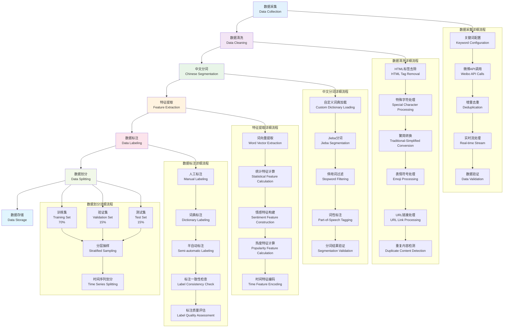
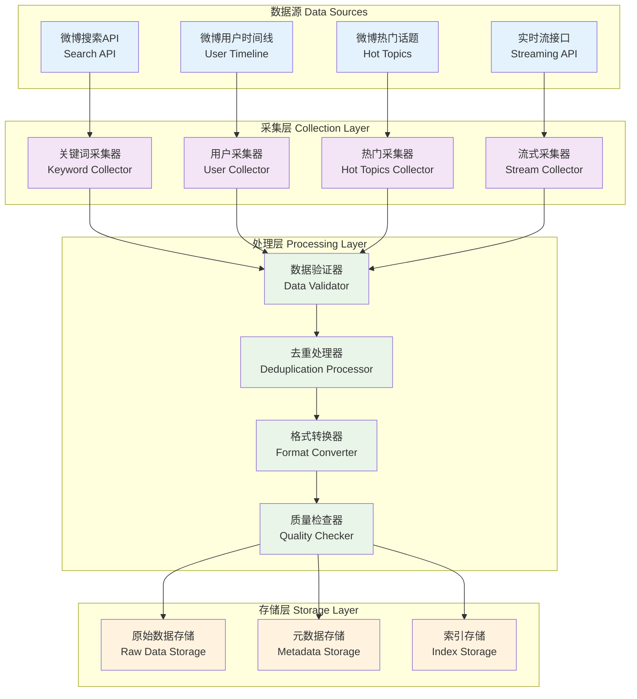
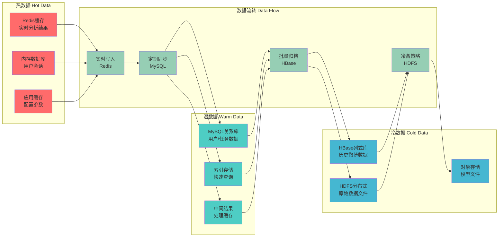

# 第5章 数据集准备 - 数据处理流程图

## 5.1 数据集处理流程图



## 5.2 数据采集详细流程

### 5.2.1 微博数据采集架构



### 5.2.2 数据采集算法实现

```python
class WeiboDataCollector:
    """微博数据采集器"""
    
    def __init__(self, config):
        self.keywords = config.get('keywords', [])
        self.user_ids = config.get('user_ids', [])
        self.collection_rate = config.get('rate', 1)  # 每秒采集次数
        self.deduplication_cache = set()
        self.session = requests.Session()
        
    def collect_by_keywords(self):
        """基于关键词的数据采集"""
        for keyword in self.keywords:
            try:
                # 1. 调用微博搜索API
                response = self.session.get(
                    f'https://m.weibo.cn/api/container/getIndex',
                    params={
                        'containerid': 100103type,
                        'q': keyword,
                        'count': 50
                    }
                )
                
                # 2. 数据验证
                if response.status_code == 200:
                    data = response.json()
                    posts = self.extract_posts(data)
                    
                    # 3. 去重处理
                    unique_posts = []
                    for post in posts:
                        post_id = post.get('id')
                        if post_id and post_id not in self.deduplication_cache:
                            self.deduplication_cache.add(post_id)
                            unique_posts.append(post)
                    
                    # 4. 存储数据
                    self.save_posts(unique_posts, keyword)
                    
            except Exception as e:
                self.log_error(f'关键词采集失败: {keyword}, 错误: {e}')
            
            # 5. 采集频率控制
            time.sleep(self.collection_rate)
    
    def collect_realtime_stream(self):
        """实时流数据采集"""
        while True:
            try:
                # 建立WebSocket连接
                ws = websocket.create_connection(
                    'wss://stream.weibo.com/2/status/sample'
                )
                
                for message in ws:
                    data = json.loads(message)
                    post = self.parse_stream_message(data)
                    
                    if post and self.is_relevant_post(post):
                        self.save_post(post)
                        
            except Exception as e:
                self.log_error(f'流采集异常: {e}')
                time.sleep(5)  # 重连间隔
```

## 5.3 数据清洗详细流程

### 5.3.1 文本预处理算法

```python
class TextPreprocessor:
    """文本预处理器"""
    
    def __init__(self):
        self.stopwords = self.load_stopwords()
        self.custom_dict = self.load_custom_dictionary()
        self.emoji_pattern = re.compile(
            r'[\U00010000-\U0010ffff\U00002600-\U000027bf\U000024c2-\U0001f251]'
        )
        
    def clean_text(self, text):
        """综合文本清洗"""
        if not text:
            return ""
            
        # 1. HTML标签去除
        text = re.sub(r'<[^>]+>', '', text)
        
        # 2. URL链接处理
        text = re.sub(r'http[s]?://\S+', '[URL]', text)
        
        # 3. @用户提及处理
        text = re.sub(r'@\w+', '[USER]', text)
        
        # 4. #话题标签处理
        text = re.sub(r'#\w+#', '[TOPIC]', text)
        
        # 5. 表情符号处理
        text = self.emoji_pattern.sub('[EMOJI]', text)
        
        # 6. 繁简转换
        text = self.traditional_to_simplified(text)
        
        # 7. 特殊字符处理
        text = re.sub(r'[^\u4e00-\u9fff\w\s]', '', text)
        
        # 8. 多余空格处理
        text = re.sub(r'\s+', ' ', text).strip()
        
        return text
    
    def segment_text(self, text):
        """中文分词处理"""
        # 1. 加载自定义词典
        jieba.load_userdict(self.custom_dict)
        
        # 2. 精确模式分词
        words = jieba.lcut(text, cut_all=False)
        
        # 3. 停用词过滤
        filtered_words = []
        for word in words:
            if (len(word) > 1 and 
                word not in self.stopwords and 
                not word.isdigit()):
                filtered_words.append(word)
        
        return filtered_words
```

### 5.3.2 数据质量评估

```python
class DataQualityAssessor:
    """数据质量评估器"""
    
    def assess_data_quality(self, dataset):
        """评估数据集质量"""
        metrics = {}
        
        # 1. 完整性评估
        metrics['completeness'] = {
            'total_records': len(dataset),
            'missing_values': self.count_missing_values(dataset),
            'completeness_rate': self.calculate_completeness(dataset)
        }
        
        # 2. 准确性评估
        metrics['accuracy'] = {
            'duplicate_rate': self.calculate_duplicate_rate(dataset),
            'format_consistency': self.check_format_consistency(dataset),
            'language_detection': self.detect_language_consistency(dataset)
        }
        
        # 3. 一致性评估
        metrics['consistency'] = {
            'timestamp_consistency': self.check_timestamp_consistency(dataset),
            'field_consistency': self.check_field_consistency(dataset),
            'value_range_consistency': self.check_value_ranges(dataset)
        }
        
        # 4. 及时性评估
        metrics['timeliness'] = {
            'data_freshness': self.calculate_freshness(dataset),
            'collection_delay': self.calculate_collection_delay(dataset),
            'update_frequency': self.calculate_update_frequency(dataset)
        }
        
        return metrics
    
    def generate_quality_report(self, metrics):
        """生成质量评估报告"""
        report = {
            'overall_score': self.calculate_overall_quality_score(metrics),
            'detailed_metrics': metrics,
            'recommendations': self.generate_improvement_recommendations(metrics)
        }
        
        return report
```

## 5.4 特征工程详细流程

### 5.4.1 情感特征构建

```python
class SentimentFeatureExtractor:
    """情感特征提取器"""
    
    def __init__(self):
        self.sentiment_dict = self.load_sentiment_dictionary()
        self.bert_tokenizer = AutoTokenizer.from_pretrained('bert-base-chinese')
        self.bert_model = AutoModel.from_pretrained('bert-base-chinese')
        
    def extract_sentiment_features(self, text):
        """提取情感特征"""
        features = {}
        
        # 1. 词典特征
        dict_features = self.extract_dictionary_features(text)
        features.update(dict_features)
        
        # 2. 统计特征
        stat_features = self.extract_statistical_features(text)
        features.update(stat_features)
        
        # 3. 语义特征
        semantic_features = self.extract_semantic_features(text)
        features.update(semantic_features)
        
        # 4. 上下文特征
        context_features = self.extract_context_features(text)
        features.update(context_features)
        
        return features
    
    def extract_dictionary_features(self, text):
        """词典特征提取"""
        words = jieba.lcut(text)
        
        # 正面情感词统计
        positive_words = [w for w in words if w in self.sentiment_dict and self.sentiment_dict[w] > 0]
        negative_words = [w for w in words if w in self.sentiment_dict and self.sentiment_dict[w] < 0]
        
        features = {
            'positive_word_count': len(positive_words),
            'negative_word_count': len(negative_words),
            'positive_word_ratio': len(positive_words) / len(words) if words else 0,
            'negative_word_ratio': len(negative_words) / len(words) if words else 0,
            'sentiment_word_ratio': (len(positive_words) + len(negative_words)) / len(words) if words else 0,
            'max_positive_score': max([self.sentiment_dict[w] for w in positive_words], default=0),
            'min_negative_score': min([self.sentiment_dict[w] for w in negative_words], default=0),
            'sentiment_intensity': sum([abs(self.sentiment_dict[w]) for w in words if w in self.sentiment_dict])
        }
        
        return features
```

### 5.4.2 BERT语义特征提取

```python
def extract_bert_features(self, text):
    """BERT语义特征提取"""
    # 1. 文本编码
    inputs = self.bert_tokenizer(
        text, 
        return_tensors='pt', 
        truncation=True, 
        padding=True, 
        max_length=512
    )
    
    # 2. BERT推理
    with torch.no_grad():
        outputs = self.bert_model(**inputs)
        last_hidden_states = outputs.last_hidden_state
        attention_weights = outputs.attentions
    
    # 3. 特征提取
    features = {
        # CLS向量特征
        'cls_embedding': last_hidden_states[:, 0, :].squeeze().numpy(),
        
        # 平均池化特征
        'mean_pooling': last_hidden_states.mean(dim=1).squeeze().numpy(),
        
        # 最大池化特征
        'max_pooling': last_hidden_states.max(dim=1).squeeze().numpy(),
        
        # 注意力特征
        'attention_entropy': self.calculate_attention_entropy(attention_weights),
        'attention_variance': self.calculate_attention_variance(attention_weights),
        
        # 序列长度特征
        'sequence_length': (inputs['attention_mask'].sum(dim=1)).item(),
        'padding_ratio': (inputs['attention_mask'] == 0).float().mean().item()
    }
    
    return features
```

## 5.5 数据存储策略

### 5.5.1 分层存储架构



### 5.5.2 数据分区策略

```python
class DataPartitioner:
    """数据分区器"""
    
    def partition_by_time(self, data, partition_unit='day'):
        """按时间分区"""
        if partition_unit == 'hour':
            return data.groupby(data['publish_time'].dt.floor('H'))
        elif partition_unit == 'day':
            return data.groupby(data['publish_time'].dt.date)
        elif partition_unit == 'week':
            return data.groupby(data['publish_time'].dt.to_period('W'))
        elif partition_unit == 'month':
            return data.groupby(data['publish_time'].dt.to_period('M'))
    
    def partition_by_sentiment(self, data):
        """按情感分区"""
        sentiment_bins = [-1, -0.5, 0, 0.5, 1]
        sentiment_labels = ['strong_negative', 'negative', 'neutral', 'positive', 'strong_positive']
        
        data['sentiment_category'] = pd.cut(
            data['sentiment_score'], 
            bins=sentiment_bins, 
            labels=sentiment_labels
        )
        
        return dict(list(data.groupby('sentiment_category')))
    
    def partition_by_popularity(self, data):
        """按热度分区"""
        popularity_percentiles = [0, 0.2, 0.4, 0.6, 0.8, 1.0]
        popularity_labels = ['very_low', 'low', 'medium', 'high', 'very_high']
        
        data['popularity_category'] = pd.qcut(
            data['popularity_score'], 
            q=popularity_percentiles, 
            labels=popularity_labels
        )
        
        return dict(list(data.groupby('popularity_category')))
```

## 5.6 数据质量监控

### 5.6.1 质量指标体系

| 质量维度 | 具体指标 | 计算方法 | 目标值 |
|---------|---------|----------|--------|
| **完整性** | 数据完整率 | (有效记录数 / 总记录数) × 100% | ≥ 95% |
| **完整性** | 字段缺失率 | (缺失字段数 / 总字段数) × 100% | ≤ 5% |
| **准确性** | 重复数据率 | (重复记录数 / 总记录数) × 100% | ≤ 2% |
| **准确性** | 格式一致性 | 符合格式的记录数 / 总记录数 | ≥ 98% |
| **一致性** | 时间戳一致性 | 有效时间戳记录数 / 总记录数 | ≥ 99% |
| **一致性** | 数值范围一致性 | 在合理范围内的记录数 / 总记录数 | ≥ 95% |
| **及时性** | 数据新鲜度 | (当前时间 - 最新数据时间) | ≤ 1小时 |
| **及时性** | 采集延迟 | 平均采集响应时间 | ≤ 2秒 |

### 5.6.2 质量监控实现

```python
class DataQualityMonitor:
    """数据质量监控器"""
    
    def __init__(self):
        self.quality_metrics = {}
        self.alert_thresholds = {
            'completeness_rate': 0.95,
            'duplicate_rate': 0.02,
            'format_consistency': 0.98,
            'freshness_hours': 1.0
        }
    
    def monitor_data_quality(self, dataset):
        """实时监控数据质量"""
        current_metrics = self.assess_data_quality(dataset)
        
        # 检查是否触发预警
        alerts = []
        for metric, threshold in self.alert_thresholds.items():
            if current_metrics.get(metric, 0) < threshold:
                alerts.append({
                    'metric': metric,
                    'current_value': current_metrics[metric],
                    'threshold': threshold,
                    'severity': 'high' if current_metrics[metric] < threshold * 0.8 else 'medium'
                })
        
        # 发送预警通知
        if alerts:
            self.send_quality_alerts(alerts)
        
        # 更新监控指标
        self.quality_metrics = current_metrics
        
        return current_metrics, alerts
    
    def generate_quality_dashboard(self):
        """生成质量监控仪表盘数据"""
        dashboard_data = {
            'overall_score': self.calculate_overall_quality_score(),
            'trend_data': self.get_quality_trends(),
            'alert_count': len(self.get_active_alerts()),
            'last_update': datetime.now().isoformat(),
            'metrics_breakdown': self.quality_metrics
        }
        
        return dashboard_data
```
