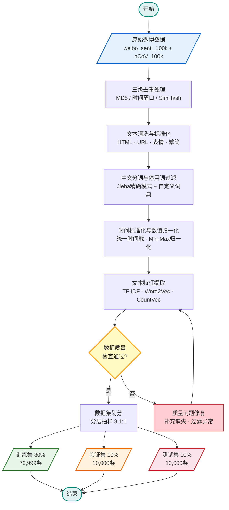
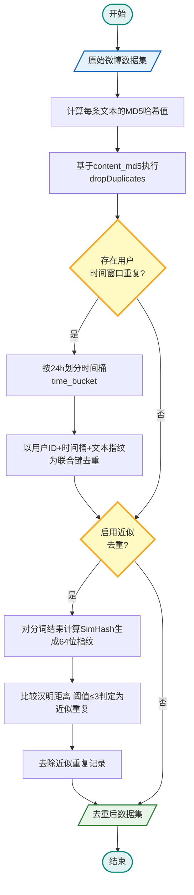
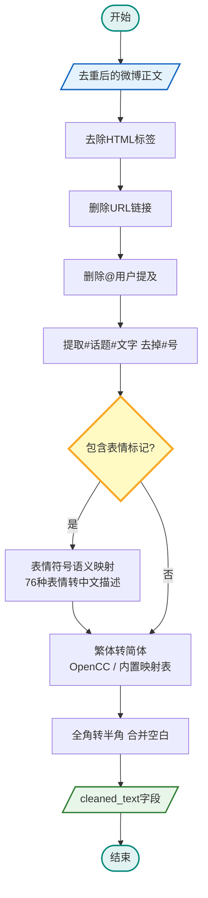
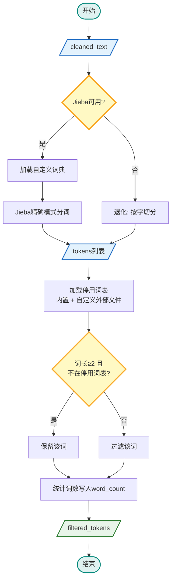
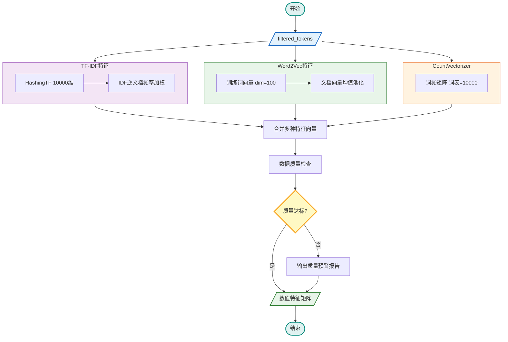
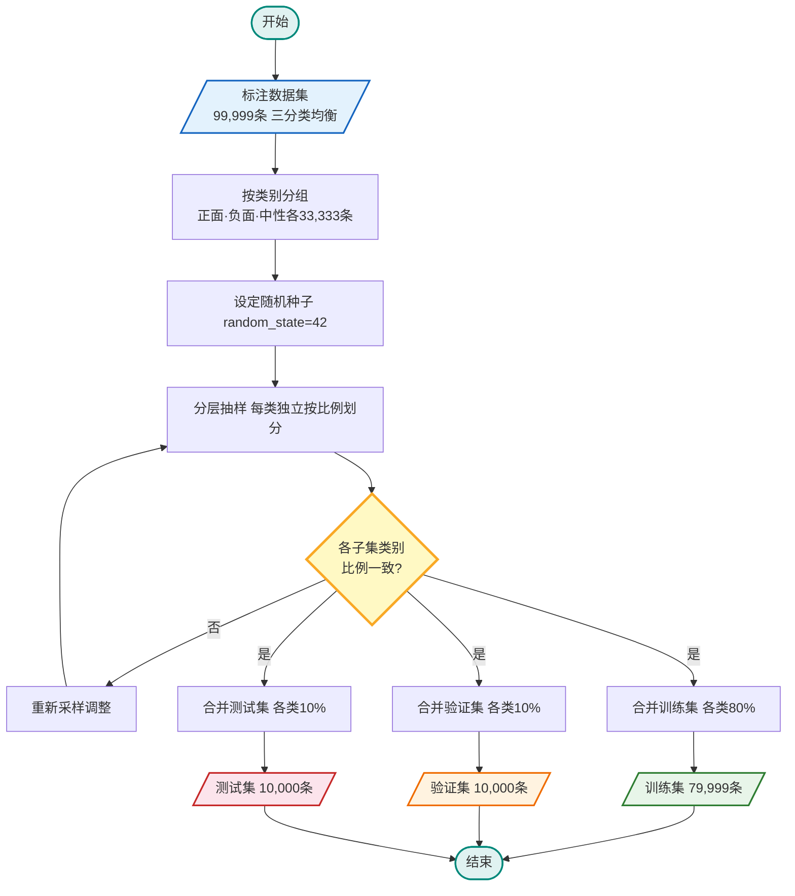

# 第5章 数据集准备

## 5.1 数据集采集

情感分析模型的训练效果在很大程度上取决于标注数据的质量和规模。本系统使用的标注数据集由两个公开的中文微博情感语料库合并而来。第一个是weibo_senti_100k，托管于HuggingFace平台（dirtycomputer/weibo_senti_100k），原始规模约12万条，每条数据包含一段微博评论文本和一个二分类标签（0表示负面，1表示正面）。第二个是nCoV_100k_train，该数据集采集于2020年初新冠疫情暴发期间，约10万条微博，标注体系为三分类（-1为负面，0为中性，1为正面）。选择这两个数据集的原因在于：前者提供了充足的正面和负面样本，后者则补充了中性类别，且两者均为真实微博文本，语言风格和噪声特征与系统实际采集的数据较为接近。

两个数据集合并后，原始数据存在两个问题：一是两个来源之间可能存在重复文本，二是类别数量不均衡——nCoV数据集中中性样本约占57%，远多于正面和负面。对此，系统先基于MD5哈希对文本进行去重，再按类别分别随机采样，使正面、负面、中性各保留33,333条，最终得到99,999条三分类标注数据。采样时固定随机种子为42，保证结果可复现。

除标注数据集外，系统还需要用于功能验证的微博采集数据。这部分数据通过系统自身的爬虫模块实时获取，用户在前端界面设定关键词、时间范围和采集数量后，后端调用爬虫通过微博移动端接口抓取微博正文、发布时间、用户信息、转发数、评论数、点赞数等字段。为应对微博的反爬机制，爬虫模块内置了User-Agent轮换、请求间隔随机化和失败自动重试策略。采集到的原始数据以JSON格式按日期分区写入HDFS，同时将任务状态和异常信息记录到MySQL的日志表中，便于追溯和监控。

完整的数据处理流程如图5-1所示，从原始数据采集开始，依次经过去重、文本清洗、标准化、分词去停用词、特征提取，最终输出可供模型训练和系统测试使用的规范化数据集。

### 图5-1 数据集处理总流程图

## 5.2 数据集预处理

微博文本的特点是短小、口语化强、噪声多。一条几十字的微博里可能同时出现HTML残留标签、URL链接、@提及、#话题标签#、表情符号、繁体字和全角标点，如果不加处理直接喂给模型，分词结果会很碎，特征也会变得稀疏。因此，系统在数据采集之后设计了一套相对完整的预处理流程。

这套流程的代码实现集中在`backend-python/spark/data_cleaner.py`中，核心类为`DataCleaner`。对外暴露的主入口是`clean_weibo_data()`方法，它内部依次调用去重、清洗、分词、停用词过滤、时间标准化、数值归一化和特征提取等步骤。

### 5.2.1 数据去重

采集到的微博数据中，重复来源主要有三种：爬虫分页抓取时的重叠、同一用户短时间内的刷屏转发、以及内容经过轻微改写但语义几乎相同的"洗稿"。针对这三种情况，系统的`remove_duplicates()`方法实现了三级去重，默认按`method='all'`依次执行。

第一级是MD5精确去重。系统对每条微博的正文计算MD5哈希值，生成`content_md5`字段，然后调用Spark的`dropDuplicates(['content_md5'])`删除文本完全一致的记录。

第二级是用户时间窗口去重。系统将微博发布时间按24小时划分时间桶（`time_bucket`），以用户ID、时间桶和文本指纹作为联合键，同一用户在同一天内发布的相同内容只保留一条。

第三级是SimHash近似去重。SimHash算法将分词后的文本映射为64位指纹，通过比较两个指纹之间的汉明距离来判断相似程度。系统代码中保留了阈值参数（默认为3），实现近似重复的过滤。

三级去重的详细流程如图5-2所示。

### 图5-2 三级去重流程图

### 5.2.2 数据清洗与文本标准化

去重完成后，下一步是对微博正文做清洗。这部分由`_clean_text_impl()`方法实现，通过Spark UDF在分布式环境下并行执行。

第一步是去除HTML标签和URL链接。系统用正则表达式将它们统一删除。第二步是处理@提及和#话题#。@用户名直接删除；话题标签只去掉两侧的#号，保留中间的话题文字。第三步是表情符号转换——系统设计了一个`EmojiConverter`类，内置了76种常见微博表情到中文描述的映射关系。部分示例如表5-1所示。

### 表5-1 微博表情符号转换示例

| 原始表情 | 转换结果 | 情感倾向 |
|---------|---------|---------|
| [哈哈] | 开心大笑 | 正面 |
| [心] | 爱心喜欢 | 正面 |
| [赞] | 点赞好评 | 正面 |
| [怒] | 生气愤怒 | 负面 |
| [泪] | 伤心难过 | 负面 |
| [衰] | 倒霉不好 | 负面 |
| [思考] | 正在思考 | 中性 |
| [围观] | 围观关注 | 中性 |

第四步是字符层面的标准化。系统调用OpenCC将繁体中文转换为简体中文，如果运行环境中没有安装OpenCC，则回退到内置的高频繁简映射表。同时，系统将全角字符转换为半角形式，并把连续的空白字符合并为单个空格。清洗后的文本保存在`cleaned_text`字段中。

文本清洗的详细流程如图5-3所示。

### 图5-3 文本清洗流程图

### 5.2.3 文本分词与去停用词

中文词与词之间没有空格，必须先做分词才能进行特征提取。系统使用Jieba分词工具，采用精确模式（`cut_all=False`），分词逻辑封装在`_tokenize_impl()`方法中，以Spark UDF的形式并行执行。如果环境中没有安装Jieba，系统会退化为按字切分的方式，保证流程不会中断。

系统在分词前加载了一份自定义词典，收录了"微博""热搜""超话""转发""点赞""评论""粉丝""大V""人工智能""深度学习""情感分析""舆情监控"等词汇。分词结果保存为`tokens`字段，同时统计每条微博的词数写入`word_count`。

分词之后是停用词过滤。系统内置了一份停用词表，涵盖常见虚词、连词介词、代词、标点符号以及部分网络口语词。过滤时同时剔除长度小于2的词语，减少单字噪声。处理后的结果保存在`filtered_tokens`字段。

分词与停用词过滤的详细流程如图5-4所示。

### 图5-4 中文分词与停用词过滤流程图

### 5.2.4 时间标准化与数值归一化

时间字段的标准化由`standardize_time()`方法完成。系统通过Spark的`coalesce()`函数依次尝试多种解析格式，最终统一转换为标准时间戳，存入`timestamp`字段。解析完成后，系统还会提取发布小时（`hour`）、星期几（`day_of_week`）和是否周末（`is_weekend`）三个辅助特征。

互动指标方面，系统的`normalize_numeric()`方法提供了两种归一化方式。默认使用Min-Max归一化，将数值映射到[0,1]区间：

$$X_{norm} = \frac{X - X_{min}}{X_{max} - X_{min}} \quad \text{(5-1)}$$

当数据中存在较多异常值时，也可以选择Z-Score标准化：

$$X_{std} = \frac{X - \mu}{\sigma} \quad \text{(5-2)}$$

其中$\mu$为均值，$\sigma$为标准差。归一化后的指标作为三维度排序模型中互动热度维度的输入。

### 5.2.5 文本特征提取与数据质量检查

系统提供了三种特征提取方法：

第一种是**TF-IDF**。使用Spark MLlib的HashingTF加IDF两步管线，将`filtered_tokens`映射为10000维的TF-IDF特征向量。其计算公式为：

$$\text{TF-IDF}(t,d) = \text{TF}(t,d) \times \log\frac{N}{1 + \text{DF}(t)} \quad \text{(5-3)}$$

第二种是**Word2Vec**。将每个词映射为100维的稠密向量，设置最小词频阈值为5。

第三种是**CountVectorizer**，基于词袋模型构建词频特征，默认词表大小10000，最小文档频率为2.0。

在特征提取完成后，`generate_quality_report()`方法会统计数据集的总记录数、各字段的空值数量、文本长度分布以及词数分布。

特征提取的完整流程如图5-5所示。

### 图5-5 文本特征提取流程图

### 5.2.6 数据集划分

划分比例为8:1:1，即80%用于训练、10%用于验证、10%用于测试。划分时采用分层抽样，即分别从正面、负面、中性三类中各按8:1:1的比例抽取，然后合并成三个子集。训练脚本中将随机种子固定为42，保证每次运行得到相同的划分结果。划分完成后的数据以Parquet格式存储。

数据集划分的完整流程如图5-6所示。

### 图5-6 数据集划分流程图

### 表5-2 数据集划分结果统计

| 子集 | 总样本数 | 正面 | 负面 | 中性 | 用途 |
|:---:|:---:|:---:|:---:|:---:|------|
| 训练集 | 79,999 | 26,666 | 26,666 | 26,667 | 模型参数学习 |
| 验证集 | 10,000 | 3,334 | 3,333 | 3,333 | 超参调优与早停判断 |
| 测试集 | 10,000 | 3,334 | 3,333 | 3,333 | 最终性能评估（完全隔离） |
| **合计** | **99,999** | **33,334** | **33,332** | **33,333** | — |

## 5.3 本章小结

本章介绍了数据集的准备过程。标注数据集由weibo_senti_100k（约12万条，正/负二分类）和nCoV_100k（约10万条，正/负/中三分类）两个公开语料库合并而成，经MD5去重和均衡采样后形成约10万条三分类数据，正面、负面、中性各约3.3万条。系统功能测试数据则通过自身的爬虫模块从微博实时采集。

预处理环节涵盖了数据去重（MD5精确去重、用户时间窗口去重、SimHash近似去重）、文本清洗（HTML标签、URL、@提及、话题标签处理，76种表情符号转换，繁简转换和全角半角统一）、中文分词与停用词过滤、时间标准化与互动指标归一化、以及TF-IDF、Word2Vec等多种特征提取方法。最后按照8:1:1的比例采用分层抽样将数据集划分为训练集、验证集和测试集，随机种子固定为42。经过这一系列处理，原始的、噪声较多的微博数据被转化为格式统一、质量可控的数据集，为后续的模型训练和系统测试打下了基础。
