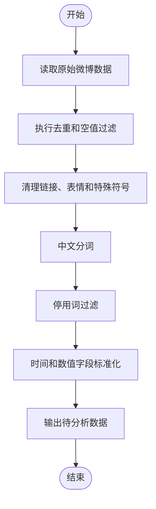
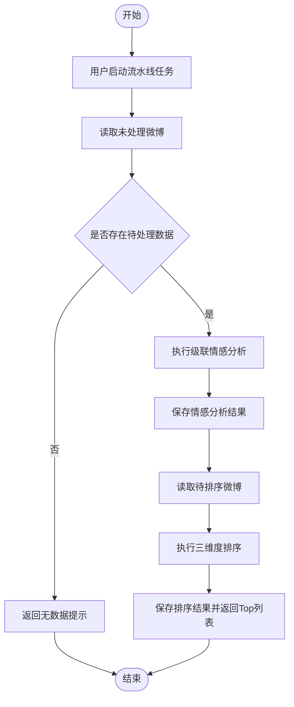
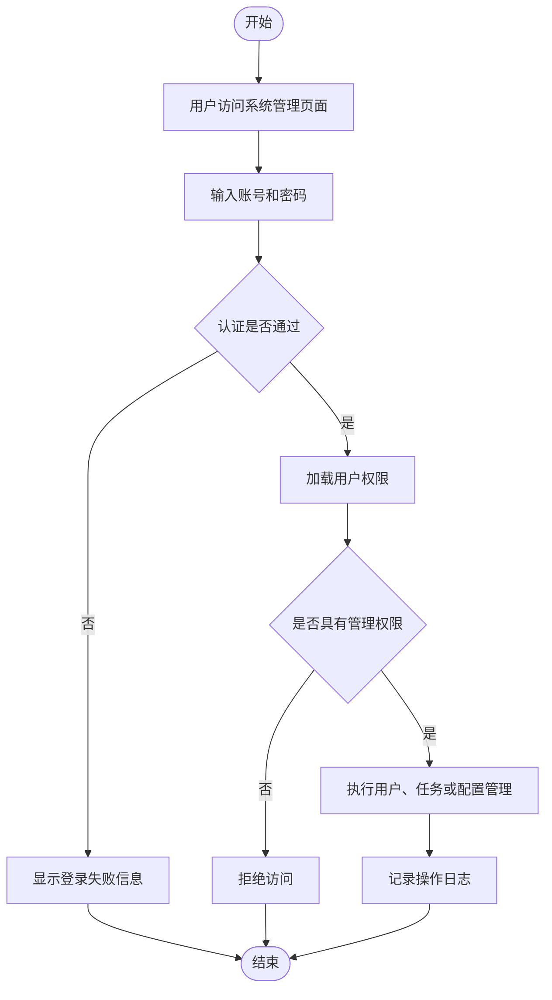
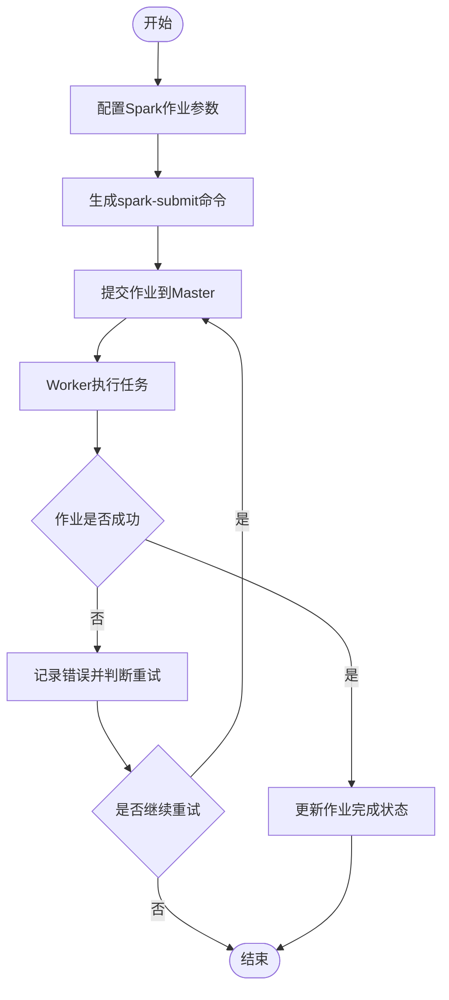
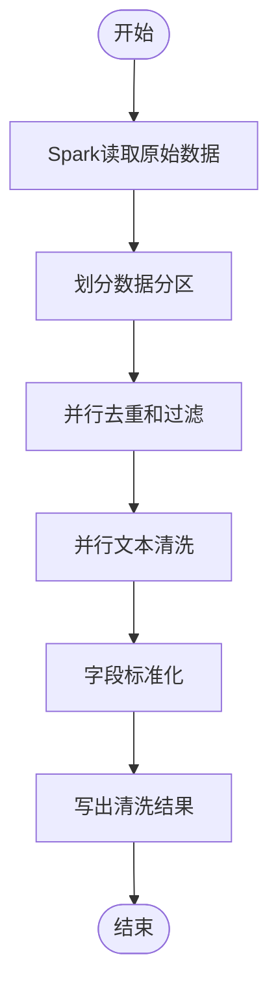
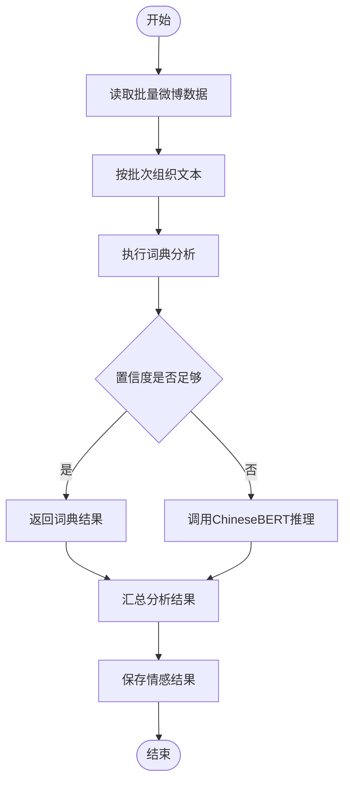
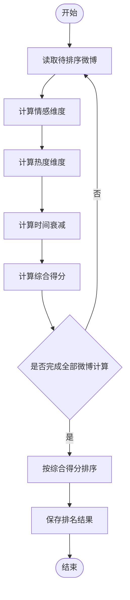
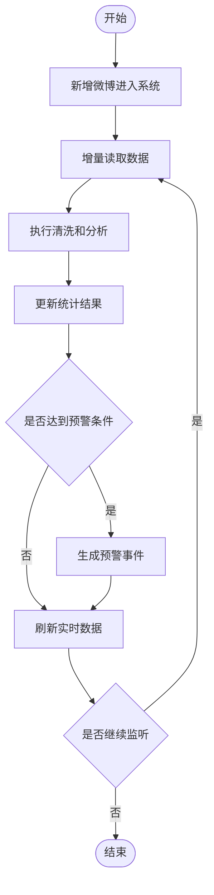

# 第6章 系统详细设计与实现

本章围绕系统实际工程实现，对前端功能模块、后端服务模块和大数据处理模块进行说明。为保证论文结构统一，第六章每个模块均严格按照第一部分：功能介绍及流程图、第二部分：界面截图描述、第三部分：核心代码的三段式结构撰写。其中，第一部分从用户角度和系统角度说明模块功能定位、设计目标、技术选型和业务流程，并在末尾附 Mermaid 功能流程图；第二部分描述页面布局、功能区域和用户操作；第三部分给出具有实际意义的核心代码片段，完整代码可在附录或项目源码中查看。

## 6.1 前端功能模块实现

前端工程位于 `web-frontend` 目录，采用 Vue 3 组件化方式实现，主要承担用户交互、任务配置、状态展示和可视化分析职责。前端不直接执行模型推理和数据库写入，而是通过 HTTP API 调用 Flask 与 Spring Boot 后端服务。

### 6.1.1 数据采集模块

#### 第一部分：功能介绍及流程图

数据采集模块的功能定位是采集微博数据并形成后续分析所需的数据源。从用户角度看，该模块需要提供清晰的操作入口、明确的状态反馈和可理解的结果展示，使用户能够在不理解底层算法细节的情况下完成业务操作。从系统角度看，该模块需要与前端页面、后端接口、数据库表和分析服务协同工作，保证数据能够按照既定流程稳定流转。

在设计目标上，数据采集模块重点考虑易用性、稳定性和可扩展性。易用性体现在界面操作步骤清晰，用户能够快速完成任务；稳定性体现在后端需要处理参数校验、异常返回和数据持久化；可扩展性体现在后续可以根据业务规模增加更多配置项或处理策略。该模块涉及的技术选型主要包括Vue 3 表单组件、Flask/Spring Boot 接口和 MySQL 存储，选择这些技术的原因是它们能够分别满足界面交互、业务处理、数据存储和分析计算需求。

该模块的核心业务流程为：前端负责参数输入和状态展示，后端负责任务创建、爬虫调度、异常记录和数据落库。整体流程遵循用户操作前端请求后端处理数据库操作返回结果的链路，保证功能实现与系统总体架构保持一致。


图6-1 数据采集模块流程图

#### 第二部分：界面截图描述

图6-2 数据采集页面展示的是数据采集模块的实际页面效果，实际截图后续可手动插入论文。该页面通常由顶部标题区、参数或筛选区、操作按钮区、结果展示区和状态反馈区组成。标题区用于说明当前功能位置，参数区用于输入业务条件，操作区用于触发查询、分析或管理动作，结果区用于展示后端返回的数据，状态区用于提示任务执行情况或异常信息。

用户在该界面上可以完成与数据采集相关的主要操作，例如配置参数、提交任务、查看结果、刷新状态和检查异常提示。界面设计时需要保证关键按钮位置清晰，表格和图表信息层次明确，使用户能够快速理解系统当前处理进度和分析结果。

#### 第三部分：核心代码

平台数据采集模块的部分核心代码如下：

```javascript
const payload = { keyword: form.keyword, limit: form.limit, start_time: form.startTime, end_time: form.endTime }
const result = await request.post('/api/crawler/start', payload)
taskId.value = result.data.task_id
await refreshTaskStatus(taskId.value)
```

如果需要展示完整业务实现，可在论文附录中补充完整代码。

### 6.1.2 数据预处理模块

#### 第一部分：功能介绍及流程图

数据预处理模块的功能定位是提升文本质量并减少噪声数据对模型分析的影响。从用户角度看，该模块需要提供清晰的操作入口、明确的状态反馈和可理解的结果展示，使用户能够在不理解底层算法细节的情况下完成业务操作。从系统角度看，该模块需要与前端页面、后端接口、数据库表和分析服务协同工作，保证数据能够按照既定流程稳定流转。

在设计目标上，数据预处理模块重点考虑易用性、稳定性和可扩展性。易用性体现在界面操作步骤清晰，用户能够快速完成任务；稳定性体现在后端需要处理参数校验、异常返回和数据持久化；可扩展性体现在后续可以根据业务规模增加更多配置项或处理策略。该模块涉及的技术选型主要包括Python 文本处理、Jieba 分词和 Spark 批处理，选择这些技术的原因是它们能够分别满足界面交互、业务处理、数据存储和分析计算需求。

该模块的核心业务流程为：用户触发预处理任务后，前端提交数据范围，后端读取原始数据并完成清洗，最后保存标准化结果。整体流程遵循用户操作前端请求后端处理数据库操作返回结果的链路，保证功能实现与系统总体架构保持一致。



图6-3 数据预处理模块流程图

#### 第二部分：界面截图描述

图6-4 数据预处理页面展示的是数据预处理模块的实际页面效果，实际截图后续可手动插入论文。该页面通常由顶部标题区、参数或筛选区、操作按钮区、结果展示区和状态反馈区组成。标题区用于说明当前功能位置，参数区用于输入业务条件，操作区用于触发查询、分析或管理动作，结果区用于展示后端返回的数据，状态区用于提示任务执行情况或异常信息。

用户在该界面上可以完成与数据预处理相关的主要操作，例如配置参数、提交任务、查看结果、刷新状态和检查异常提示。界面设计时需要保证关键按钮位置清晰，表格和图表信息层次明确，使用户能够快速理解系统当前处理进度和分析结果。

#### 第三部分：核心代码

平台数据预处理模块的部分核心代码如下：

```python
def clean_text(text: str) -> str:
    text = re.sub(r'http\S+', '', text)
    text = re.sub(r'@\S+', '', text)
    text = re.sub(r'[^\u4e00-\u9fa5A-Za-z0-9]', ' ', text)
    return text.strip()
```

如果需要展示完整业务实现，可在论文附录中补充完整代码。

### 6.1.3 情感分析模块

#### 第一部分：功能介绍及流程图

情感分析模块的功能定位是完成微博文本正面、负面和中性三分类。从用户角度看，该模块需要提供清晰的操作入口、明确的状态反馈和可理解的结果展示，使用户能够在不理解底层算法细节的情况下完成业务操作。从系统角度看，该模块需要与前端页面、后端接口、数据库表和分析服务协同工作，保证数据能够按照既定流程稳定流转。

在设计目标上，情感分析模块重点考虑易用性、稳定性和可扩展性。易用性体现在界面操作步骤清晰，用户能够快速完成任务；稳定性体现在后端需要处理参数校验、异常返回和数据持久化；可扩展性体现在后续可以根据业务规模增加更多配置项或处理策略。该模块涉及的技术选型主要包括情感词典、ChineseBERT、Flask API 和模型单例加载，选择这些技术的原因是它们能够分别满足界面交互、业务处理、数据存储和分析计算需求。

该模块的核心业务流程为：用户发起分析后，后端先执行词典分析，再根据置信度决定是否调用 ChineseBERT，最后将结果写入情感分析表。整体流程遵循用户操作前端请求后端处理数据库操作返回结果的链路，保证功能实现与系统总体架构保持一致。


图6-5 情感分析模块流程图

#### 第二部分：界面截图描述

图6-6 情感分析页面展示的是情感分析模块的实际页面效果，实际截图后续可手动插入论文。该页面通常由顶部标题区、参数或筛选区、操作按钮区、结果展示区和状态反馈区组成。标题区用于说明当前功能位置，参数区用于输入业务条件，操作区用于触发查询、分析或管理动作，结果区用于展示后端返回的数据，状态区用于提示任务执行情况或异常信息。

用户在该界面上可以完成与情感分析相关的主要操作，例如配置参数、提交任务、查看结果、刷新状态和检查异常提示。界面设计时需要保证关键按钮位置清晰，表格和图表信息层次明确，使用户能够快速理解系统当前处理进度和分析结果。

#### 第三部分：核心代码

平台情感分析模块的部分核心代码如下：

```python
def analyze(self, text: str) -> Dict:
    dict_label, dict_score = SentimentLexicon.analyze(text)
    dict_confidence = abs(dict_score)
    if dict_confidence > self.config.confidence_threshold or self._bert is None:
        return {'sentiment_class': dict_label, 'score': dict_score, 'confidence': dict_confidence, 'method': 'cascade-lexicon'}
    bert_result = self._bert.predict(text)
    return {'sentiment_class': bert_result['label'], 'score': bert_result['score'], 'confidence': bert_result['confidence'], 'method': 'cascade-bert'}
```

如果需要展示完整业务实现，可在论文附录中补充完整代码。

### 6.1.4 热点话题分析模块

#### 第一部分：功能介绍及流程图

热点话题分析模块的功能定位是发现微博数据中的高频关键词、热门话题和重点微博。从用户角度看，该模块需要提供清晰的操作入口、明确的状态反馈和可理解的结果展示，使用户能够在不理解底层算法细节的情况下完成业务操作。从系统角度看，该模块需要与前端页面、后端接口、数据库表和分析服务协同工作，保证数据能够按照既定流程稳定流转。

在设计目标上，热点话题分析模块重点考虑易用性、稳定性和可扩展性。易用性体现在界面操作步骤清晰，用户能够快速完成任务；稳定性体现在后端需要处理参数校验、异常返回和数据持久化；可扩展性体现在后续可以根据业务规模增加更多配置项或处理策略。该模块涉及的技术选型主要包括Jieba 分词、词频统计、ECharts 词云和数据库聚合查询，选择这些技术的原因是它们能够分别满足界面交互、业务处理、数据存储和分析计算需求。

该模块的核心业务流程为：前端提交筛选条件，后端统计关键词并关联情感及互动指标，最终返回词云和热门微博数据。整体流程遵循用户操作前端请求后端处理数据库操作返回结果的链路，保证功能实现与系统总体架构保持一致。


图6-7 热点话题分析模块流程图

#### 第二部分：界面截图描述

图6-8 热点话题分析页面展示的是热点话题分析模块的实际页面效果，实际截图后续可手动插入论文。该页面通常由顶部标题区、参数或筛选区、操作按钮区、结果展示区和状态反馈区组成。标题区用于说明当前功能位置，参数区用于输入业务条件，操作区用于触发查询、分析或管理动作，结果区用于展示后端返回的数据，状态区用于提示任务执行情况或异常信息。

用户在该界面上可以完成与热点话题分析相关的主要操作，例如配置参数、提交任务、查看结果、刷新状态和检查异常提示。界面设计时需要保证关键按钮位置清晰，表格和图表信息层次明确，使用户能够快速理解系统当前处理进度和分析结果。

#### 第三部分：核心代码

平台热点话题分析模块的部分核心代码如下：

```python
from collections import Counter

def build_wordcloud_data(texts):
    counter = Counter()
    for text in texts:
        words = jieba.lcut(text)
        counter.update(w for w in words if w not in stop_words and len(w) > 1)
    return [{'name': word, 'value': count} for word, count in counter.most_common(100)]
```

如果需要展示完整业务实现，可在论文附录中补充完整代码。

### 6.1.5 实时舆情监控模块

#### 第一部分：功能介绍及流程图

实时舆情监控模块的功能定位是持续观察系统运行状态和舆情变化。从用户角度看，该模块需要提供清晰的操作入口、明确的状态反馈和可理解的结果展示，使用户能够在不理解底层算法细节的情况下完成业务操作。从系统角度看，该模块需要与前端页面、后端接口、数据库表和分析服务协同工作，保证数据能够按照既定流程稳定流转。

在设计目标上，实时舆情监控模块重点考虑易用性、稳定性和可扩展性。易用性体现在界面操作步骤清晰，用户能够快速完成任务；稳定性体现在后端需要处理参数校验、异常返回和数据持久化；可扩展性体现在后续可以根据业务规模增加更多配置项或处理策略。该模块涉及的技术选型主要包括Vue 定时轮询、Flask 状态接口、统计接口和预警阈值判断，选择这些技术的原因是它们能够分别满足界面交互、业务处理、数据存储和分析计算需求。

该模块的核心业务流程为：用户打开监控页面后，前端周期性请求后端状态接口，后端返回任务状态、情感分布和异常信息，前端实时刷新页面。整体流程遵循用户操作前端请求后端处理数据库操作返回结果的链路，保证功能实现与系统总体架构保持一致。


图6-9 实时舆情监控模块流程图

#### 第二部分：界面截图描述

图6-10 实时舆情监控页面展示的是实时舆情监控模块的实际页面效果，实际截图后续可手动插入论文。该页面通常由顶部标题区、参数或筛选区、操作按钮区、结果展示区和状态反馈区组成。标题区用于说明当前功能位置，参数区用于输入业务条件，操作区用于触发查询、分析或管理动作，结果区用于展示后端返回的数据，状态区用于提示任务执行情况或异常信息。

用户在该界面上可以完成与实时舆情监控相关的主要操作，例如配置参数、提交任务、查看结果、刷新状态和检查异常提示。界面设计时需要保证关键按钮位置清晰，表格和图表信息层次明确，使用户能够快速理解系统当前处理进度和分析结果。

#### 第三部分：核心代码

平台实时舆情监控模块的部分核心代码如下：

```javascript
let timer = null
onMounted(() => {
  timer = setInterval(async () => {
    const res = await request.get('/api/pipeline/status')
    monitorState.value = res.data
  }, 5000)
})
onUnmounted(() => clearInterval(timer))
```

如果需要展示完整业务实现，可在论文附录中补充完整代码。

### 6.1.6 数据流水线管理模块

#### 第一部分：功能介绍及流程图

数据流水线管理模块的功能定位是串联采集、分析、排序和结果入库过程。从用户角度看，该模块需要提供清晰的操作入口、明确的状态反馈和可理解的结果展示，使用户能够在不理解底层算法细节的情况下完成业务操作。从系统角度看，该模块需要与前端页面、后端接口、数据库表和分析服务协同工作，保证数据能够按照既定流程稳定流转。

在设计目标上，数据流水线管理模块重点考虑易用性、稳定性和可扩展性。易用性体现在界面操作步骤清晰，用户能够快速完成任务；稳定性体现在后端需要处理参数校验、异常返回和数据持久化；可扩展性体现在后续可以根据业务规模增加更多配置项或处理策略。该模块涉及的技术选型主要包括Flask API、PipelineService、MySQL 和后台线程，选择这些技术的原因是它们能够分别满足界面交互、业务处理、数据存储和分析计算需求。

该模块的核心业务流程为：用户触发任务后，后端从数据库读取待处理数据，依次完成情感分析和三维度排序，并将结果写回数据库。整体流程遵循用户操作前端请求后端处理数据库操作返回结果的链路，保证功能实现与系统总体架构保持一致。



图6-11 数据流水线管理模块流程图

#### 第二部分：界面截图描述

图6-12 数据流水线管理页面展示的是数据流水线管理模块的实际页面效果，实际截图后续可手动插入论文。该页面通常由顶部标题区、参数或筛选区、操作按钮区、结果展示区和状态反馈区组成。标题区用于说明当前功能位置，参数区用于输入业务条件，操作区用于触发查询、分析或管理动作，结果区用于展示后端返回的数据，状态区用于提示任务执行情况或异常信息。

用户在该界面上可以完成与数据流水线管理相关的主要操作，例如配置参数、提交任务、查看结果、刷新状态和检查异常提示。界面设计时需要保证关键按钮位置清晰，表格和图表信息层次明确，使用户能够快速理解系统当前处理进度和分析结果。

#### 第三部分：核心代码

平台数据流水线管理模块的部分核心代码如下：

```python
def run_pipeline(self, limit: int = 500) -> Dict:
    db = get_db_service()
    unprocessed = db.get_unprocessed_weibos(limit=limit)
    sentiment_results = self.sentiment_stage.analyze_batch(unprocessed)
    db.save_sentiment_results(sentiment_results)
    unranked = db.get_unranked_weibos(limit=limit)
    ranked = self.ranking_stage.rank(unranked)
    db.save_tri_dimension_results(ranked, batch_id)
    return {'status': 'completed', 'top_ranked': ranked[:10]}
```

如果需要展示完整业务实现，可在论文附录中补充完整代码。

### 6.1.7 可视化展示模块

#### 第一部分：功能介绍及流程图

可视化展示模块的功能定位是将后端统计数据转换为图表和表格。从用户角度看，该模块需要提供清晰的操作入口、明确的状态反馈和可理解的结果展示，使用户能够在不理解底层算法细节的情况下完成业务操作。从系统角度看，该模块需要与前端页面、后端接口、数据库表和分析服务协同工作，保证数据能够按照既定流程稳定流转。

在设计目标上，可视化展示模块重点考虑易用性、稳定性和可扩展性。易用性体现在界面操作步骤清晰，用户能够快速完成任务；稳定性体现在后端需要处理参数校验、异常返回和数据持久化；可扩展性体现在后续可以根据业务规模增加更多配置项或处理策略。该模块涉及的技术选型主要包括Vue 3、ECharts、统计接口和组件化图表，选择这些技术的原因是它们能够分别满足界面交互、业务处理、数据存储和分析计算需求。

该模块的核心业务流程为：用户选择筛选条件后，前端请求后端统计接口，后端返回结构化数据，前端根据图表类型完成渲染。整体流程遵循用户操作前端请求后端处理数据库操作返回结果的链路，保证功能实现与系统总体架构保持一致。


图6-13 可视化展示模块流程图

#### 第二部分：界面截图描述

图6-14 可视化展示页面展示的是可视化展示模块的实际页面效果，实际截图后续可手动插入论文。该页面通常由顶部标题区、参数或筛选区、操作按钮区、结果展示区和状态反馈区组成。标题区用于说明当前功能位置，参数区用于输入业务条件，操作区用于触发查询、分析或管理动作，结果区用于展示后端返回的数据，状态区用于提示任务执行情况或异常信息。

用户在该界面上可以完成与可视化展示相关的主要操作，例如配置参数、提交任务、查看结果、刷新状态和检查异常提示。界面设计时需要保证关键按钮位置清晰，表格和图表信息层次明确，使用户能够快速理解系统当前处理进度和分析结果。

#### 第三部分：核心代码

平台可视化展示模块的部分核心代码如下：

```javascript
const option = {
  tooltip: { trigger: 'item' },
  series: [{
    type: 'pie',
    radius: ['40%', '70%'],
    data: sentimentDistribution.value
  }]
}
chart.setOption(option)
```

如果需要展示完整业务实现，可在论文附录中补充完整代码。

### 6.1.8 系统管理模块

#### 第一部分：功能介绍及流程图

系统管理模块的功能定位是支撑用户认证、权限控制、任务管理和配置维护。从用户角度看，该模块需要提供清晰的操作入口、明确的状态反馈和可理解的结果展示，使用户能够在不理解底层算法细节的情况下完成业务操作。从系统角度看，该模块需要与前端页面、后端接口、数据库表和分析服务协同工作，保证数据能够按照既定流程稳定流转。

在设计目标上，系统管理模块重点考虑易用性、稳定性和可扩展性。易用性体现在界面操作步骤清晰，用户能够快速完成任务；稳定性体现在后端需要处理参数校验、异常返回和数据持久化；可扩展性体现在后续可以根据业务规模增加更多配置项或处理策略。该模块涉及的技术选型主要包括Spring Boot、权限判断、管理控制器和日志记录，选择这些技术的原因是它们能够分别满足界面交互、业务处理、数据存储和分析计算需求。

该模块的核心业务流程为：用户登录后，系统根据权限展示管理入口，管理员可维护用户、任务、配置和日志信息。整体流程遵循用户操作前端请求后端处理数据库操作返回结果的链路，保证功能实现与系统总体架构保持一致。



图6-15 系统管理模块流程图

#### 第二部分：界面截图描述

图6-16 系统管理页面展示的是系统管理模块的实际页面效果，实际截图后续可手动插入论文。该页面通常由顶部标题区、参数或筛选区、操作按钮区、结果展示区和状态反馈区组成。标题区用于说明当前功能位置，参数区用于输入业务条件，操作区用于触发查询、分析或管理动作，结果区用于展示后端返回的数据，状态区用于提示任务执行情况或异常信息。

用户在该界面上可以完成与系统管理相关的主要操作，例如配置参数、提交任务、查看结果、刷新状态和检查异常提示。界面设计时需要保证关键按钮位置清晰，表格和图表信息层次明确，使用户能够快速理解系统当前处理进度和分析结果。

#### 第三部分：核心代码

平台系统管理模块的部分核心代码如下：

```java
@SpringBootApplication
@ComponentScan(basePackages = "com.weibo")
public class WebApplication {
    public static void main(String[] args) {
        SpringApplication.run(WebApplication.class, args);
    }
}
```

如果需要展示完整业务实现，可在论文附录中补充完整代码。

## 6.2 后端服务模块实现

后端服务采用 Java Spring Boot 与 Python Flask 双后端协同架构。Spring Boot 负责用户认证、任务管理和系统管理等结构化业务；Flask 负责情感分析、三维度排序、数据流水线和 Spark 调度等算法密集型业务。

### 6.2.1 Java Spring Boot 后端

#### 第一部分：功能介绍及流程图

Java Spring Boot 后端模块的功能定位是处理认证、采集任务、仪表盘和系统管理等结构化业务。从用户角度看，该模块需要提供清晰的操作入口、明确的状态反馈和可理解的结果展示，使用户能够在不理解底层算法细节的情况下完成业务操作。从系统角度看，该模块需要与前端页面、后端接口、数据库表和分析服务协同工作，保证数据能够按照既定流程稳定流转。

在设计目标上，Java Spring Boot 后端模块重点考虑易用性、稳定性和可扩展性。易用性体现在界面操作步骤清晰，用户能够快速完成任务；稳定性体现在后端需要处理参数校验、异常返回和数据持久化；可扩展性体现在后续可以根据业务规模增加更多配置项或处理策略。该模块涉及的技术选型主要包括Spring Boot、REST Controller、Service 分层和 MySQL，选择这些技术的原因是它们能够分别满足界面交互、业务处理、数据存储和分析计算需求。

该模块的核心业务流程为：前端请求进入控制器后，后端校验参数、调用业务层、访问数据库，并返回统一 JSON 响应。整体流程遵循用户操作前端请求后端处理数据库操作返回结果的链路，保证功能实现与系统总体架构保持一致。


图6-17 Java Spring Boot 后端流程图

#### 第二部分：界面截图描述

图6-18 Spring Boot 后端支撑页面展示的是Java Spring Boot 后端模块的实际页面效果，实际截图后续可手动插入论文。该页面通常由顶部标题区、参数或筛选区、操作按钮区、结果展示区和状态反馈区组成。标题区用于说明当前功能位置，参数区用于输入业务条件，操作区用于触发查询、分析或管理动作，结果区用于展示后端返回的数据，状态区用于提示任务执行情况或异常信息。

用户在该界面上可以完成与Java Spring Boot 后端相关的主要操作，例如配置参数、提交任务、查看结果、刷新状态和检查异常提示。界面设计时需要保证关键按钮位置清晰，表格和图表信息层次明确，使用户能够快速理解系统当前处理进度和分析结果。

#### 第三部分：核心代码

平台Java Spring Boot 后端模块的部分核心代码如下：

```java
@RestController
@RequestMapping("/api/auth")
public class AuthController {
    @PostMapping("/login")
    public Result login(@RequestBody LoginRequest request) {
        return authService.login(request);
    }
}
```

如果需要展示完整业务实现，可在论文附录中补充完整代码。

### 6.2.2 Python Flask 后端

#### 第一部分：功能介绍及流程图

Python Flask 后端模块的功能定位是承载情感分析、排序、流水线和 Spark 调度等算法业务。从用户角度看，该模块需要提供清晰的操作入口、明确的状态反馈和可理解的结果展示，使用户能够在不理解底层算法细节的情况下完成业务操作。从系统角度看，该模块需要与前端页面、后端接口、数据库表和分析服务协同工作，保证数据能够按照既定流程稳定流转。

在设计目标上，Python Flask 后端模块重点考虑易用性、稳定性和可扩展性。易用性体现在界面操作步骤清晰，用户能够快速完成任务；稳定性体现在后端需要处理参数校验、异常返回和数据持久化；可扩展性体现在后续可以根据业务规模增加更多配置项或处理策略。该模块涉及的技术选型主要包括Flask Blueprint、Flask-CORS、模型服务和数据库服务，选择这些技术的原因是它们能够分别满足界面交互、业务处理、数据存储和分析计算需求。

该模块的核心业务流程为：前端请求进入 Flask 蓝图后，系统根据业务类型调用模型、数据库或 Spark 服务，最终返回分析结果。整体流程遵循用户操作前端请求后端处理数据库操作返回结果的链路，保证功能实现与系统总体架构保持一致。


图6-19 Python Flask 后端流程图

#### 第二部分：界面截图描述

图6-20 Flask 后端支撑页面展示的是Python Flask 后端模块的实际页面效果，实际截图后续可手动插入论文。该页面通常由顶部标题区、参数或筛选区、操作按钮区、结果展示区和状态反馈区组成。标题区用于说明当前功能位置，参数区用于输入业务条件，操作区用于触发查询、分析或管理动作，结果区用于展示后端返回的数据，状态区用于提示任务执行情况或异常信息。

用户在该界面上可以完成与Python Flask 后端相关的主要操作，例如配置参数、提交任务、查看结果、刷新状态和检查异常提示。界面设计时需要保证关键按钮位置清晰，表格和图表信息层次明确，使用户能够快速理解系统当前处理进度和分析结果。

#### 第三部分：核心代码

平台Python Flask 后端模块的部分核心代码如下：

```python
app = Flask(__name__)
CORS(app, resources={r"/api/*": {"origins": "*"}})
app.register_blueprint(pipeline_bp, url_prefix='/api/pipeline')
app.register_blueprint(tri_dimension_bp, url_prefix='/api/tri-dimension')
app.register_blueprint(unified_bp, url_prefix='/api/v2')
```

如果需要展示完整业务实现，可在论文附录中补充完整代码。

### 6.2.3 双后端协同机制

#### 第一部分：功能介绍及流程图

双后端协同模块的功能定位是分离管理业务与算法业务，提高系统可维护性。从用户角度看，该模块需要提供清晰的操作入口、明确的状态反馈和可理解的结果展示，使用户能够在不理解底层算法细节的情况下完成业务操作。从系统角度看，该模块需要与前端页面、后端接口、数据库表和分析服务协同工作，保证数据能够按照既定流程稳定流转。

在设计目标上，双后端协同模块重点考虑易用性、稳定性和可扩展性。易用性体现在界面操作步骤清晰，用户能够快速完成任务；稳定性体现在后端需要处理参数校验、异常返回和数据持久化；可扩展性体现在后续可以根据业务规模增加更多配置项或处理策略。该模块涉及的技术选型主要包括Vue API 封装、Spring Boot、Flask 和共享 MySQL，选择这些技术的原因是它们能够分别满足界面交互、业务处理、数据存储和分析计算需求。

该模块的核心业务流程为：用户在统一前端操作，系统根据业务类型调用不同后端，两类后端通过数据库共享数据。整体流程遵循用户操作前端请求后端处理数据库操作返回结果的链路，保证功能实现与系统总体架构保持一致。


图6-21 双后端协同机制流程图

#### 第二部分：界面截图描述

图6-22 双后端协同页面展示的是双后端协同模块的实际页面效果，实际截图后续可手动插入论文。该页面通常由顶部标题区、参数或筛选区、操作按钮区、结果展示区和状态反馈区组成。标题区用于说明当前功能位置，参数区用于输入业务条件，操作区用于触发查询、分析或管理动作，结果区用于展示后端返回的数据，状态区用于提示任务执行情况或异常信息。

用户在该界面上可以完成与双后端协同相关的主要操作，例如配置参数、提交任务、查看结果、刷新状态和检查异常提示。界面设计时需要保证关键按钮位置清晰，表格和图表信息层次明确，使用户能够快速理解系统当前处理进度和分析结果。

#### 第三部分：核心代码

平台双后端协同模块的部分核心代码如下：

```javascript
const apiMap = {
  auth: 'http://localhost:8080/api',
  analysis: 'http://localhost:5000/api'
}
export function requestAnalysis(url, data) {
  return axios.post(`${apiMap.analysis}${url}`, data)
}
```

如果需要展示完整业务实现，可在论文附录中补充完整代码。

## 6.3 大数据处理模块实现

大数据处理模块用于支撑微博数据的批量清洗、离线分析、排序计算和准实时监控。系统通过 Spark 作业服务统一管理作业提交、状态维护和错误处理，并与 Python 业务流水线共同构成数据处理执行层。

### 6.3.1 Spark 伪集群环境搭建

#### 第一部分：功能介绍及流程图

Spark 伪集群模块的功能定位是在单机环境模拟分布式处理流程。从用户角度看，该模块需要提供清晰的操作入口、明确的状态反馈和可理解的结果展示，使用户能够在不理解底层算法细节的情况下完成业务操作。从系统角度看，该模块需要与前端页面、后端接口、数据库表和分析服务协同工作，保证数据能够按照既定流程稳定流转。

在设计目标上，Spark 伪集群模块重点考虑易用性、稳定性和可扩展性。易用性体现在界面操作步骤清晰，用户能够快速完成任务；稳定性体现在后端需要处理参数校验、异常返回和数据持久化；可扩展性体现在后续可以根据业务规模增加更多配置项或处理策略。该模块涉及的技术选型主要包括Spark local/standalone、spark-submit 和后端作业状态管理，选择这些技术的原因是它们能够分别满足界面交互、业务处理、数据存储和分析计算需求。

该模块的核心业务流程为：用户提交批处理任务后，后端生成 Spark 命令并提交作业，同时记录运行状态和异常信息。整体流程遵循用户操作前端请求后端处理数据库操作返回结果的链路，保证功能实现与系统总体架构保持一致。



图6-23 Spark 伪集群环境流程图

#### 第二部分：界面截图描述

图6-24 Spark 伪集群监控页面展示的是Spark 伪集群模块的实际页面效果，实际截图后续可手动插入论文。该页面通常由顶部标题区、参数或筛选区、操作按钮区、结果展示区和状态反馈区组成。标题区用于说明当前功能位置，参数区用于输入业务条件，操作区用于触发查询、分析或管理动作，结果区用于展示后端返回的数据，状态区用于提示任务执行情况或异常信息。

用户在该界面上可以完成与Spark 伪集群相关的主要操作，例如配置参数、提交任务、查看结果、刷新状态和检查异常提示。界面设计时需要保证关键按钮位置清晰，表格和图表信息层次明确，使用户能够快速理解系统当前处理进度和分析结果。

#### 第三部分：核心代码

平台Spark 伪集群模块的部分核心代码如下：

```python
cmd = ['spark-submit', '--master', self.config.master_url, script_path, '--input', input_path, '--output', output_path]
process = subprocess.Popen(cmd, stdout=subprocess.PIPE, stderr=subprocess.PIPE)
```

如果需要展示完整业务实现，可在论文附录中补充完整代码。

### 6.3.2 分布式数据预处理

#### 第一部分：功能介绍及流程图

分布式数据预处理模块的功能定位是提升大规模微博文本清洗效率。从用户角度看，该模块需要提供清晰的操作入口、明确的状态反馈和可理解的结果展示，使用户能够在不理解底层算法细节的情况下完成业务操作。从系统角度看，该模块需要与前端页面、后端接口、数据库表和分析服务协同工作，保证数据能够按照既定流程稳定流转。

在设计目标上，分布式数据预处理模块重点考虑易用性、稳定性和可扩展性。易用性体现在界面操作步骤清晰，用户能够快速完成任务；稳定性体现在后端需要处理参数校验、异常返回和数据持久化；可扩展性体现在后续可以根据业务规模增加更多配置项或处理策略。该模块涉及的技术选型主要包括PySpark DataFrame、UDF、分区处理和 Parquet 输出，选择这些技术的原因是它们能够分别满足界面交互、业务处理、数据存储和分析计算需求。

该模块的核心业务流程为：后端提交 Spark 作业，Spark 读取原始数据后并行完成去重、清洗和标准化，最后输出结构化结果。整体流程遵循用户操作前端请求后端处理数据库操作返回结果的链路，保证功能实现与系统总体架构保持一致。



图6-25 分布式数据预处理流程图

#### 第二部分：界面截图描述

图6-26 分布式数据预处理页面展示的是分布式数据预处理模块的实际页面效果，实际截图后续可手动插入论文。该页面通常由顶部标题区、参数或筛选区、操作按钮区、结果展示区和状态反馈区组成。标题区用于说明当前功能位置，参数区用于输入业务条件，操作区用于触发查询、分析或管理动作，结果区用于展示后端返回的数据，状态区用于提示任务执行情况或异常信息。

用户在该界面上可以完成与分布式数据预处理相关的主要操作，例如配置参数、提交任务、查看结果、刷新状态和检查异常提示。界面设计时需要保证关键按钮位置清晰，表格和图表信息层次明确，使用户能够快速理解系统当前处理进度和分析结果。

#### 第三部分：核心代码

平台分布式数据预处理模块的部分核心代码如下：

```python
df = spark.read.json(input_path)
df = df.dropDuplicates(['weibo_id'])
df = df.filter(df.content.isNotNull())
df = df.withColumn('clean_content', clean_text_udf(df.content))
df.write.mode('overwrite').parquet(output_path)
```

如果需要展示完整业务实现，可在论文附录中补充完整代码。

### 6.3.3 分布式情感分析实现

#### 第一部分：功能介绍及流程图

分布式情感分析模块的功能定位是对批量微博数据执行情感分类。从用户角度看，该模块需要提供清晰的操作入口、明确的状态反馈和可理解的结果展示，使用户能够在不理解底层算法细节的情况下完成业务操作。从系统角度看，该模块需要与前端页面、后端接口、数据库表和分析服务协同工作，保证数据能够按照既定流程稳定流转。

在设计目标上，分布式情感分析模块重点考虑易用性、稳定性和可扩展性。易用性体现在界面操作步骤清晰，用户能够快速完成任务；稳定性体现在后端需要处理参数校验、异常返回和数据持久化；可扩展性体现在后续可以根据业务规模增加更多配置项或处理策略。该模块涉及的技术选型主要包括Spark 批处理调度、Python 模型服务和 MySQL 持久化，选择这些技术的原因是它们能够分别满足界面交互、业务处理、数据存储和分析计算需求。

该模块的核心业务流程为：Spark 负责组织批量数据，Python 服务负责模型推理，最终将情感结果保存到数据库。整体流程遵循用户操作前端请求后端处理数据库操作返回结果的链路，保证功能实现与系统总体架构保持一致。



图6-27 分布式情感分析流程图

#### 第二部分：界面截图描述

图6-28 分布式情感分析页面展示的是分布式情感分析模块的实际页面效果，实际截图后续可手动插入论文。该页面通常由顶部标题区、参数或筛选区、操作按钮区、结果展示区和状态反馈区组成。标题区用于说明当前功能位置，参数区用于输入业务条件，操作区用于触发查询、分析或管理动作，结果区用于展示后端返回的数据，状态区用于提示任务执行情况或异常信息。

用户在该界面上可以完成与分布式情感分析相关的主要操作，例如配置参数、提交任务、查看结果、刷新状态和检查异常提示。界面设计时需要保证关键按钮位置清晰，表格和图表信息层次明确，使用户能够快速理解系统当前处理进度和分析结果。

#### 第三部分：核心代码

平台分布式情感分析模块的部分核心代码如下：

```python
sentiment_results = []
for row in weibo_data:
    result = sentiment_stage.analyze(row['content'])
    result['weibo_id'] = row['weibo_id']
    sentiment_results.append(result)
db.save_sentiment_results(sentiment_results)
```

如果需要展示完整业务实现，可在论文附录中补充完整代码。

### 6.3.4 三维度排序分布式实现

#### 第一部分：功能介绍及流程图

三维度排序模块的功能定位是从情感、热度和时间三个维度筛选重点微博。从用户角度看，该模块需要提供清晰的操作入口、明确的状态反馈和可理解的结果展示，使用户能够在不理解底层算法细节的情况下完成业务操作。从系统角度看，该模块需要与前端页面、后端接口、数据库表和分析服务协同工作，保证数据能够按照既定流程稳定流转。

在设计目标上，三维度排序模块重点考虑易用性、稳定性和可扩展性。易用性体现在界面操作步骤清晰，用户能够快速完成任务；稳定性体现在后端需要处理参数校验、异常返回和数据持久化；可扩展性体现在后续可以根据业务规模增加更多配置项或处理策略。该模块涉及的技术选型主要包括归一化计算、对数热度平滑、时间半衰期和 Spark 并行计算，选择这些技术的原因是它们能够分别满足界面交互、业务处理、数据存储和分析计算需求。

该模块的核心业务流程为：系统读取情感结果和互动指标，计算各维度得分并排序，最终将排名结果写入数据库。整体流程遵循用户操作前端请求后端处理数据库操作返回结果的链路，保证功能实现与系统总体架构保持一致。



图6-29 三维度排序分布式流程图

#### 第二部分：界面截图描述

图6-30 三维度排序页面展示的是三维度排序模块的实际页面效果，实际截图后续可手动插入论文。该页面通常由顶部标题区、参数或筛选区、操作按钮区、结果展示区和状态反馈区组成。标题区用于说明当前功能位置，参数区用于输入业务条件，操作区用于触发查询、分析或管理动作，结果区用于展示后端返回的数据，状态区用于提示任务执行情况或异常信息。

用户在该界面上可以完成与三维度排序相关的主要操作，例如配置参数、提交任务、查看结果、刷新状态和检查异常提示。界面设计时需要保证关键按钮位置清晰，表格和图表信息层次明确，使用户能够快速理解系统当前处理进度和分析结果。

#### 第三部分：核心代码

平台三维度排序模块的部分核心代码如下：

```python
heat = math.log10(1 + reposts * 0.4 + comments * 0.3 + likes * 0.3)
time_decay = pow(2, -hours_since_publish / self.config.half_life_hours)
score = 0.4 * sentiment_norm + 0.4 * heat_norm + 0.2 * time_decay
```

如果需要展示完整业务实现，可在论文附录中补充完整代码。

### 6.3.5 实时流处理实现

#### 第一部分：功能介绍及流程图

实时流处理模块的功能定位是支持舆情数据持续更新和准实时监控。从用户角度看，该模块需要提供清晰的操作入口、明确的状态反馈和可理解的结果展示，使用户能够在不理解底层算法细节的情况下完成业务操作。从系统角度看，该模块需要与前端页面、后端接口、数据库表和分析服务协同工作，保证数据能够按照既定流程稳定流转。

在设计目标上，实时流处理模块重点考虑易用性、稳定性和可扩展性。易用性体现在界面操作步骤清晰，用户能够快速完成任务；稳定性体现在后端需要处理参数校验、异常返回和数据持久化；可扩展性体现在后续可以根据业务规模增加更多配置项或处理策略。该模块涉及的技术选型主要包括前端轮询、Flask 状态接口、任务状态缓存和后续流处理扩展，选择这些技术的原因是它们能够分别满足界面交互、业务处理、数据存储和分析计算需求。

该模块的核心业务流程为：新增数据进入系统后，后端增量处理并更新统计信息，前端持续刷新监控页面。整体流程遵循用户操作前端请求后端处理数据库操作返回结果的链路，保证功能实现与系统总体架构保持一致。



图6-31 实时流处理流程图

#### 第二部分：界面截图描述

图6-32 实时流处理页面展示的是实时流处理模块的实际页面效果，实际截图后续可手动插入论文。该页面通常由顶部标题区、参数或筛选区、操作按钮区、结果展示区和状态反馈区组成。标题区用于说明当前功能位置，参数区用于输入业务条件，操作区用于触发查询、分析或管理动作，结果区用于展示后端返回的数据，状态区用于提示任务执行情况或异常信息。

用户在该界面上可以完成与实时流处理相关的主要操作，例如配置参数、提交任务、查看结果、刷新状态和检查异常提示。界面设计时需要保证关键按钮位置清晰，表格和图表信息层次明确，使用户能够快速理解系统当前处理进度和分析结果。

#### 第三部分：核心代码

平台实时流处理模块的部分核心代码如下：

```python
def get_status(self) -> Dict:
    return {
        'running': self._running,
        'last_result': self._last_result,
        'bert_available': self.sentiment_stage._bert is not None
    }
```

如果需要展示完整业务实现，可在论文附录中补充完整代码。

## 6.4 本章小结

本章按照固定三段式结构，对系统前端功能模块、后端服务模块和大数据处理模块的实现进行了说明。每个模块均从功能定位、用户操作、系统处理、技术选型、界面布局和核心代码等角度展开，既说明了系统功能如何呈现给用户，也说明了后端如何完成业务处理和数据流转。

通过本章实现描述可以看出，系统已经形成从微博采集、数据预处理、情感分析、热点话题发现、实时监控、数据流水线到可视化展示的完整闭环。各模块通过统一接口和数据库协同工作，提高了系统的可维护性、可扩展性和工程实现完整性。
