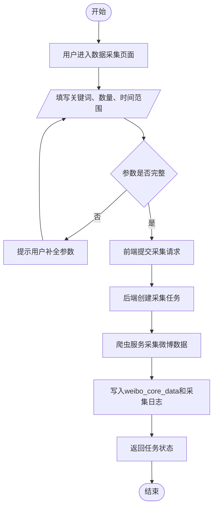
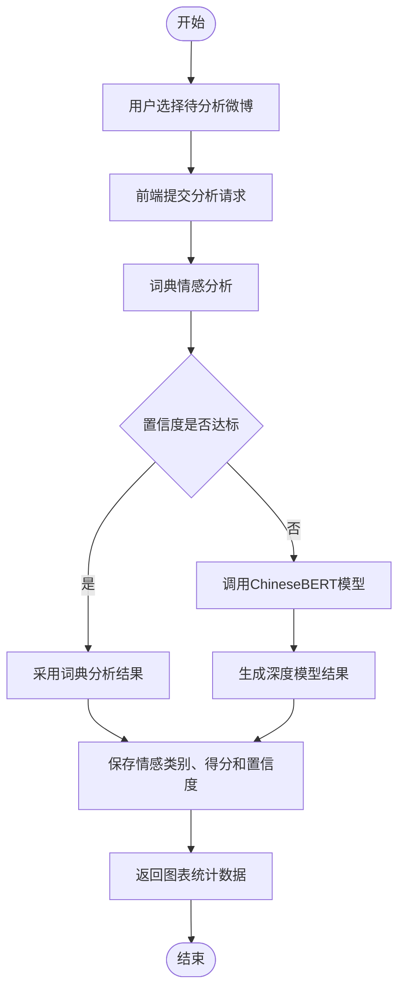
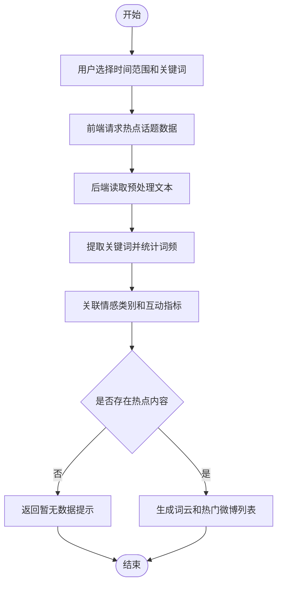
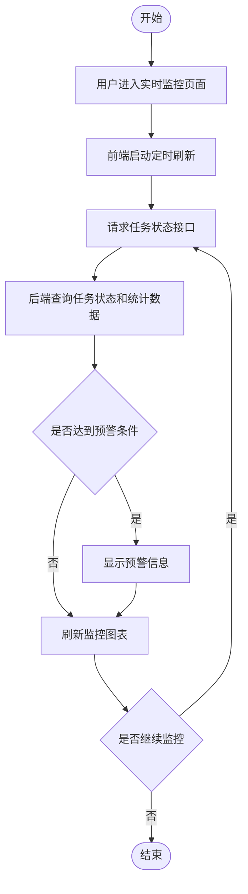
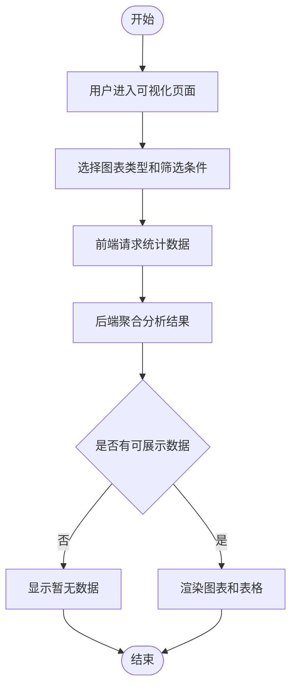
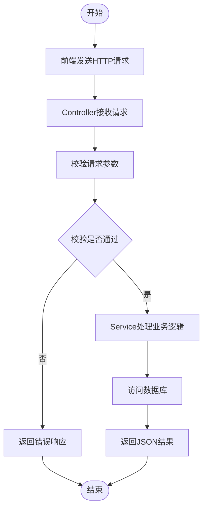
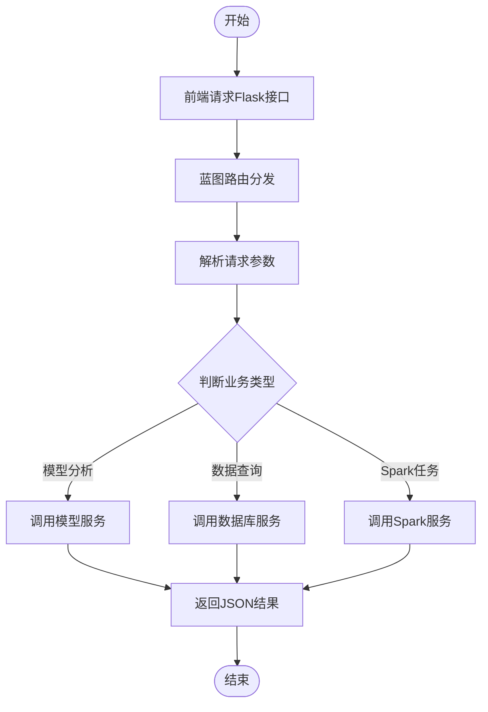
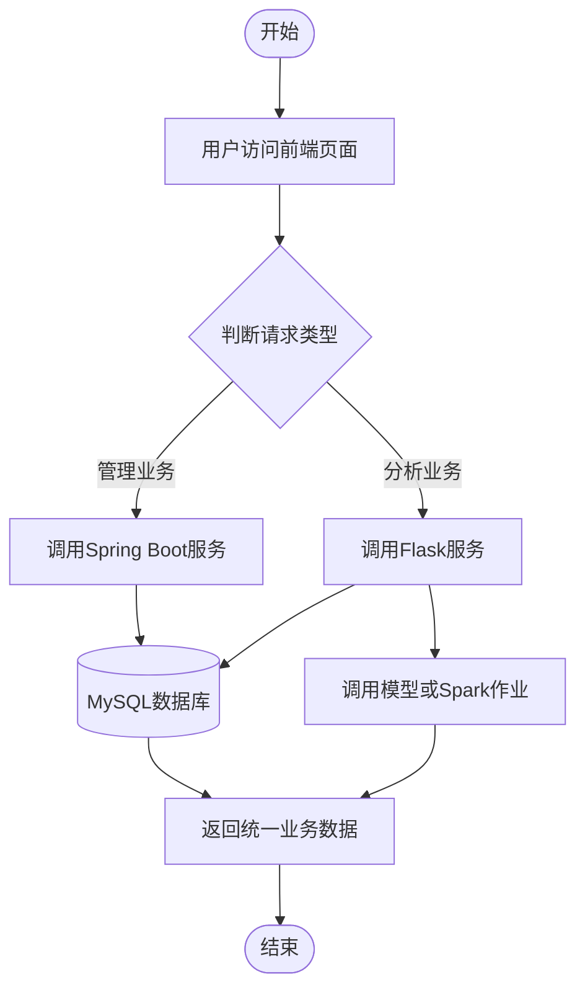

# 第6章 系统详细设计与实现

本章按照“功能介绍及流程图、界面截图、核心代码”的固定结构，说明系统主要功能实现。文字描述突出模块用途、处理流程和实现要点，流程图展示业务流转，截图与代码用于辅助说明实际效果。

## 6.1 前端功能模块实现

前端工程采用 Vue 3 组件化实现，主要负责用户操作、任务配置、状态展示和图表可视化。前端通过 HTTP API 调用后端服务，不直接执行模型推理和数据库写入。

### 6.1.1 数据采集模块

#### 第一部分：功能介绍及流程图

数据采集模块是系统获取微博语料的入口，主要负责根据关键词、采集数量和时间范围生成采集任务。设计时既要保证用户填写参数简单明确，又要避免空参数、重复提交和任务状态不清等问题，因此前端先完成表单校验，后端再创建任务并记录执行过程。采集完成后，微博正文、发布时间、互动指标和采集日志统一写入数据库，为后续清洗、情感分析和可视化提供数据来源。

该模块采用 Vue 3 表单组件、Flask/Spring Boot 接口和 MySQL 存储等技术实现。其核心流程为：用户填写采集条件后提交请求，后端创建采集任务并调用爬虫服务，采集结果写入 `weibo_core_data` 和采集日志表，最后向页面返回任务状态。



图6-1 数据采集模块流程图

#### 第二部分：界面截图描述

图6-2 为数据采集页面的实现界面。页面上方展示模块标题和采集说明，中部提供关键词、采集数量和时间范围等配置项，下方显示任务执行状态和采集结果提示。界面将“开始采集”等主要按钮放在表单附近，便于用户完成参数填写后直接提交任务；当参数缺失或采集异常时，页面会给出明确反馈。

#### 第三部分：核心代码

平台数据采集模块的部分核心代码如下：

```javascript
const payload = { keyword: form.keyword, limit: form.limit, start_time: form.startTime, end_time: form.endTime }
const result = await request.post('/api/crawler/start', payload)
taskId.value = result.data.task_id
await refreshTaskStatus(taskId.value)
```

如果需要展示完整业务实现，可在论文附录中补充完整代码。

### 6.1.2 数据预处理模块

#### 第一部分：功能介绍及流程图

数据预处理模块用于将原始微博转换为适合模型分析的规范文本。微博内容中常包含链接、表情、用户提及、重复文本和无效字符，若直接进入模型会影响分词质量和情感判断结果。因此系统在分析前统一完成去重、空值过滤、噪声清理和字段标准化，保证后续处理数据格式一致、内容相对干净。

该模块采用 Python 文本处理、Jieba 分词和 Spark 批处理等技术实现。其核心流程为：系统读取原始微博后过滤空值与重复数据，清理链接、表情和特殊符号，再完成中文分词、停用词过滤和时间字段标准化。


图6-3 数据预处理模块流程图

#### 第二部分：界面截图描述

图6-4 为数据预处理页面的实现界面。页面展示待处理数据规模、清洗任务入口、执行状态和处理结果信息。用户可以通过页面启动清洗任务，并查看清洗前后数据量变化、异常数据提示和处理进度，从而判断当前数据是否已经满足情感分析要求。

#### 第三部分：核心代码

平台数据预处理模块的部分核心代码如下：

```python
def clean_text(text: str) -> str:
    text = re.sub(r'http\S+', '', text)
    text = re.sub(r'@\S+', '', text)
    text = re.sub(r'[^\u4e00-\u9fa5A-Za-z0-9]', ' ', text)
    return text.strip()
```

如果需要展示完整业务实现，可在论文附录中补充完整代码。

### 6.1.3 情感分析模块

#### 第一部分：功能介绍及流程图

情感分析模块用于判断微博文本的情绪倾向，并将结果划分为正面、负面和中性三类。模块设计时兼顾分析效率和准确率：对情感倾向明显的文本优先使用词典方法快速判断，对置信度较低或语义较复杂的文本再调用 ChineseBERT 模型进行深度分析。分析完成后，系统保存情感类别、情感得分和置信度，供统计图表、热点分析和预警模块继续使用。

该模块采用情感词典、ChineseBERT、Flask API 和模型单例加载等技术实现。其核心流程为：用户选择待分析微博后提交请求，后端先执行词典分析，并根据置信度决定是否调用 ChineseBERT，最后保存情感类别、得分和置信度。



图6-5 情感分析模块流程图

#### 第二部分：界面截图描述

图6-6 为情感分析页面的实现界面。页面通常包括待分析数据选择、分析操作按钮、情感分布图和分析结果列表等区域。用户既可以通过图表查看整体情绪占比，也可以在表格中追踪单条微博的情感类别、得分和置信度，使分析结果更加直观。

#### 第三部分：核心代码

平台情感分析模块的部分核心代码如下：

```python
def analyze(self, text: str) -> Dict:
    dict_label, dict_score = SentimentLexicon.analyze(text)
    dict_confidence = abs(dict_score)
    if dict_confidence > self.config.confidence_threshold or self._bert is None:
        return {'sentiment_class': dict_label, 'score': dict_score, 'confidence': dict_confidence, 'method': 'cascade-lexicon'}
    bert_result = self._bert.predict(text)
    return {'sentiment_class': bert_result['label'], 'score': bert_result['score'], 'confidence': bert_result['confidence'], 'method': 'cascade-bert'}
```

如果需要展示完整业务实现，可在论文附录中补充完整代码。

### 6.1.4 热点话题分析模块

#### 第一部分：功能介绍及流程图

热点话题分析模块用于从微博数据中识别高频话题和重点微博，并基于三维度排序模型计算综合得分。系统将情感强度、互动热度和时效性分别按 0.4、0.4、0.2 的权重进行加权，得到热点微博的综合排序结果。前端提供词云图和热门微博列表两个核心视图，用户可通过滑块动态调整权重占比，排序结果随权重变化即时刷新；点击词云关键词后，系统可筛选相关微博，并支持自定义关键词检索。

该模块采用 Jieba 分词、词频统计、ECharts 词云、三维度排序模型和数据库聚合查询等技术实现。其核心流程为：系统读取预处理文本后完成词频统计，再关联情感强度、互动热度和发布时间等指标，最终生成词云数据和按综合得分排序的热门微博列表。



图6-7 热点话题分析模块流程图

#### 第二部分：界面截图描述

图6-8 为热点话题分析页面的实现界面。页面左侧为词云图区域，用于展示当前数据中的高频关键词；右侧为热门微博列表，用于展示按综合得分排序后的微博内容。列表顶部设置情感强度、互动热度和时效性权重调节滑块，用户调整后页面会即时刷新排序结果，底部趋势分析折线图用于展示热点话题随时间变化的情况。

#### 第三部分：核心代码

平台热点话题分析模块的部分核心代码如下：

```python
from collections import Counter

def build_wordcloud_data(texts):
    counter = Counter()
    for text in texts:
        words = jieba.lcut(text)
        counter.update(w for w in words if w not in stop_words and len(w) > 1)
    return [{'name': word, 'value': count} for word, count in counter.most_common(100)]
```

如果需要展示完整业务实现，可在论文附录中补充完整代码。

### 6.1.5 实时舆情监控模块

#### 第一部分：功能介绍及流程图

实时舆情监控模块用于持续展示系统运行状态和舆情变化情况。用户进入监控页面后，系统会周期性获取任务进度、数据总量、情感分布和异常信息，避免用户频繁手动刷新。模块设计时重点关注数据更新及时性和异常提示可见性，当负面情绪比例或任务异常达到预设条件时，页面会及时展示预警信息。

该模块采用 Vue 定时轮询、Flask 状态接口、统计接口和预警阈值判断等技术实现。其核心流程为：用户进入页面后，前端定时请求任务状态与统计接口，后端返回情感分布、异常信息和预警结果，页面根据返回数据自动刷新。



图6-9 实时舆情监控模块流程图

#### 第二部分：界面截图描述

图6-10 为实时舆情监控页面的实现界面。页面集中展示任务运行状态、情感趋势、异常提醒和关键统计指标，方便用户掌握系统当前处理情况。图表区域随接口返回数据自动刷新，预警信息以醒目的方式展示，帮助用户及时发现舆情风险。

#### 第三部分：核心代码

平台实时舆情监控模块的部分核心代码如下：

```javascript
let timer = null
onMounted(() => {
  timer = setInterval(async () => {
    const res = await request.get('/api/pipeline/status')
    monitorState.value = res.data
  }, 5000)
})
onUnmounted(() => clearInterval(timer))
```

如果需要展示完整业务实现，可在论文附录中补充完整代码。

### 6.1.6 数据流水线管理模块

#### 第一部分：功能介绍及流程图

数据流水线管理模块用于把数据采集、预处理、情感分析、三维度排序和结果入库等步骤组织成完整处理链路。相比用户逐个执行功能，该模块可以减少重复操作，并通过统一任务状态反映整体处理进度。设计时需要处理无数据、部分失败和任务重复启动等情况，保证流水线在异常场景下仍能返回明确状态。

该模块采用 Flask API、PipelineService、MySQL 和后台线程等技术实现。其核心流程为：用户启动任务后，后端读取待处理数据，依次完成情感分析和三维度排序，并将处理结果写回数据库，最后返回处理状态和 Top 列表。


图6-11 数据流水线管理模块流程图

#### 第二部分：界面截图描述

图6-12 为数据流水线管理页面的实现界面。页面以任务启动、阶段状态和结果预览为主要内容，用户可以看到流水线是否正在运行、各处理阶段是否完成以及最终排序结果。界面通过状态标签和结果列表呈现处理进度，便于用户判断系统是否已经完成完整分析。

#### 第三部分：核心代码

平台数据流水线管理模块的部分核心代码如下：

```python
def run_pipeline(self, limit: int = 500) -> Dict:
    db = get_db_service()
    unprocessed = db.get_unprocessed_weibos(limit=limit)
    sentiment_results = self.sentiment_stage.analyze_batch(unprocessed)
    db.save_sentiment_results(sentiment_results)
    unranked = db.get_unranked_weibos(limit=limit)
    ranked = self.ranking_stage.rank(unranked)
    db.save_tri_dimension_results(ranked, batch_id)
    return {'status': 'completed', 'top_ranked': ranked[:10]}
```

如果需要展示完整业务实现，可在论文附录中补充完整代码。

### 6.1.7 可视化展示模块

#### 第一部分：功能介绍及流程图

可视化展示模块用于将复杂的分析结果转化为直观图表，帮助用户快速理解微博情感分布、话题热度和数据变化趋势。模块设计时重点考虑图表之间的信息层次，既展示总体统计，也保留可追溯的明细列表。用户可以通过筛选条件调整展示范围，从而观察不同时间段或不同关键词下的分析结果。

该模块采用 Vue 3、ECharts、统计接口和组件化图表等技术实现。其核心流程为：用户选择筛选条件或图表类型后，前端请求统计接口，后端聚合分析结果，页面根据返回数据渲染饼图、折线图、词云和列表。



图6-13 可视化展示模块流程图

#### 第二部分：界面截图描述

图6-14 为可视化展示页面的实现界面。页面将情感分布、趋势变化、关键词词云和微博列表分区展示，用户可在一个页面中查看总体统计和具体数据。界面通过卡片和图表组件组织信息，增强了结果展示的直观性和可读性。

#### 第三部分：核心代码

平台可视化展示模块的部分核心代码如下：

```javascript
const option = {
  tooltip: { trigger: 'item' },
  series: [{
    type: 'pie',
    radius: ['40%', '70%'],
    data: sentimentDistribution.value
  }]
}
chart.setOption(option)
```

如果需要展示完整业务实现，可在论文附录中补充完整代码。

### 6.1.8 系统管理模块

#### 第一部分：功能介绍及流程图

系统管理模块用于保障平台基础运行，包括用户登录认证、角色权限控制、任务管理、配置维护和操作日志记录等内容。由于管理功能涉及系统数据安全，模块在设计时需要区分普通用户与管理员权限，避免未授权用户访问敏感操作。用户登录成功后，系统根据角色加载不同菜单和接口权限，管理员可以进一步维护任务、用户和系统配置。

该模块采用 Spring Boot、权限判断、管理控制器和日志记录等技术实现。其核心流程为：用户提交账号密码后，系统完成身份认证并加载权限信息，若具备管理权限则允许执行管理操作，同时记录关键操作日志。


图6-15 系统管理模块流程图

#### 第二部分：界面截图描述

图6-16 为系统管理页面的实现界面。页面按照管理对象划分功能区域，包括用户信息、任务状态、系统配置和日志查看等内容。管理员可以在页面中完成查询、维护和状态确认操作，普通用户则只能访问授权范围内的功能。

#### 第三部分：核心代码

平台系统管理模块的部分核心代码如下：

```java
@SpringBootApplication
@ComponentScan(basePackages = "com.weibo")
public class WebApplication {
    public static void main(String[] args) {
        SpringApplication.run(WebApplication.class, args);
    }
}
```

如果需要展示完整业务实现，可在论文附录中补充完整代码。

## 6.2 后端服务模块实现

后端采用 Spring Boot 与 Flask 协同架构。Spring Boot 处理认证、任务和管理类业务，Flask 处理情感分析、排序、流水线和 Spark 调度等算法业务。

### 6.2.1 Java Spring Boot 后端

#### 第一部分：功能介绍及流程图

Java Spring Boot 后端主要承担认证、采集任务、仪表盘统计和系统管理等结构化业务。模块设计时采用 Controller、Service、Repository 的分层方式，将接口接收、业务处理和数据访问分开，便于后续维护和扩展。对外接口统一返回 JSON 结果，并通过参数校验和异常处理保证前端能够获得明确反馈。

该模块采用 Spring Boot、REST Controller、Service 分层和 MySQL 等技术实现。其核心流程为：前端发送 HTTP 请求后，Controller 接收并校验参数，校验通过后调用 Service 完成业务处理和数据库访问，最后返回统一格式的响应数据。



图6-17 Java Spring Boot 后端流程图

#### 第二部分：界面截图描述

图6-18 为 Spring Boot 后端支撑页面的实现界面。用户在前端页面进行登录、任务查询或管理操作时，页面展示的数据均由 Spring Boot 接口返回。该界面重点体现后端对账号认证、任务状态和管理数据的支撑作用，用户无需感知具体接口调用过程。

#### 第三部分：核心代码

平台Java Spring Boot 后端模块的部分核心代码如下：

```java
@RestController
@RequestMapping("/api/auth")
public class AuthController {
    @PostMapping("/login")
    public Result login(@RequestBody LoginRequest request) {
        return authService.login(request);
    }
}
```

如果需要展示完整业务实现，可在论文附录中补充完整代码。

### 6.2.2 Python Flask 后端

#### 第一部分：功能介绍及流程图

Python Flask 后端主要承载情感分析、三维度排序、流水线调度和 Spark 作业调用等算法类业务。由于这类功能与模型推理、文本处理和批处理任务关系更紧密，系统将其与管理类业务分离，便于单独维护算法服务。Flask 后端通过蓝图组织不同业务接口，并统一对前端返回分析结果和任务状态。

该模块采用 Flask Blueprint、Flask-CORS、模型服务和数据库服务等技术实现。其核心流程为：请求进入 Flask 蓝图后，系统解析参数并判断业务类型，再调用模型服务、数据库服务或 Spark 服务，最后返回 JSON 格式的分析结果。



图6-19 Python Flask 后端流程图

#### 第二部分：界面截图描述

图6-20 为 Flask 后端支撑页面的实现界面。页面中的情感分析、流水线执行、排序结果和统计图表均依赖 Flask 接口提供数据。用户在页面上提交分析或查询请求后，系统通过 Flask 后端完成模型计算和数据汇总，并将结果展示在对应区域。

#### 第三部分：核心代码

平台Python Flask 后端模块的部分核心代码如下：

```python
app = Flask(__name__)
CORS(app, resources={r"/api/*": {"origins": "*"}})
app.register_blueprint(pipeline_bp, url_prefix='/api/pipeline')
app.register_blueprint(tri_dimension_bp, url_prefix='/api/tri-dimension')
app.register_blueprint(unified_bp, url_prefix='/api/v2')
```

如果需要展示完整业务实现，可在论文附录中补充完整代码。

### 6.2.3 双后端协同机制

#### 第一部分：功能介绍及流程图

双后端协同机制用于将管理类业务和算法类业务分离，降低单一后端的复杂度。前端仍然保持统一入口，用户不需要区分请求由哪个后端处理；系统根据接口路径和业务类型分别调用 Spring Boot 或 Flask 服务。两类后端通过共享数据库和统一数据结构协作，既保证业务数据一致，也便于算法模块独立扩展。

该模块采用 Vue API 封装、Spring Boot、Flask 和共享 MySQL 等技术实现。其核心流程为：用户在统一前端操作，系统根据请求类型调用对应后端服务，两类后端通过 MySQL 共享业务数据，并向前端返回统一格式的结果。



图6-21 双后端协同机制流程图

#### 第二部分：界面截图描述

图6-22 为双后端协同页面的实现界面。用户在页面中看到的是统一的功能入口和结果展示，而后端实际根据业务类型完成分流处理。管理类数据由 Spring Boot 返回，分析类数据由 Flask 返回，前端通过统一封装降低了接口差异对页面开发的影响。

#### 第三部分：核心代码

平台双后端协同模块的部分核心代码如下：

```javascript
const apiMap = {
  auth: 'http://localhost:8080/api',
  analysis: 'http://localhost:5000/api'
}
export function requestAnalysis(url, data) {
  return axios.post(`${apiMap.analysis}${url}`, data)
}
```

如果需要展示完整业务实现，可在论文附录中补充完整代码。

## 6.3 大数据处理模块实现

大数据处理模块支撑微博数据的批量清洗、离线分析、排序计算和准实时监控。系统通过 Spark 管理作业提交、状态维护和异常处理，并与 Python 流水线共同完成数据处理。

### 6.3.1 Spark 伪集群环境搭建

#### 第一部分：功能介绍及流程图

Spark 伪集群环境用于在有限硬件条件下模拟分布式数据处理过程，为大规模微博数据清洗和分析提供运行基础。模块设计时重点关注作业提交、运行状态记录和异常反馈，使系统能够在单机或伪分布式环境下完成批处理任务。通过 Spark Master 与 Worker 的配合，系统可以将数据处理任务拆分执行，提高批量处理效率。

该模块采用 Spark local/standalone、spark-submit 和后端作业状态管理等技术实现。其核心流程为：后端根据任务参数生成 spark-submit 命令，提交作业到 Spark Master 后由 Worker 执行任务，系统记录运行状态并在异常时返回错误信息。


图6-23 Spark 伪集群环境流程图

#### 第二部分：界面截图描述

图6-24 为 Spark 伪集群监控页面的实现界面。页面展示作业配置、提交状态、运行进度和异常信息，用户可以通过页面了解 Spark 作业是否成功启动。界面重点体现作业状态反馈，使用户能够判断批处理任务是否正常执行。

#### 第三部分：核心代码

平台Spark 伪集群模块的部分核心代码如下：

```python
cmd = ['spark-submit', '--master', self.config.master_url, script_path, '--input', input_path, '--output', output_path]
process = subprocess.Popen(cmd, stdout=subprocess.PIPE, stderr=subprocess.PIPE)
```

如果需要展示完整业务实现，可在论文附录中补充完整代码。

### 6.3.2 分布式数据预处理

#### 第一部分：功能介绍及流程图

分布式数据预处理用于提升大规模微博文本的清洗效率。当数据量较小时，普通 Python 脚本可以完成处理；当数据规模扩大后，单机串行清洗会出现耗时长、内存压力大等问题。因此系统通过 Spark 将原始数据划分为多个分区并行处理，在保证清洗规则一致的同时提高批量处理能力。

该模块采用 PySpark DataFrame、UDF、分区处理和 Parquet 输出等技术实现。其核心流程为：Spark 读取原始数据后按分区执行去重、空值过滤、文本清洗和字段标准化，最后输出结构化清洗结果供后续分析使用。


图6-25 分布式数据预处理流程图

#### 第二部分：界面截图描述

图6-26 为分布式数据预处理页面的实现界面。页面展示输入数据路径、输出路径、处理状态和清洗结果概览，用户可以查看 Spark 任务是否成功完成。相比普通清洗页面，该界面更强调批处理任务状态、处理耗时和输出结果位置。

#### 第三部分：核心代码

平台分布式数据预处理模块的部分核心代码如下：

```python
df = spark.read.json(input_path)
df = df.dropDuplicates(['weibo_id'])
df = df.filter(df.content.isNotNull())
df = df.withColumn('clean_content', clean_text_udf(df.content))
df.write.mode('overwrite').parquet(output_path)
```

如果需要展示完整业务实现，可在论文附录中补充完整代码。

### 6.3.3 分布式情感分析实现

#### 第一部分：功能介绍及流程图

分布式情感分析模块的目标是对已经清洗好的大规模微博数据进行批量情感分类。由于 ChineseBERT 模型推理需要较多算力，且 Spark 作业通常运行在 CPU 集群上，本系统采用了"Spark 负责数据组织 + Python 服务负责推理"的混合模式。具体流程是：Spark 作业从 HDFS/Parquet 文件中读取已清洗的微博文本，按批次（每批 256 条）通过 HTTP 请求调用 Flask 的情感分析接口，再将返回的情感类别、得分和置信度写入 MySQL（或可选写入 HBase）。

这种架构的优点是可以复用单机版已有的级联分析逻辑（词典初筛 + ChineseBERT 复核），无需在 Spark 中重新实现模型推理；缺点是网络通信会带来额外延迟。为了缓解这一问题，Spark 作业中使用了 `foreachPartition` 算子，将一个分区内的所有微博合并为一次 HTTP 批量请求，避免了"每条微博一次调用"的高开销模式。

为保证作业稳定性，模块设计了重试机制：对于失败的请求（如网络超时或服务端瞬时不可用），作业会重试 3 次；若仍然失败，则将错误记录写入单独的错误表 `sentiment_failure_log`，整体作业不会因个别批次失败而中断。该模块涉及的关键技术包括 Spark 批处理调度、PyTorch + ChineseBERT 模型推理、Flask HTTP 服务和 MySQL 数据持久化。


图6-27 分布式情感分析流程图

#### 第二部分：界面截图描述

图6-28 为分布式情感分析作业运行时的 Spark Web UI 监控截图（Stage 详情页），展示了作业各 Stage 的任务总数（Tasks: Succeeded/Total）、已完成任务数、失败任务数以及任务执行时长的统计摘要（Summary Metrics 中的 Min / 中位数 / Max 等耗时分位）。考虑到本模块采用了"Spark 负责数据组织 + Python 服务负责模型推理"的混合架构，Spark 作业通过 foreachPartition 按批次（每批 256 条）调用 Flask 情感分析接口，因此每个 Task 对应一次批量分析请求，Task 平均执行时间近似反映了 Flask 接口处理一个批次的端到端响应耗时。下方 Tasks 表格列出了每个任务的 Status、Duration、GC Time 与 Shuffle 读写量，可用于定位慢任务和异常重试。

#### 第三部分：核心代码

平台分布式情感分析模块的部分核心代码如下：

```python
sentiment_results = []
for row in weibo_data:
    result = sentiment_stage.analyze(row['content'])
    result['weibo_id'] = row['weibo_id']
    sentiment_results.append(result)
db.save_sentiment_results(sentiment_results)
```

如果需要展示完整业务实现，可在论文附录中补充完整代码。

### 6.3.4 三维度排序分布式实现

#### 第一部分：功能介绍及流程图

三维度排序分布式模块用于对已完成情感分析的大规模微博数据进行综合评分和排名。与单机版不同，Spark 版本的排序需要处理分布在多个节点上的数据，因此必须使用分布式排序算法（例如 `orderBy` 结合 `repartition` 与 `sortWithinPartitions`），以避免全量数据集中到 Driver 端排序而引发性能瓶颈。

情感强度、互动热度和时效性的计算均可表示为 Spark 列表达式，无需使用 Python UDF，从而避免 JVM 与 Python 解释器之间频繁的数据序列化开销。具体而言，模块首先从 `weibo_core_data` 表和 `sentiment_analysis_results` 表中关联读取必要字段，然后使用 `withColumn` 依次计算情感强度归一化、原始热度（对数平滑）、热度归一化、时间衰减因子，最后加权求和得到综合得分；最终通过 `orderBy(col("score_composite").desc)` 生成全局排名。

考虑到数据量可能达到百万条级别，模块在排序前对数据进行合理分区和缓存（`cache` / `persist`），以减少 shuffle 开销。排序结果按批次写入 `tri_dimension_ranking` 表，并附带时间戳作为 `batch_id`，便于前端按批次回溯历史排名。该模块涉及的关键技术包括 Spark SQL 列表达式、归一化与对数平滑、时间半衰期函数和 MySQL 批量写入。


图6-29 三维度排序分布式流程图

#### 第二部分：界面截图描述

图6-30 为三维度排序结果的展示界面。页面上方提供了参数配置区，用户可选择预设策略（默认、情感优先、热度优先），或手动调节热度权重（转发 λ_r、评论 λ_c、点赞 λ_l）与时间半衰期 H（6h/12h/24h/48h）等参数。计算完成后，页面下方以排名表格和可视化图表双形式展示结果：表格呈现排名、微博正文、情感极性、情感得分、热度综合得分与最终综合得分；可视化区域支持在散点图与热力图之间切换，并可按“高情感高热”“高情感低热”等四象限进行筛选，辅助用户从不同角度观察排序结果的分布特征。页面右上提供“导出数据”按钮，可将当前排名列表以 Excel/CSV 格式导出，便于后续在外部工具中进一步分析。结合各维度的细分得分，用户能够直观判断某条微博排名靠前的具体原因（是以情感强度为主还是以热度为主），辅助舆情分析人员定位重点内容。

#### 第三部分：核心代码

平台三维度排序模块的部分核心代码如下：

```python
heat = math.log10(1 + reposts * 0.4 + comments * 0.3 + likes * 0.3)
time_decay = pow(2, -hours_since_publish / self.config.half_life_hours)
score = 0.4 * sentiment_norm + 0.4 * heat_norm + 0.2 * time_decay
```

如果需要展示完整业务实现，可在论文附录中补充完整代码。

### 6.3.5 实时流处理实现

#### 第一部分：功能介绍及流程图

实时流处理模块用于支持舆情数据的持续更新和准实时监控。考虑到微博数据具有变化快、热点持续时间短的特点，系统需要在新增数据进入后及时完成增量清洗、情感分析和统计更新。该模块在实现上以轮询和状态缓存为基础，为后续接入真正的流式计算框架保留扩展空间。

该模块采用前端轮询、Flask 状态接口、任务状态缓存和后续流处理扩展等技术实现。其核心流程为：新增微博进入系统后，后端增量完成清洗、分析和统计更新，前端持续刷新并在达到阈值时显示预警。


图6-31 实时流处理流程图

#### 第二部分：核心代码

平台实时流处理模块的部分核心代码如下：

```python
def get_status(self) -> Dict:
    return {
        'running': self._running,
        'last_result': self._last_result,
        'bert_available': self.sentiment_stage._bert is not None
    }
```

如果需要展示完整业务实现，可在论文附录中补充完整代码。

## 6.4 本章小结

本章按照固定三段式结构说明了前端、后端和大数据处理模块的实现。各模块围绕功能作用、操作流程、界面效果和核心代码展开，体现了系统从页面交互到数据处理的完整实现过程。

通过上述实现，系统形成了从微博采集、预处理、情感分析、热点发现、实时监控到可视化展示的业务闭环。各模块通过统一接口和数据库协同工作，保证了系统的可维护性与扩展性。
