# 第6章 系统实现 - 界面图与模块实现

## 6.1 数据采集界面图

### 6.1.1 界面原型图

```mermaid
graph TD
    subgraph "数据采集模块界面"
        A[顶部导航栏<br/>Data Collection]
        B[采集配置面板<br/>Collection Configuration]
        C[实时监控面板<br/>Real-time Monitoring]
        D[采集日志面板<br/>Collection Logs]
        E[统计图表面板<br/>Statistics Charts]
    end
    
    subgraph "采集配置详细界面"
        B1[关键词输入框<br/>Keyword Input]
        B2[时间范围选择<br/>Time Range Selector]
        B3[采集频率设置<br/>Collection Rate]
        B4[数据源选择<br/>Data Source Selection]
        B5[高级配置选项<br/>Advanced Options]
        B6[启动/停止按钮<br/>Start/Stop Buttons]
    end
    
    subgraph "实时监控详细界面"
        C1[进度条显示<br/>Progress Bar]
        C2[实时数据流<br/>Real-time Data Stream]
        C3[采集速率图表<br/>Collection Rate Chart]
        C4[错误计数器<br/>Error Counter]
        C5[成功计数器<br/>Success Counter]
        C6[状态指示器<br/>Status Indicator]
    end
    
    subgraph "采集日志详细界面"
        D1[日志级别筛选<br/>Log Level Filter]
        D2[时间范围筛选<br/>Time Range Filter]
        D3[关键词筛选<br/>Keyword Filter]
        D4[日志列表展示<br/>Log List Display]
        D5[日志详情弹窗<br/>Log Detail Modal]
        D6[日志导出功能<br/>Log Export Function]
    end
    
    subgraph "统计图表详细界面"
        E1[采集总量趋势图<br/>Total Collection Trend]
        E2[成功率饼图<br/>Success Rate Pie Chart]
        E3[关键词分布图<br/>Keyword Distribution]
        E4[时间分布热力图<br/>Time Distribution Heatmap]
        E5[错误类型统计<br/>Error Type Statistics]
        E6[性能指标仪表盘<br/>Performance Metrics Dashboard]
    end
    
    A --> B
    A --> C
    A --> D
    A --> E
    
    B --> B1
    B --> B2
    B --> B3
    B --> B4
    B --> B5
    B --> B6
    
    C --> C1
    C --> C2
    C --> C3
    C --> C4
    C --> C5
    C --> C6
    
    D --> D1
    D --> D2
    D --> D3
    D --> D4
    D --> D5
    D --> D6
    
    E --> E1
    E --> E2
    E --> E3
    E --> E4
    E --> E5
    E --> E6
    
    style A fill:#e3f2fd
    style B fill:#f3e5f5
    style C fill:#e8f5e8
    style D fill:#fff3e0
    style E fill:#fce4ec
```



### 6.1.2 界面截图描述

#### 主界面布局
- **顶部导航栏**: 显示"数据采集"模块标题，提供快速切换到其他模块的导航
- **左侧配置面板**: 包含采集参数配置、任务管理、高级设置
- **中央监控区域**: 实时显示采集进度、数据流、状态指示器
- **右侧统计面板**: 展示采集统计数据、图表分析、性能指标

#### 交互功能
- **拖拽式配置**: 支持拖拽调整采集参数顺序
- **实时预览**: 采集过程中实时预览数据样本
- **一键启动**: 支持保存配置模板，一键启动采集任务
- **智能推荐**: 基于历史数据推荐最优采集参数

## 6.2 情感分析可视化界面图

### 6.2.1 界面原型图

```mermaid
graph TD
    subgraph "情感分析可视化界面"
        A[功能选项卡<br/>Function Tabs]
        B[分析配置面板<br/>Analysis Configuration]
        C[结果展示区域<br/>Results Display Area]
        D[分析工具栏<br/>Analysis Toolbar]
        E[状态信息栏<br/>Status Information Bar]
    end
    
    subgraph "分析配置详细界面"
        B1[分析方法选择<br/>Analysis Method Selection]
        B2[数据源选择<br/>Data Source Selection]
        B3[批处理设置<br/>Batch Processing Settings]
        B4[输出格式配置<br/>Output Format Configuration]
        B5[高级参数设置<br/>Advanced Parameter Settings]
        B6[执行分析按钮<br/>Execute Analysis Button]
    end
    
    subgraph "结果展示详细界面"
        C1[情感分布饼图<br/>Sentiment Distribution Pie Chart]
        C2[情感趋势折线图<br/>Sentiment Trend Line Chart]
        C3[情感强度直方图<br/>Sentiment Intensity Histogram]
        C4[关键词情感云图<br/>Keyword Sentiment Word Cloud]
        C5[分析结果表格<br/>Analysis Results Table]
        C6[置信度分布图<br/>Confidence Distribution Chart]
    end
    
    subgraph "分析工具详细界面"
        D1[数据筛选器<br/>Data Filter]
        D2[时间范围选择器<br/>Time Range Selector]
        D3[导出功能按钮<br/>Export Function Buttons]
        D4[视图切换按钮<br/>View Switch Buttons]
        D5[刷新按钮<br/>Refresh Button]
        D6[帮助按钮<br/>Help Button]
    end
    
    subgraph "状态信息详细界面"
        E1[处理进度条<br/>Processing Progress Bar]
        E2[处理速度显示<br/>Processing Speed Display]
        E3[已处理数量<br/>Processed Count Display]
        E4[剩余时间估算<br/>Remaining Time Estimation]
        E5[错误信息显示<br/>Error Information Display]
        E6[系统资源使用<br/>System Resource Usage]
    end
    
    A --> B
    A --> C
    A --> D
    A --> E
    
    B --> B1
    B --> B2
    B --> B3
    B --> B4
    B --> B5
    B --> B6
    
    C --> C1
    C --> C2
    C --> C3
    C --> C4
    C --> C5
    C --> C6
    
    D --> D1
    D --> D2
    D --> D3
    D --> D4
    D --> D5
    D --> D6
    
    E --> E1
    E --> E2
    E --> E3
    E --> E4
    E --> E5
    E --> E6
    
    style A fill:#e3f2fd
    style B fill:#f3e5f5
    style C fill:#e8f5e8
    style D fill:#fff3e0
    style E fill:#fce4ec
```



### 6.2.2 可视化图表详细说明

#### 情感分布饼图
- **图表类型**: 环形饼图 (Donut Chart)
- **数据维度**: 正面、中性、负面情感占比
- **交互功能**: 
  - 鼠标悬停显示具体数值和百分比
  - 点击扇区查看详细数据列表
  - 支持图例点击显示/隐藏对应数据
- **动画效果**: 数据加载时的渐进式动画，切换时的平滑过渡

#### 情感趋势折线图
- **图表类型**: 多系列折线图 (Multi-line Chart)
- **X轴**: 时间维度（支持小时/天/周/月切换）
- **Y轴**: 情感得分范围 [-1, 1]
- **系列线条**: 
  - 平均情感得分趋势
  - 正面情感占比趋势
  - 负面情感占比趋势
- **高级功能**: 
  - 数据缩放和平移
  - 数据点悬停详情
  - 趋势线拟合
  - 异常点标注

## 6.3 热点话题分析界面图

### 6.3.1 界面原型图

```mermaid
graph TD
    subgraph "热点话题分析界面"
        A[控制面板<br/>Control Panel]
        B[词云展示区<br/>Word Cloud Display]
        C[热门微博列表<br/>Hot Weibo List]
        D[趋势分析图表<br/>Trend Analysis Charts]
        E[详情侧边栏<br/>Detail Sidebar]
    end
    
    subgraph "控制面板详细界面"
        A1[时间范围选择<br/>Time Range Selection]
        A2[话题数量设置<br/>Topic Count Setting]
        A3[更新频率控制<br/>Update Frequency Control]
        A4[数据源筛选<br/>Data Source Filter]
        A5[排序方式选择<br/>Sort Method Selection]
        A6[自动刷新开关<br/>Auto Refresh Toggle]
    end
    
    subgraph "词云展示详细界面"
        B1[动态词云图<br/>Dynamic Word Cloud]
        B2[词频统计图<br/>Word Frequency Chart]
        B3[情感色彩映射<br/>Sentiment Color Mapping]
        B4[交互式筛选<br/>Interactive Filtering]
        B5[词云样式设置<br/>Word Cloud Style Settings]
        B6[导出功能<br/>Export Function]
    end
    
    subgraph "热门微博列表详细界面"
        C1[微博卡片列表<br/>Weibo Card List]
        C2[排序选项<br/>Sort Options]
        C3[分页控件<br/>Pagination Controls]
        C4[批量操作<br/>Batch Operations]
        C5[收藏功能<br/>Favorite Function]
        C6[分享功能<br/>Share Function]
    end
    
    subgraph "趋势分析详细界面"
        D1[话题热度趋势<br/>Topic Popularity Trend]
        D2[情感变化趋势<br/>Sentiment Change Trend]
        D3[传播速度分析<br/>Propagation Speed Analysis]
        D4[地域分布图<br/>Geographic Distribution]
        D5[用户参与度<br/>User Engagement]
        D6[时间分布热力图<br/>Time Distribution Heatmap]
    end
    
    subgraph "详情侧边栏详细界面"
        E1[话题详情面板<br/>Topic Detail Panel]
        E2[相关话题推荐<br/>Related Topics Recommendation]
        E3[情感分析结果<br/>Sentiment Analysis Results]
        E4[关键用户列表<br/>Key Users List]
        E5[传播路径图<br/>Propagation Path Graph]
        E6[历史数据对比<br/>Historical Data Comparison]
    end
    
    A --> B
    A --> C
    A --> D
    A --> E
    
    A --> A1
    A --> A2
    A --> A3
    A --> A4
    A --> A5
    A --> A6
    
    B --> B1
    B --> B2
    B --> B3
    B --> B4
    B --> B5
    B --> B6
    
    C --> C1
    C --> C2
    C --> C3
    C --> C4
    C --> C5
    C --> C6
    
    D --> D1
    D --> D2
    D --> D3
    D --> D4
    D --> D5
    D --> D6
    
    E --> E1
    E --> E2
    E --> E3
    E --> E4
    E --> E5
    E --> E6
    
    style A fill:#e3f2fd
    style B fill:#f3e5f5
    style C fill:#e8f5e8
    style D fill:#fff3e0
    style E fill:#fce4ec
```



### 6.3.2 词云图技术实现

```vue
<template>
  <div class="word-cloud-container">
    <div ref="wordCloudRef" class="word-cloud"></div>
    <div class="word-cloud-controls">
      <el-slider v-model="fontSize" :min="12" :max="48" @change="updateWordCloud" />
      <el-select v-model="colorScheme" @change="updateWordCloud">
        <el-option label="情感色彩" value="sentiment" />
        <el-option label="热度色彩" value="popularity" />
        <el-option label="彩虹色彩" value="rainbow" />
      </el-select>
    </div>
  </div>
</template>

<script setup>
import { ref, onMounted, watch } from 'vue'
import * as echarts from 'echarts'
import 'echarts-wordcloud'

const wordCloudRef = ref(null)
const fontSize = ref(24)
const colorScheme = ref('sentiment')
const wordCloudData = ref([])

const updateWordCloud = () => {
  if (!wordCloudRef.value) return
  
  const chart = echarts.init(wordCloudRef.value)
  
  const option = {
    series: [{
      type: 'wordCloud',
      shape: 'circle',
      sizeRange: [12, fontSize.value],
      rotationRange: [-90, 90],
      rotationStep: 45,
      gridSize: 8,
      drawOutOfBound: false,
      layoutAnimation: true,
      textStyle: {
        fontFamily: 'Microsoft YaHei',
        fontWeight: 'bold',
        color: (params) => getColorByScheme(params.data, colorScheme.value)
      },
      emphasis: {
        focus: 'self',
        textStyle: {
          shadowBlur: 10,
          shadowColor: 'rgba(0, 0, 0, 0.2)'
        }
      },
      data: wordCloudData.value
    }]
  }
  
  chart.setOption(option)
  
  // 添加点击事件
  chart.on('click', (params) => {
    handleWordClick(params.data)
  })
}

const getColorByScheme = (data, scheme) => {
  if (scheme === 'sentiment') {
    return data.sentiment > 0 ? '#52c41a' : 
           data.sentiment < 0 ? '#f5222d' : '#909399'
  } else if (scheme === 'popularity') {
    const intensity = data.popularity / 100
    return `rgba(24, 144, 255, ${intensity})`
  } else {
    const colors = ['#5470c6', '#91cc75', '#fac858', '#ee6666', '#73c0de', '#3ba272']
    return colors[Math.floor(Math.random() * colors.length)]
  }
}

onMounted(() => {
  // 加载词云数据
  loadWordCloudData()
  updateWordCloud()
  
  // 响应式处理
  window.addEventListener('resize', () => {
    if (wordCloudRef.value) {
      echarts.getInstance(wordCloudRef.value).resize()
    }
  })
})
</script>

<style scoped>
.word-cloud-container {
  position: relative;
  width: 100%;
  height: 500px;
}

.word-cloud {
  width: 100%;
  height: 100%;
}

.word-cloud-controls {
  position: absolute;
  top: 10px;
  right: 10px;
  background: rgba(255, 255, 255, 0.9);
  padding: 10px;
  border-radius: 8px;
  box-shadow: 0 2px 8px rgba(0, 0, 0, 0.1);
}
</style>
```

## 6.4 实时舆情监控模块界面图

### 6.4.1 界面原型图

```mermaid
graph TD
    subgraph "实时舆情监控界面"
        A[监控配置区<br/>Monitoring Configuration]
        B[实时数据流<br/>Real-time Data Stream]
        C[预警通知区<br/>Alert Notification Area]
        D[监控仪表盘<br/>Monitoring Dashboard]
        E[历史记录区<br/>History Records Area]
    end
    
    subgraph "监控配置详细界面"
        A1[关键词管理<br/>Keyword Management]
        A2[预警规则设置<br/>Alert Rule Configuration]
        A3[监控频率控制<br/>Monitoring Frequency Control]
        A4[数据源选择<br/>Data Source Selection]
        A5[通知方式配置<br/>Notification Method Setup]
        A6[监控状态控制<br/>Monitoring Status Control]
    end
    
    subgraph "实时数据流详细界面"
        B1[实时微博流<br/>Real-time Weibo Stream]
        B2[情感分析流<br/>Sentiment Analysis Stream]
        B3[热度计算流<br/>Popularity Calculation Stream]
        B4[异常检测流<br/>Anomaly Detection Stream]
        B5[数据统计面板<br/>Data Statistics Panel]
        B6[流控制按钮<br/>Stream Control Buttons]
    end
    
    subgraph "预警通知详细界面"
        C1[预警级别指示<br/>Alert Level Indicator]
        C2[预警消息列表<br/>Alert Message List]
        C3[预警统计图表<br/>Alert Statistics Chart]
        C4[通知历史记录<br/>Notification History]
        C5[预警设置面板<br/>Alert Settings Panel]
        C6[静音模式开关<br/>Mute Mode Toggle]
    end
    
    subgraph "监控仪表盘详细界面"
        D1[实时情感分布<br/>Real-time Sentiment Distribution]
        D2[关键词热度排行<br/>Keyword Popularity Ranking]
        D3[异常事件时间轴<br/>Anomaly Event Timeline]
        D4[系统性能监控<br/>System Performance Monitoring]
        D5[数据采集速率<br/>Data Collection Rate]
        D6[预警响应时间<br/>Alert Response Time]
    end
    
    subgraph "历史记录详细界面"
        E1[历史数据查询<br/>Historical Data Query]
        E2[数据导出功能<br/>Data Export Function]
        E3[趋势分析图表<br/>Trend Analysis Charts]
        E4[对比分析工具<br/>Comparative Analysis Tools]
        E5[报告生成功能<br/>Report Generation Function]
        E6[数据归档管理<br/>Data Archive Management]
    end
    
    A --> B
    A --> C
    A --> D
    A --> E
    
    A --> A1
    A --> A2
    A --> A3
    A --> A4
    A --> A5
    A --> A6
    
    B --> B1
    B --> B2
    B --> B3
    B --> B4
    B --> B5
    B --> B6
    
    C --> C1
    C --> C2
    C --> C3
    C --> C4
    C --> C5
    C --> C6
    
    D --> D1
    D --> D2
    D --> D3
    D --> D4
    D --> D5
    D --> D6
    
    E --> E1
    E --> E2
    E --> E3
    E --> E4
    E --> E5
    E --> E6
    
    style A fill:#e3f2fd
    style B fill:#f3e5f5
    style C fill:#e8f5e8
    style D fill:#fff3e0
    style E fill:#fce4ec
```



### 6.4.2 WebSocket实时数据流实现

```javascript
class RealtimeMonitor {
  constructor() {
    this.ws = null
    this.reconnectAttempts = 0
    this.maxReconnectAttempts = 5
    this.reconnectInterval = 5000
    this.heartbeatInterval = 30000
    this.dataBuffer = []
    this.alertThresholds = {
      sentimentNegative: 0.6,
      popularitySpike: 2.0,
      anomalyDetection: 0.8
    }
  }
  
  connect() {
    try {
      this.ws = new WebSocket(`ws://${window.location.host}/ws/monitor`)
      
      this.ws.onopen = () => {
        console.log('WebSocket连接已建立')
        this.reconnectAttempts = 0
        this.startHeartbeat()
        this.subscribeToKeywords()
      }
      
      this.ws.onmessage = (event) => {
        this.handleMessage(JSON.parse(event.data))
      }
      
      this.ws.onclose = () => {
        console.log('WebSocket连接已关闭')
        this.stopHeartbeat()
        this.attemptReconnect()
      }
      
      this.ws.onerror = (error) => {
        console.error('WebSocket错误:', error)
        this.handleConnectionError(error)
      }
      
    } catch (error) {
      console.error('WebSocket连接失败:', error)
      this.attemptReconnect()
    }
  }
  
  handleMessage(data) {
    switch (data.type) {
      case 'sentiment_update':
        this.updateSentimentDisplay(data.payload)
        break
      case 'popularity_spike':
        this.handlePopularitySpike(data.payload)
        break
      case 'anomaly_detected':
        this.handleAnomalyDetection(data.payload)
        break
      case 'keyword_match':
        this.updateKeywordMatch(data.payload)
        break
      case 'system_status':
        this.updateSystemStatus(data.payload)
        break
    }
  }
  
  updateSentimentDisplay(payload) {
    // 更新情感分布图
    const sentimentChart = echarts.getInstance('sentiment-chart')
    if (sentimentChart) {
      const option = sentimentChart.getOption()
      option.series[0].data = payload.data
      sentimentChart.setOption(option)
    }
    
    // 检查负面情感阈值
    if (payload.negativeRatio > this.alertThresholds.sentimentNegative) {
      this.triggerAlert({
        type: 'sentiment_negative',
        level: 'warning',
        message: `负面情感比例达到 ${(payload.negativeRatio * 100).toFixed(1)}%`,
        data: payload
      })
    }
  }
  
  handlePopularitySpike(payload) {
    // 处理热度异常峰值
    if (payload.spikeFactor > this.alertThresholds.popularitySpike) {
      this.triggerAlert({
        type: 'popularity_spike',
        level: 'critical',
        message: `关键词"${payload.keyword}"热度异常增长${payload.spikeFactor}倍`,
        data: payload
      })
    }
    
    // 更新热度排行
    this.updatePopularityRanking(payload)
  }
  
  triggerAlert(alert) {
    // 显示预警通知
    this.showAlertNotification(alert)
    
    // 记录预警历史
    this.saveAlertToHistory(alert)
    
    // 发送外部通知（邮件/短信）
    this.sendExternalNotification(alert)
  }
  
  subscribeToKeywords() {
    const keywords = this.getMonitoredKeywords()
    this.ws.send(JSON.stringify({
      type: 'subscribe',
      payload: { keywords }
    }))
  }
  
  startHeartbeat() {
    this.heartbeatTimer = setInterval(() => {
      if (this.ws && this.ws.readyState === WebSocket.OPEN) {
        this.ws.send(JSON.stringify({ type: 'ping' }))
      }
    }, this.heartbeatInterval)
  }
  
  attemptReconnect() {
    if (this.reconnectAttempts < this.maxReconnectAttempts) {
      this.reconnectAttempts++
      console.log(`尝试重连 (${this.reconnectAttempts}/${this.maxReconnectAttempts})`)
      
      setTimeout(() => {
        this.connect()
      }, this.reconnectInterval)
    } else {
      console.error('达到最大重连次数，停止重连')
      this.showConnectionError()
    }
  }
}
```

## 6.5 数据流水线管理模块图

### 6.5.1 流程与界面图

```mermaid
graph TD
    subgraph "数据流水线管理界面"
        A[流水线设计器<br/>Pipeline Designer]
        B[任务节点库<br/>Task Node Library]
        C[流水线列表<br/>Pipeline List]
        D[执行监控面板<br/>Execution Monitoring Panel]
        E[调度管理器<br/>Schedule Manager]
    end
    
    subgraph "流水线设计器详细界面"
        A1[可视化画布<br/>Visual Canvas]
        A2[节点工具箱<br/>Node Toolbox]
        A3[属性配置面板<br/>Property Configuration Panel]
        A4[连线规则设置<br/>Connection Rule Settings]
        A5[验证检查器<br/>Validation Checker]
        A6[保存/加载功能<br/>Save/Load Functions]
    end
    
    subgraph "任务节点库详细界面"
        B1[数据采集节点<br/>Data Collection Nodes]
        B2[数据预处理节点<br/>Data Preprocessing Nodes]
        B3[情感分析节点<br/>Sentiment Analysis Nodes]
        B4[数据存储节点<br/>Data Storage Nodes]
        B5[通知节点<br/>Notification Nodes]
        B6[自定义节点<br/>Custom Nodes]
    end
    
    subgraph "流水线列表详细界面"
        C1[流水线卡片列表<br/>Pipeline Card List]
        C2[搜索过滤功能<br/>Search Filter Function]
        C3[排序分组功能<br/>Sort Group Function]
        C4[批量操作功能<br/>Batch Operations]
        C5[版本管理功能<br/>Version Management]
        C6[导入导出功能<br/>Import Export Functions]
    end
    
    subgraph "执行监控详细界面"
        D1[实时执行状态<br/>Real-time Execution Status]
        D2[任务进度追踪<br/>Task Progress Tracking]
        D3[错误日志显示<br/>Error Log Display]
        D4[性能指标监控<br/>Performance Metrics Monitoring]
        D5[资源使用情况<br/>Resource Usage Status]
        D6[执行历史记录<br/>Execution History Records]
    end
    
    subgraph "调度管理详细界面"
        E1[定时任务配置<br/>Scheduled Task Configuration]
        E2[触发条件设置<br/>Trigger Condition Settings]
        E3[依赖关系管理<br/>Dependency Management]
        E4[调度日历视图<br/>Schedule Calendar View]
        E5[调度统计报表<br/>Schedule Statistics Report]
        E6[调度策略配置<br/>Schedule Strategy Configuration]
    end
    
    A --> B
    A --> C
    A --> D
    A --> E
    
    A --> A1
    A --> A2
    A --> A3
    A --> A4
    A --> A5
    A --> A6
    
    B --> B1
    B --> B2
    B --> B3
    B --> B4
    B --> B5
    B --> B6
    
    C --> C1
    C --> C2
    C --> C3
    C --> C4
    C --> C5
    C --> C6
    
    D --> D1
    D --> D2
    D --> D3
    D --> D4
    D --> D5
    D --> D6
    
    E --> E1
    E --> E2
    E --> E3
    E --> E4
    E --> E5
    E --> E6
    
    style A fill:#e3f2fd
    style B fill:#f3e5f5
    style C fill:#e8f5e8
    style D fill:#fff3e0
    style E fill:#fce4ec
```



### 6.5.2 流水线引擎实现

```javascript
class PipelineEngine {
  constructor() {
    this.pipelines = new Map()
    this.executingPipelines = new Map()
    this.taskQueue = []
    this.maxConcurrentPipelines = 3
  }
  
  createPipeline(pipelineConfig) {
    const pipeline = {
      id: this.generateId(),
      name: pipelineConfig.name,
      description: pipelineConfig.description,
      nodes: [],
      connections: [],
      variables: {},
      schedule: pipelineConfig.schedule,
      status: 'draft',
      createdAt: new Date(),
      updatedAt: new Date()
    }
    
    this.pipelines.set(pipeline.id, pipeline)
    return pipeline
  }
  
  addNode(pipelineId, nodeConfig) {
    const pipeline = this.pipelines.get(pipelineId)
    if (!pipeline) throw new Error('Pipeline not found')
    
    const node = {
      id: this.generateId(),
      type: nodeConfig.type,
      name: nodeConfig.name,
      config: nodeConfig.config,
      position: nodeConfig.position,
      status: 'idle',
      inputs: [],
      outputs: []
    }
    
    pipeline.nodes.push(node)
    return node
  }
  
  connectNodes(pipelineId, sourceNodeId, targetNodeId, condition) {
    const pipeline = this.pipelines.get(pipelineId)
    if (!pipeline) throw new Error('Pipeline not found')
    
    const connection = {
      id: this.generateId(),
      source: sourceNodeId,
      target: targetNodeId,
      condition: condition || 'success',
      status: 'active'
    }
    
    pipeline.connections.push(connection)
    return connection
  }
  
  async executePipeline(pipelineId, triggerData = {}) {
    const pipeline = this.pipelines.get(pipelineId)
    if (!pipeline) throw new Error('Pipeline not found')
    
    if (this.executingPipelines.has(pipelineId)) {
      throw new Error('Pipeline is already executing')
    }
    
    if (this.executingPipelines.size >= this.maxConcurrentPipelines) {
      throw new Error('Maximum concurrent pipelines reached')
    }
    
    // 验证流水线
    const validation = this.validatePipeline(pipeline)
    if (!validation.isValid) {
      throw new Error(`Pipeline validation failed: ${validation.errors.join(', ')}`)
    }
    
    // 创建执行实例
    const execution = {
      id: this.generateId(),
      pipelineId: pipelineId,
      status: 'running',
      startTime: new Date(),
      endTime: null,
      nodeExecutions: new Map(),
      variables: { ...pipeline.variables, ...triggerData },
      logs: []
    }
    
    this.executingPipelines.set(pipelineId, execution)
    
    try {
      // 构建执行图
      const executionGraph = this.buildExecutionGraph(pipeline)
      
      // 拓扑排序
      const executionOrder = this.topologicalSort(executionGraph)
      
      // 按顺序执行节点
      for (const nodeId of executionOrder) {
        await this.executeNode(pipelineId, nodeId, execution)
      }
      
      execution.status = 'completed'
      execution.endTime = new Date()
      
    } catch (error) {
      execution.status = 'failed'
      execution.error = error.message
      execution.endTime = new Date()
      
      this.logError(pipelineId, error)
    }
    
    return execution
  }
  
  async executeNode(pipelineId, nodeId, execution) {
    const pipeline = this.pipelines.get(pipelineId)
    const node = pipeline.nodes.find(n => n.id === nodeId)
    
    if (!node) throw new Error(`Node ${nodeId} not found`)
    
    const nodeExecution = {
      id: this.generateId(),
      nodeId: nodeId,
      status: 'running',
      startTime: new Date(),
      endTime: null,
      inputs: [],
      outputs: [],
      logs: []
    }
    
    execution.nodeExecutions.set(nodeId, nodeExecution)
    
    try {
      // 根据节点类型执行相应逻辑
      const result = await this.executeNodeByType(node, execution.variables)
      
      nodeExecution.status = 'completed'
      nodeExecution.endTime = new Date()
      nodeExecution.outputs = result.outputs
      
      // 更新执行变量
      Object.assign(execution.variables, result.variables)
      
      // 检查输出连接条件
      this.checkOutputConditions(pipeline, nodeId, result, execution)
      
    } catch (error) {
      nodeExecution.status = 'failed'
      nodeExecution.endTime = new Date()
      nodeExecution.error = error.message
      
      throw error
    }
  }
  
  async executeNodeByType(node, variables) {
    switch (node.type) {
      case 'data_collection':
        return await this.executeDataCollectionNode(node.config, variables)
      case 'data_preprocessing':
        return await this.executeDataPreprocessingNode(node.config, variables)
      case 'sentiment_analysis':
        return await this.executeSentimentAnalysisNode(node.config, variables)
      case 'data_storage':
        return await this.executeDataStorageNode(node.config, variables)
      case 'notification':
        return await this.executeNotificationNode(node.config, variables)
      default:
        throw new Error(`Unknown node type: ${node.type}`)
    }
  }
  
  validatePipeline(pipeline) {
    const errors = []
    
    // 检查节点配置
    for (const node of pipeline.nodes) {
      if (!node.config || Object.keys(node.config).length === 0) {
        errors.push(`Node ${node.name} has invalid configuration`)
      }
    }
    
    // 检查连接有效性
    for (const connection of pipeline.connections) {
      const sourceNode = pipeline.nodes.find(n => n.id === connection.source)
      const targetNode = pipeline.nodes.find(n => n.id === connection.target)
      
      if (!sourceNode || !targetNode) {
        errors.push(`Invalid connection: ${connection.source} -> ${connection.target}`)
      }
    }
    
    // 检查循环依赖
    const hasCycle = this.detectCycle(pipeline)
    if (hasCycle) {
      errors.push('Pipeline contains cyclic dependencies')
    }
    
    return {
      isValid: errors.length === 0,
      errors: errors
    }
  }
}
```
